<p align="center"></p>

<h1 align="center">GeckIt</h1>

Run Claude Code in several projects at once, and see at a glance which session is working, which one waits for you and which one is done.

GeckIt makes your Claude Code chats into a Kanban board with tasks and projects. The chats are your local Claude Code sessions, run on your Claude subscription. It also corrects the text you select and transcribes what you say by a shortcut.

<p align="center">
  <a href="https://github.com/anetrebskii/geckit/releases/latest"></a>
  <a href="https://github.com/anetrebskii/geckit/releases/latest"></a>
  <a href="https://github.com/anetrebskii/geckit/releases/latest"></a>
  <a href="https://github.com/anetrebskii/geckit/releases/latest"></a>
</p>

https://github.com/user-attachments/assets/3dbb1aa1-d750-4e84-a60e-d579cb2aa5ec

The iPhone app is on [TestFlight](https://testflight.apple.com/join/7B7vbk2e). It is in Apple's review now, so the link opens once the review passes.

A new task is started with a goal. While Claude works on it, another task asks to run a command and gets an answer. When the goal holds, the card moves to In review by itself.

## Board

In terminal tabs it is easy to lose the session that asked you something and has waited since. You work with Claude Code sessions like with tasks on a Kanban board. You can keep track of them and see how the work goes on different projects.

<picture>
  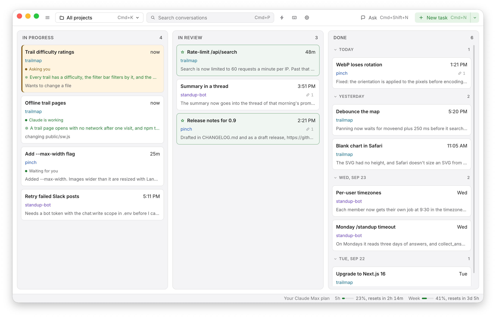
</picture>

- Three columns: In progress, In review, Done. A card is dragged from one to the next, and Done is grouped by the day.
- A card shows its project, whether Claude is working, asks you something or waits for you, the goal, and the links written in the conversation.
- New task starts a conversation in a project, with a goal if you give one. Claude keeps working until the goal holds, then the card moves to In review by itself.
- All projects on one board, or one project at a time with Cmd+K.
- Cmd+click or Shift+click picks several cards, and they are moved, hidden or deleted together.
- Ask (Cmd+Shift+N) is a question outside any project. It is not put on the board.

### Search

Find the conversation where something was decided without remembering which project it was in. The field at the top of the board (Cmd+P) finds a conversation by its title, its project or anything said in it.

<picture>
  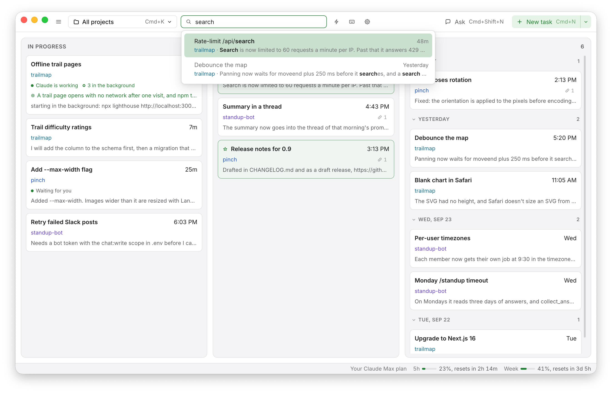
</picture>

### Profiles

Keep work and your own projects apart. A profile is a set of projects, for example one for work and one for your own. The board, search, New task and shortcuts show only the projects of the profile in use.

<picture>
  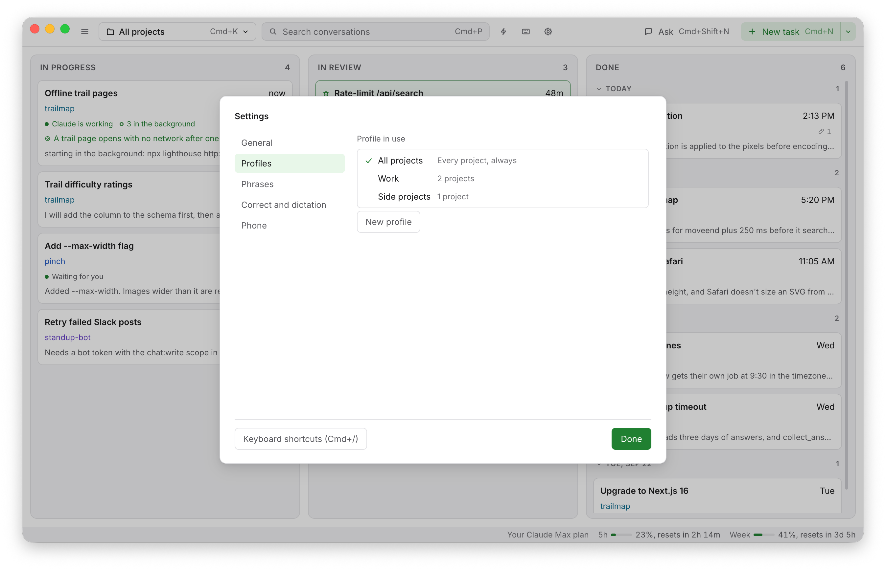
</picture>

## Conversations

Press a card and the conversation opens over the board. You can use it instead of iTerm2 + Claude Code.

<picture>
  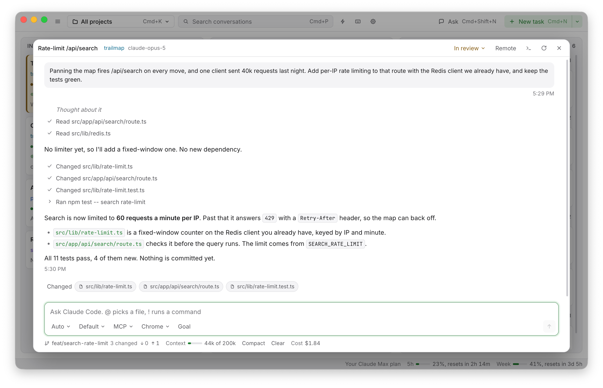
</picture>

- Ctrl+Tab switches between conversations as it works in VS Code between files.
- A notification when AI has finished its job, so you never miss it waiting for you.
- The status bar shows the 5-hour and weekly limits, the context size out of the maximum, the total price and git information.
- @ picks a file or folder from the project, a message starting with ! runs a command, Up brings back your past message, images can be pasted or dropped in.
- The mode (Manual, Auto, Plan), the model, MCP servers and Claude in Chrome are chosen under the message field. Remote continues the conversation on claude.ai or in the Claude app.
- Background jobs are managed as the Claude Code terminal does.

<picture>
  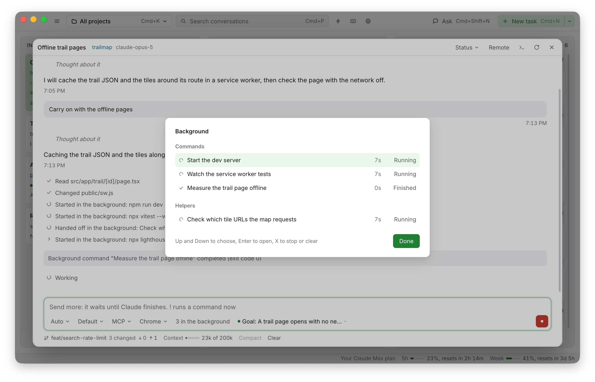
</picture>

- The board can be switched to a list, grouped by project, with favorites at the top and Cmd+1... between them.

<picture>
  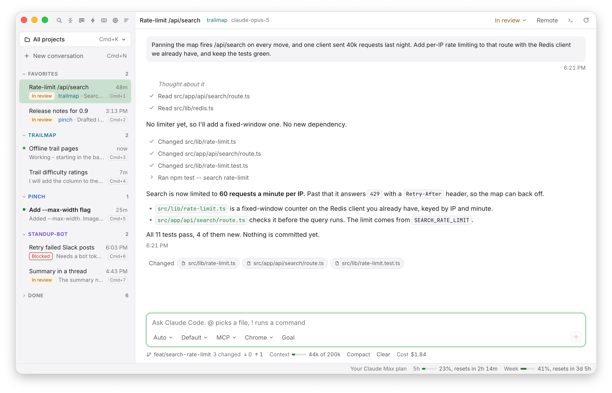
</picture>

## Screen recording

Show the bug instead of typing a description of it. Press Cmd+Alt+R, show the problem on the screen and say what is wrong. GeckIt writes down what you said and keeps frames of what you showed.

<picture>
  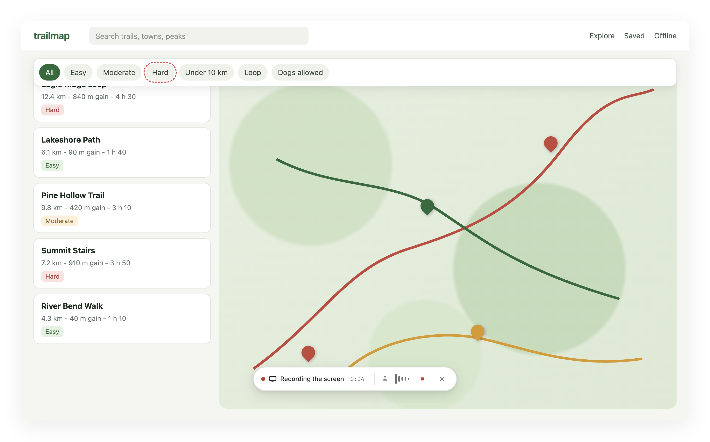
</picture>

Then Ask sends it to Claude as a question, and Make a task finds the project it is about and starts a task there, with a goal.

<p>
  <picture>
    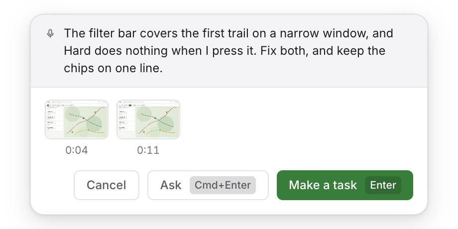
  </picture>
  <picture>
    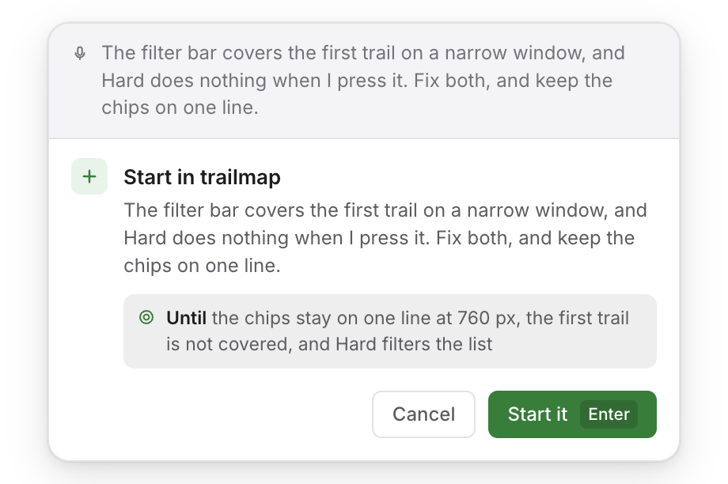
  </picture>
</p>

The New task form has Record the screen too: the recording fills the form.

## Say it

Start or stop work without typing, from any app. Press Cmd+Alt+G and say what to do: start a task in a project, write to a conversation, stop it, mark it done. GeckIt shows what it understood and does it when you agree.

<picture>
  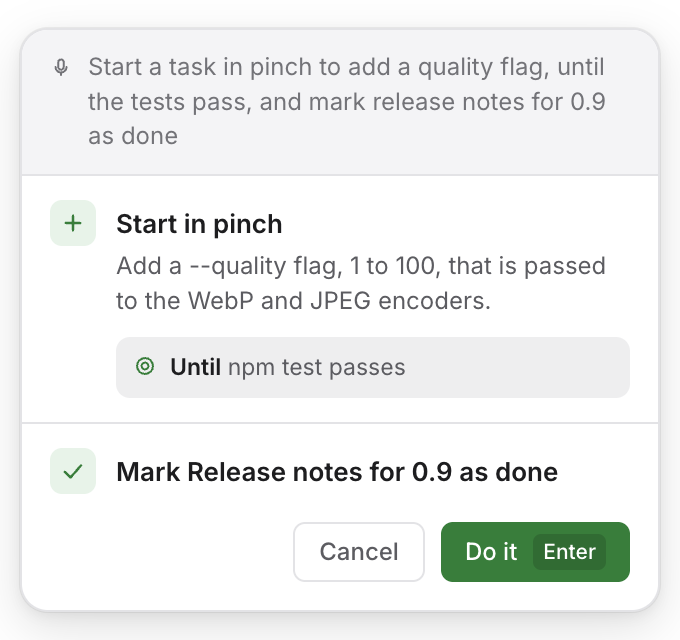
</picture>

## Shortcuts

The prompt you type every morning, typed once. A shortcut is a saved prompt for a project, with a goal, a mode and a model. Run it from the board (Cmd+J) or the menu bar, or give it a timetable: every day, every weekday, every week or a cron line. A timed shortcut runs while GeckIt is open.

<picture>
  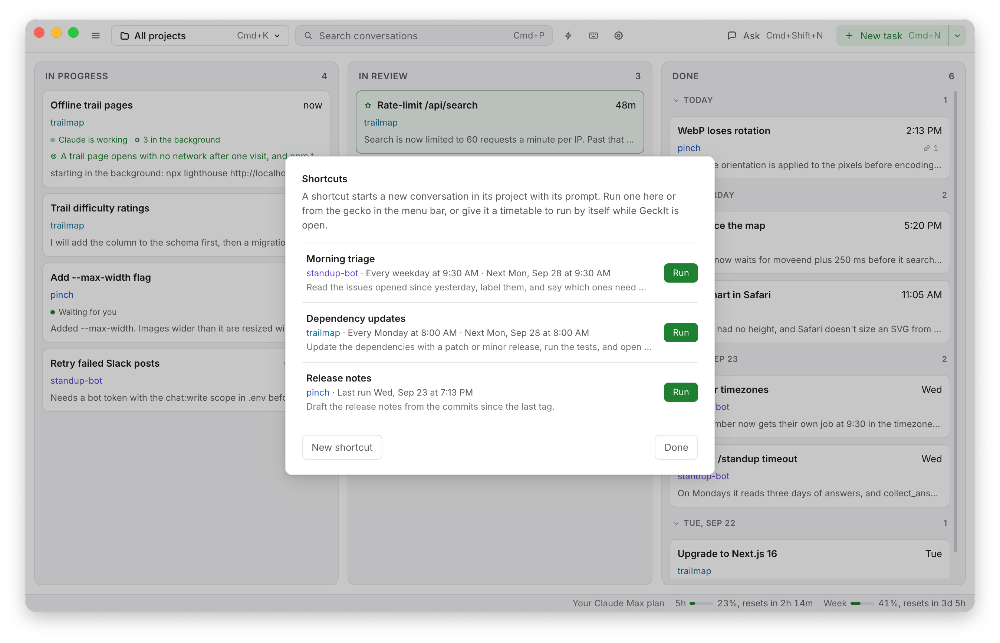
</picture>

## Phone

Answer a waiting command without going back to the Mac. The board and the conversations on your iPhone. Turn on Phone in Settings and scan the code with the GeckIt app. The phone connects to the Mac over WebRTC. The iPhone app is on [TestFlight](https://testflight.apple.com/join/7B7vbk2e), in Apple's review for now.

<picture>
  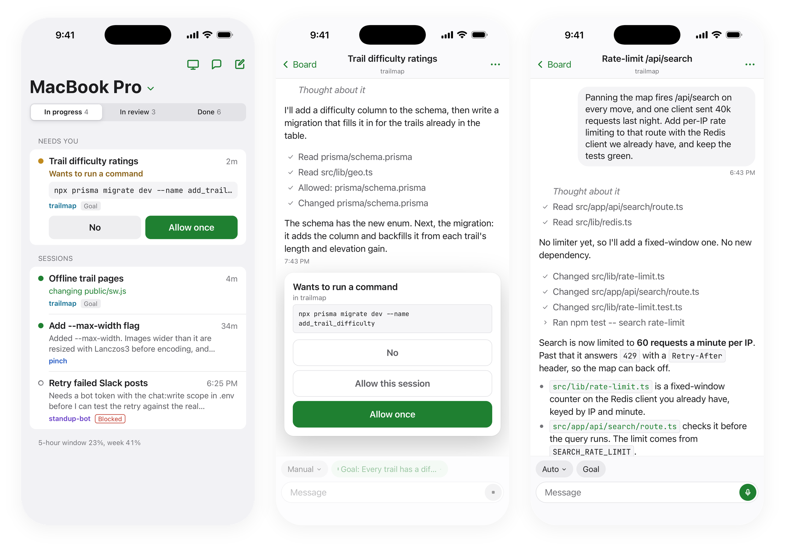
</picture>

## Correct and Transcribe

Fix a message or dictate it without leaving the app you write in.

<p>
  <picture>
    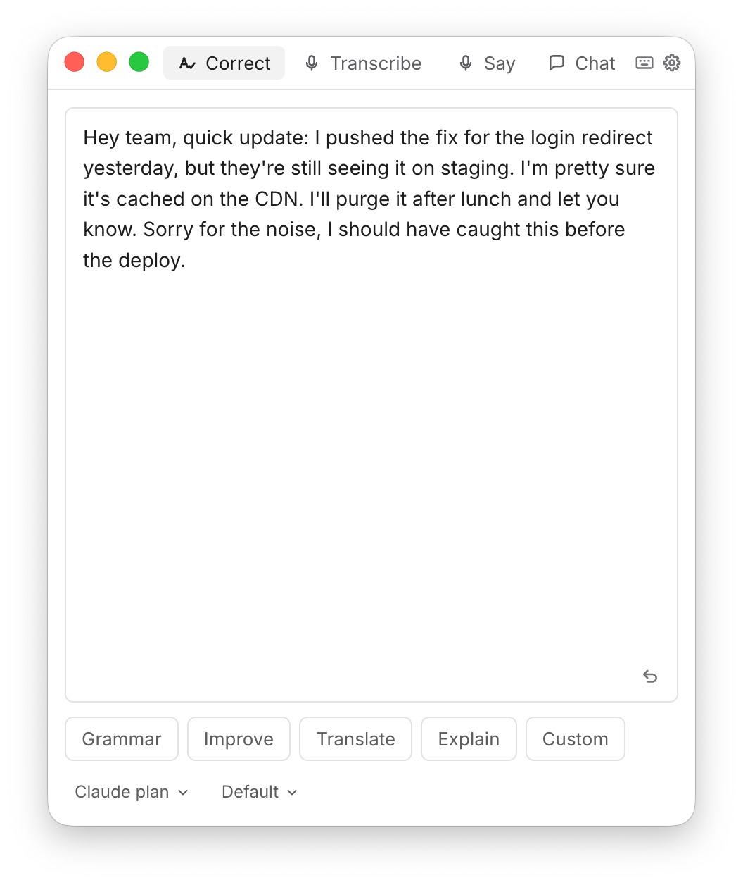
  </picture>
  <picture>
    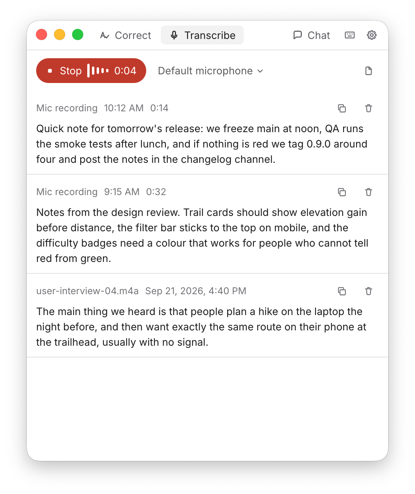
  </picture>
</p>

- **Correct.** Select text anywhere and press Cmd+C+D. GeckIt corrects the grammar, improves, translates or explains it.
- **Transcribe.** Press Cmd+Alt+V, speak, and the text is pasted where you were typing. Audio files can be transcribed too, and you choose the microphone.

<picture>
  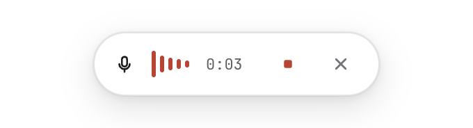
</picture>

On Windows and Linux the shortcuts use Ctrl instead of Cmd.

## Claude Code knows about GeckIt

GeckIt adds a short guide to `~/.claude`, so Claude Code knows about the board, goals and cards. On macOS and Linux it also installs a `geckit` command that says what was done: `geckit sessions --today`, `geckit show <id>`. One setting turns both off.

## Install

Download it from [Releases](https://github.com/anetrebskii/geckit/releases/latest): a dmg for Apple Silicon or Intel Macs, an installer for Windows, an AppImage for Linux. It updates itself.

The board and Correct need [Claude Code](https://code.claude.com/docs/en/overview) installed and signed in with a Claude subscription. Correct can run on an OpenAI, Anthropic or OpenRouter key instead. Transcribe, screen recording and Say it need an OpenRouter key, set in Settings.

The Windows installer is not signed, so SmartScreen warns about it: More info, then Run anyway. It installs for your user only, into `%LOCALAPPDATA%\Programs\geckit`, without administrator rights.

Do not keep one conversation open in GeckIt and in a terminal at the same time: two `claude` processes would write to the same history file.

## Build from source

Node 22 or later.

```bash
cd client
npm install
npm run dev
```

## License

MIT, with one more condition: an app, service or site built from this code shows "Based on GeckIt by Alex Netrebskii" with a link to this repository, in its About screen or README. The GeckIt name and the gecko icon are not part of the license. See [LICENSE](LICENSE).
