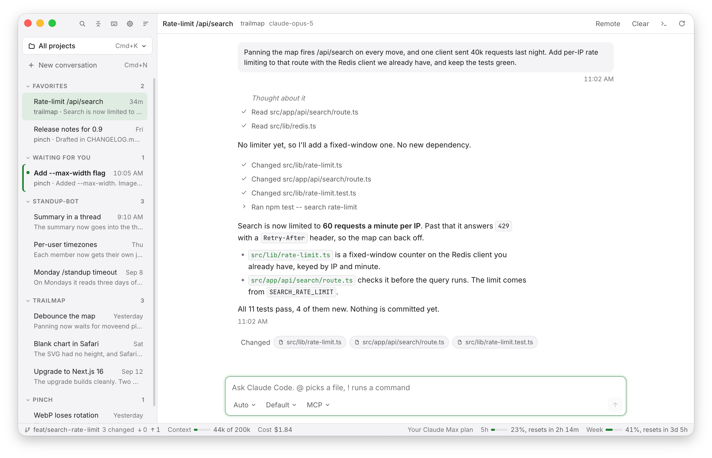

<p align="center"></p>

<h1 align="center">GeckIt</h1>

GeckIt corrects the text you select, transcribes what you say by a shortcut, and has Claude Code chats you can use instead of iTerm2 + Claude Code, on your Claude subscription.

<picture>
  <source media="(prefers-color-scheme: dark)" srcset="docs/screenshots/chat-dark.png">
  
</picture>

## Chat

- Chats you can use instead of iTerm2 + Claude Code. They run your own Claude Code on your Claude subscription.
- Conversations are grouped by project. Favorites are placed at the top, can be re-ordered, and Cmd+1... navigates between them.
- Ctrl+Tab switches between conversations as it works in VS Code between files.
- A notification when AI has finished its job, so you never miss it waiting for you.
- The status bar shows the 5-hour and weekly limits, the context size out of the maximum, the total price and git information.
- @ picks a file or folder from the project, a message starting with ! runs a command, Up brings back your past message, images can be pasted or dropped in.
- Background jobs are managed as the Claude Code terminal does.

## Correct and Transcribe

<p>
  <picture>
    <source media="(prefers-color-scheme: dark)" srcset="docs/screenshots/correct-dark.png">
    
  </picture>
  <picture>
    <source media="(prefers-color-scheme: dark)" srcset="docs/screenshots/transcribe-dark.png">
    
  </picture>
</p>

- **Correct.** Select text anywhere and press Cmd+C+D. GeckIt corrects the grammar, improves, translates or explains it.
- **Transcribe.** Press Cmd+Alt+V, speak, and the text is pasted where you were typing. Audio files can be transcribed too, and you choose the microphone.

<picture>
  <source media="(prefers-color-scheme: dark)" srcset="docs/screenshots/voice-dark.png">
  
</picture>

On Windows and Linux the shortcuts use Ctrl instead of Cmd.

## Install

Download it from [Releases](https://github.com/anetrebskii/geckit/releases/latest): a dmg for Apple Silicon or Intel Macs, an installer for Windows, an AppImage for Linux. It updates itself.

Chat and Correct need [Claude Code](https://code.claude.com/docs/en/overview) installed and signed in with a Claude subscription. Correct can run on an OpenAI, Anthropic or OpenRouter key instead. Transcribe needs an OpenRouter key, set in Settings.

## Build from source

Node 22 or later.

```bash
cd client
npm install
npm run dev
```
