<p align="center"></p>

<h1 align="center">GeckIt, a Kanban board for Codex and Claude Code</h1>

<p align="center">Built by an engineer obsessed with personal productivity.</p>

Working with several Codex or Claude Code conversations at once? See which are working, which are waiting for you and which are done.

GeckIt puts Codex and Claude Code conversations on one Kanban board across your projects. It also corrects selected text and transcribes speech with a shortcut.

<p align="center">
  <a href="https://github.com/anetrebskii/geckit/releases/latest/download/GeckIt-arm64.dmg"></a>
  <a href="https://github.com/anetrebskii/geckit/releases/latest/download/GeckIt-x64.dmg"></a>
  <a href="https://github.com/anetrebskii/geckit/releases/latest/download/GeckIt-Setup.exe"></a>
  <a href="https://github.com/anetrebskii/geckit/releases/latest/download/GeckIt.AppImage"></a>
</p>

<p align="center">Free, with the source public. Run Codex with your ChatGPT account or Claude Code with your Claude account. No API key.</p>

<p align="center">GeckIt is not made by or affiliated with Anthropic or OpenAI. Claude and Claude Code are trademarks of Anthropic.</p>

<a href="https://github.com/user-attachments/assets/3dbb1aa1-d750-4e84-a60e-d579cb2aa5ec">
  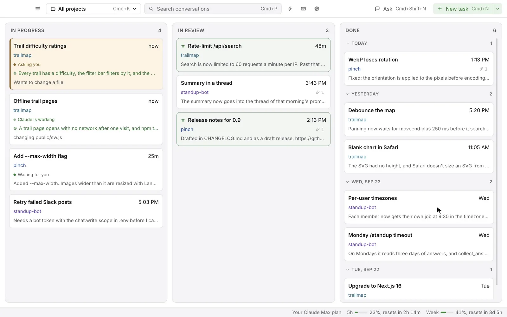
</a>

A new task is started with a goal. While Claude works on it, another task asks to run a command and gets an answer. When the goal holds, the card moves to In review by itself. [Play it as a video](https://github.com/user-attachments/assets/3dbb1aa1-d750-4e84-a60e-d579cb2aa5ec).

The iPhone app is on [TestFlight](https://testflight.apple.com/join/7B7vbk2e). It is in Apple's review now, so the link opens once the review passes.

## Board

Working in terminal tabs, it is easy to miss a conversation that is waiting for you. GeckIt shows Codex and Claude Code conversations as cards on one board, across projects.

<picture>
  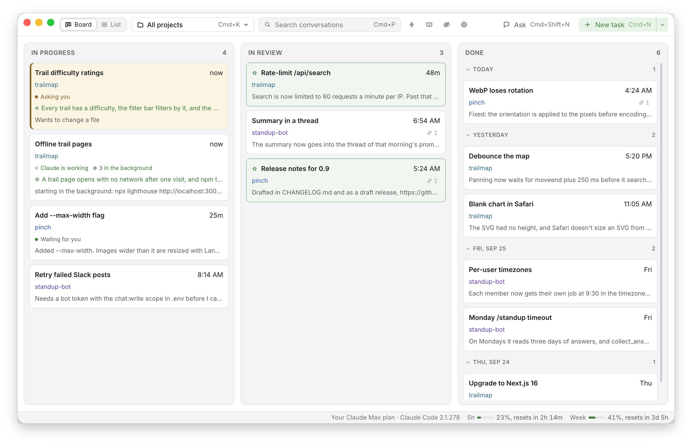
</picture>

- Three columns: In progress, In review, Done. A card is dragged from one to the next, and Done is grouped by the day.
- A card shows its project, whether the assistant is working or waiting for you, its goal and links from the conversation.
- New task starts a conversation in a project, with an optional goal. The assistant keeps working until the goal holds, then the card moves to In review by itself.
- All projects on one board, or one project at a time with Cmd+K.
- Cmd+click or Shift+click picks several cards, and they are moved, hidden or deleted together. Hidden conversations are behind their own button in the top bar.
- Ask (Cmd+Shift+N) is a question outside any project. It is not put on the board.

### Search

Find the conversation where something was decided without remembering which project it was in. The field at the top of the board (Cmd+P) finds a conversation by its title, its project or anything said in it.

<picture>
  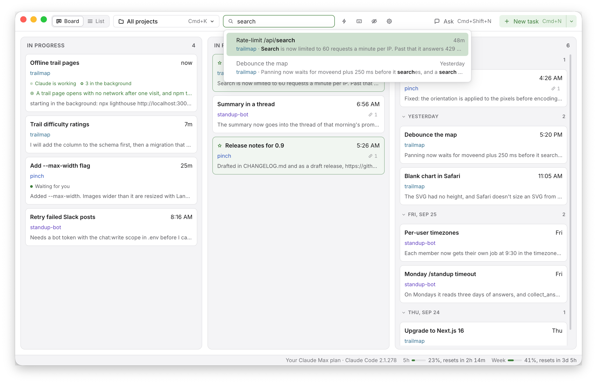
</picture>

### Profiles

Keep work and your own projects apart. A profile is a set of projects, for example one for work and one for your own. The board, search, New task and shortcuts show only the projects of the profile in use.

<picture>
  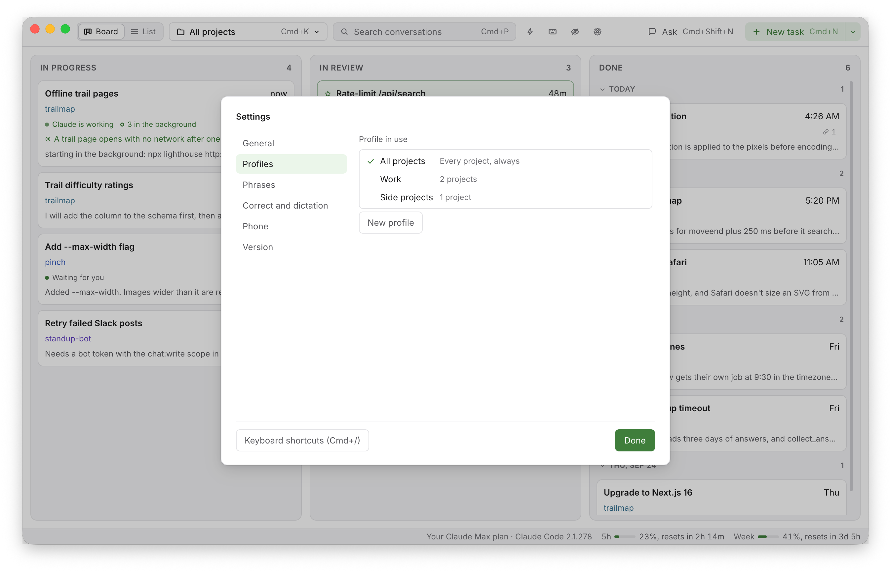
</picture>

## Conversations

Press a card and the conversation opens over the board. Work with Codex or Claude Code there instead of switching between terminal tabs.

<picture>
  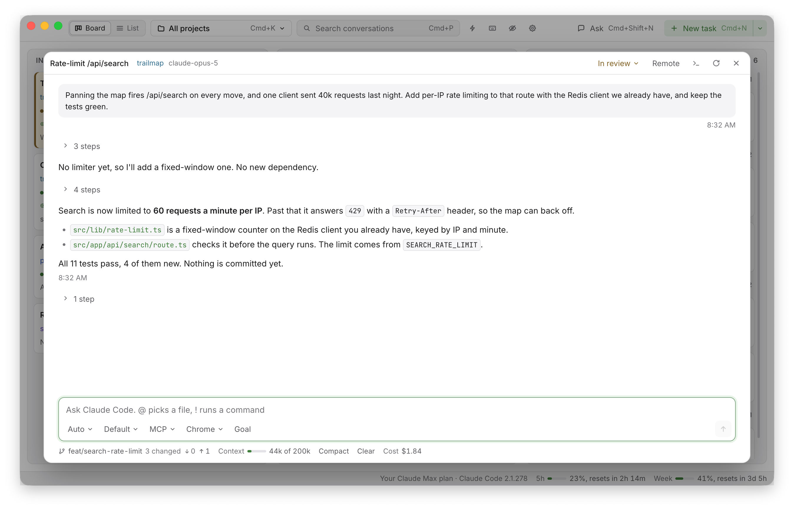
</picture>

- Ctrl+Tab switches between conversations as it works in VS Code between files.
- A notification when AI has finished its job, so you never miss it waiting for you.
- The status bar shows usage limits, context size, cost and git information.
- @ picks a file or folder from the project, a message starting with ! runs a command, Up brings back your past message, images can be pasted or dropped in.
- Choose a mode and model under the message field. Codex uses its own permission checks. Claude Code also supports MCP servers, Claude in Chrome and Remote Control, which continues the conversation on claude.ai or in the Claude app.
- Background jobs run alongside the conversation.

<picture>
  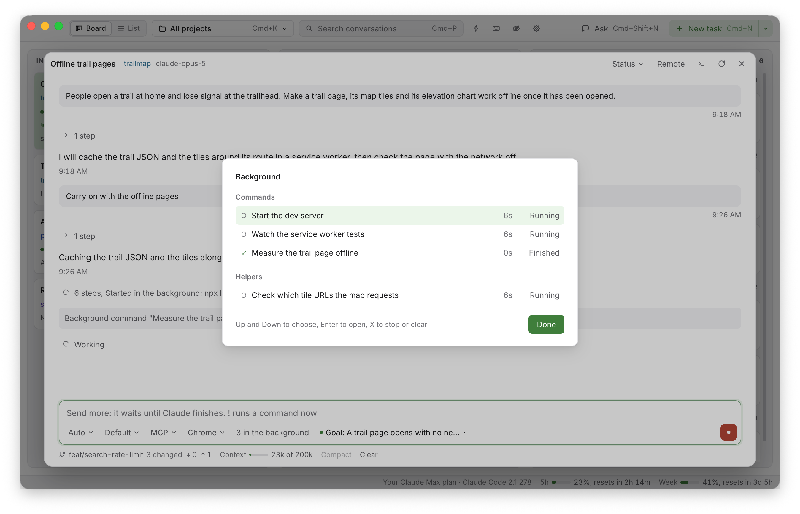
</picture>

- The Board/List switch at the left of the top bar shows the conversations as a list, grouped by project, with favorites at the top and Cmd+1... between them.

<picture>
  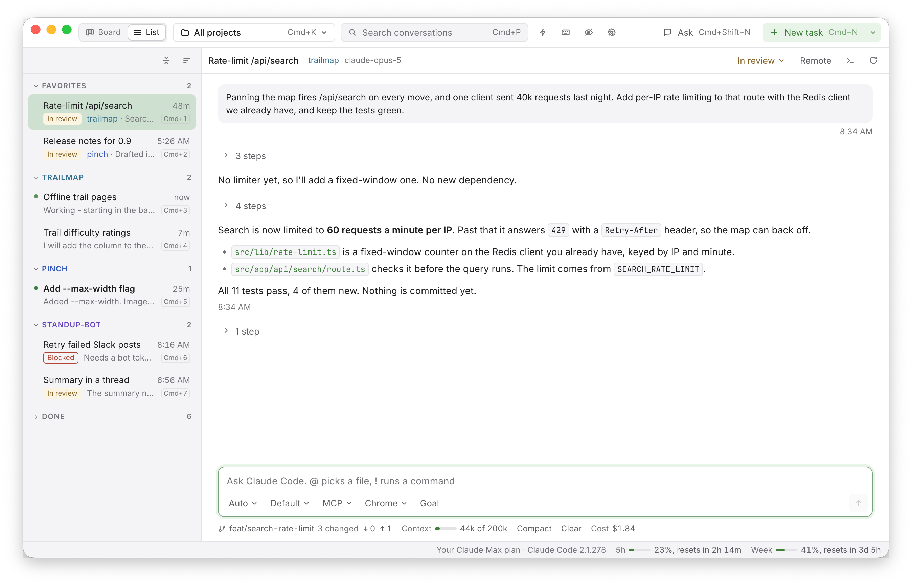
</picture>

## Screen recording

Show the bug instead of typing a description of it. Press Cmd+Alt+R, show the problem on the screen and say what is wrong. GeckIt writes down what you said and keeps frames of what you showed.

<picture>
  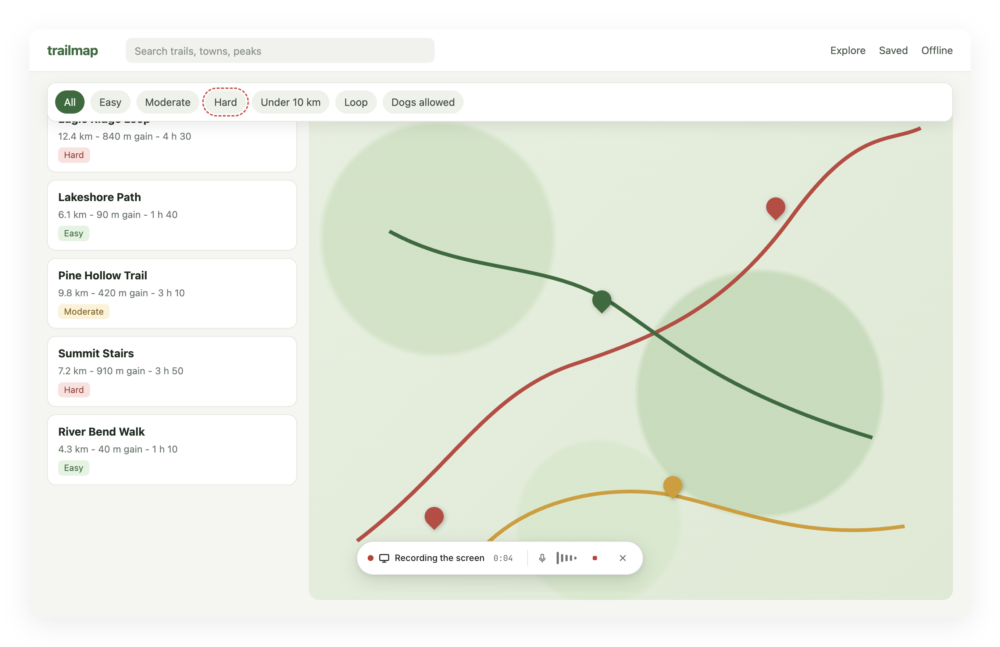
</picture>

Then Ask sends it to your selected assistant as a question, or Make a task finds the project and starts a task there with a goal.

<p>
  <picture>
    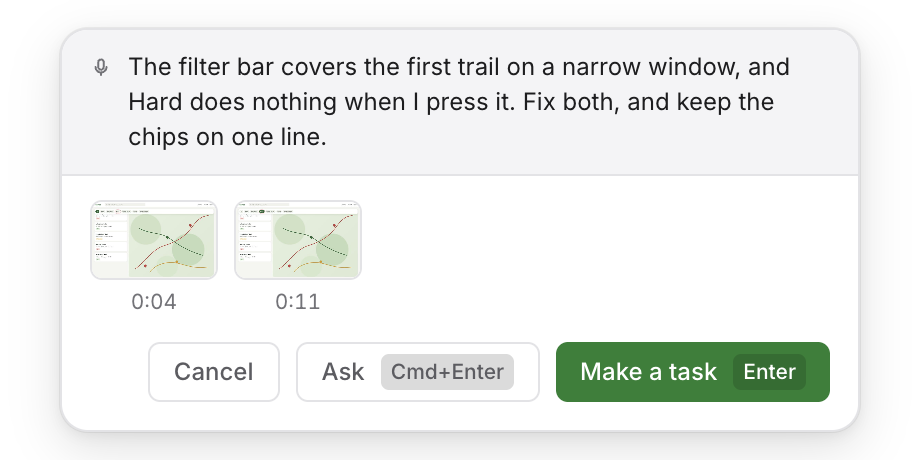
  </picture>
  <picture>
    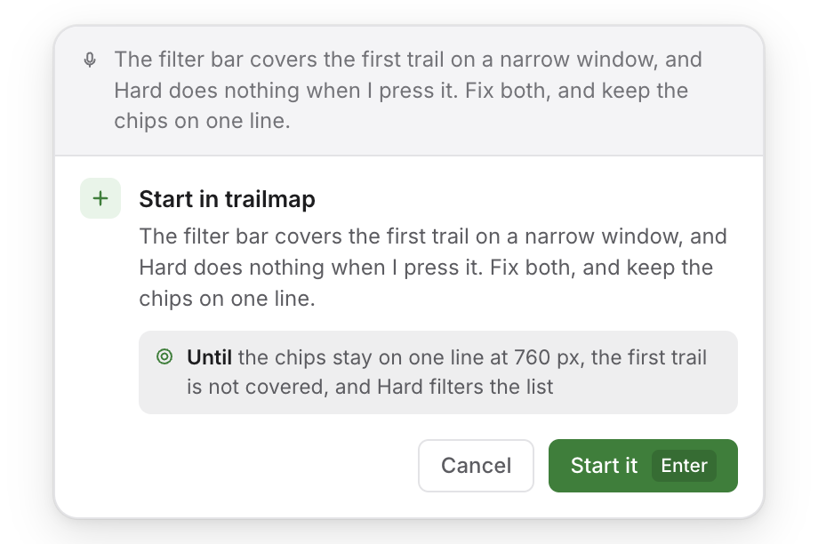
  </picture>
</p>

The New task form has Record the screen too: the recording fills the form.

## Say it

Start or stop work without typing, from any app. Press Cmd+Alt+G and say what to do: start a task in a project, write to a conversation, stop it, mark it done. GeckIt shows what it understood and does it when you agree.

<picture>
  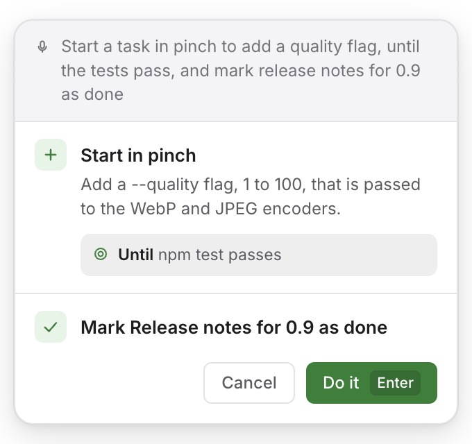
</picture>

## Shortcuts

The prompt you type every morning, typed once. A shortcut is a saved prompt for a project, with a goal, a mode and a model. Run it from the board (Cmd+J) or the menu bar, or give it a timetable: every day, every weekday, every week or a cron line. A timed shortcut runs while GeckIt is open.

<picture>
  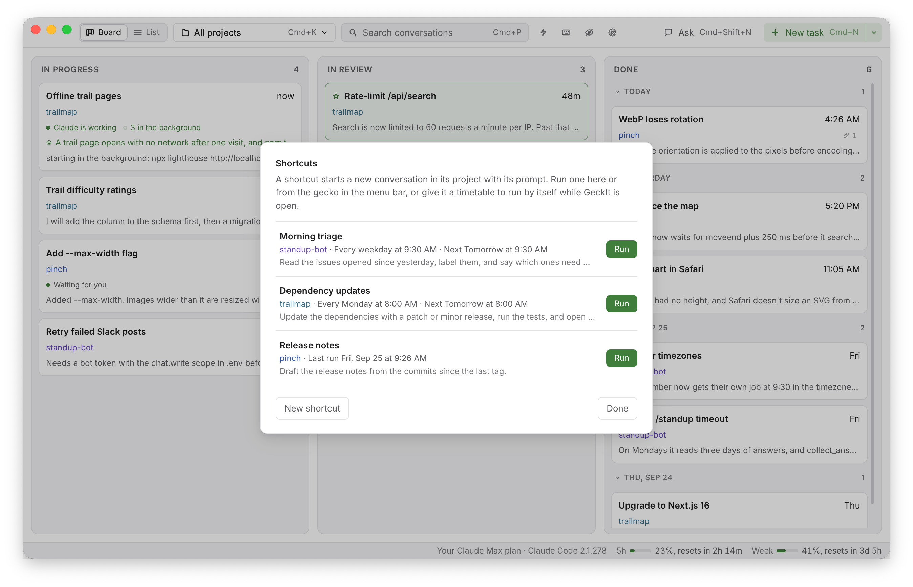
</picture>

## Phone

Your chats on your iPhone, with full control over them: the board, every conversation, the commands waiting for an answer, new tasks and shortcuts. It is made to be fast on a slow network: the app opens on what it already has and loads only the end of a conversation.

AI asks you to do something on the computer? No need to go back to it: you can control your Mac from the phone. A finger moves the Mac's pointer, a tap clicks, two fingers scroll, and a double tap zooms in.

<p align="center">
  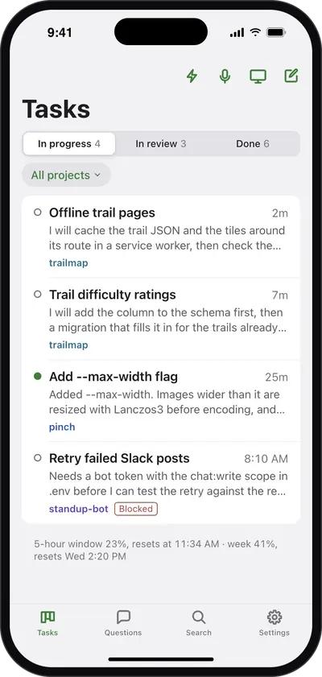
</p>

The board shows the chats of every project, then only trailmap's. A chat is opened and gets one reply. Claude runs the tests and asks for a button only a person can press: Chrome on the Mac wants to show notifications. The Mac's screen opens on the phone, and the pointer is moved to Allow.

Turn on Phone in Settings and scan the code with the GeckIt app. The phone connects to the Mac over WebRTC. The iPhone app is on [TestFlight](https://testflight.apple.com/join/7B7vbk2e), in Apple's review for now.

## Correct and Transcribe

Fix a message or dictate it without leaving the app you write in.

<p>
  <picture>
    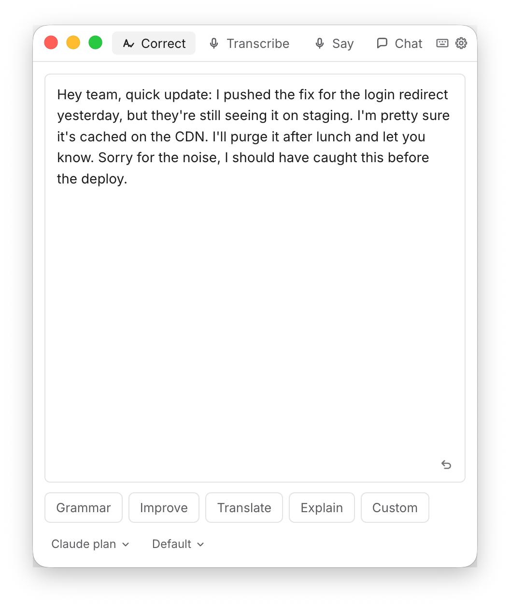
  </picture>
  <picture>
    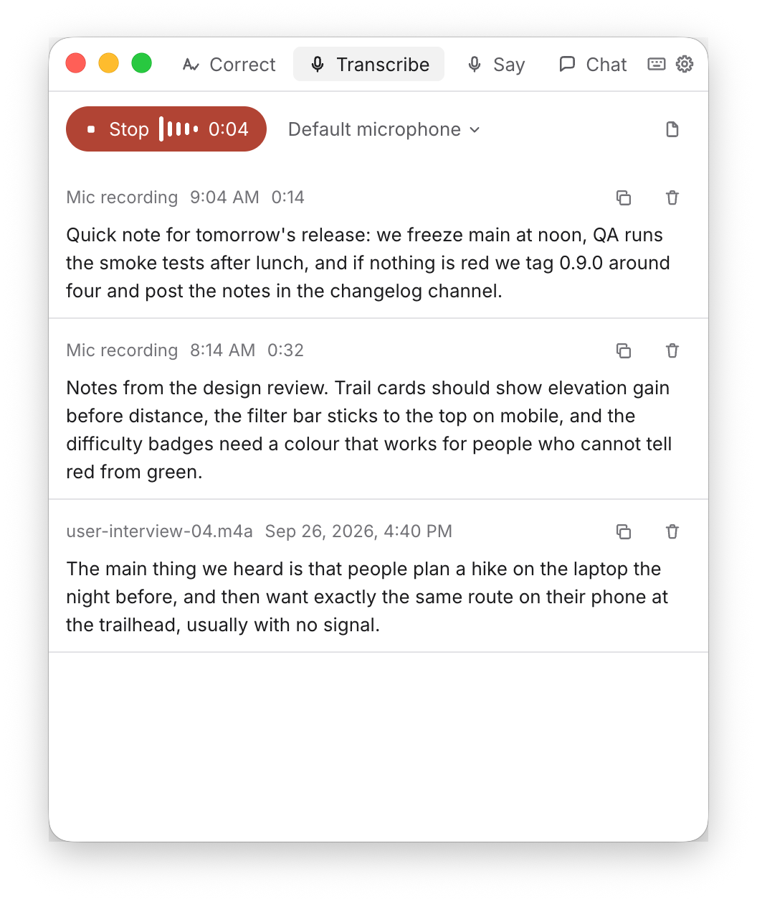
  </picture>
</p>

- **Correct.** Select text anywhere and press Cmd+C+D. GeckIt corrects the grammar, improves, translates or explains it.
- **Transcribe.** Press Cmd+Alt+V, speak, and the text is pasted where you were typing. Audio files can be transcribed too, and you choose the microphone.

<picture>
  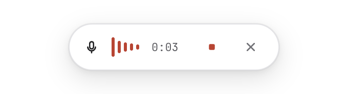
</picture>

On Windows and Linux the shortcuts use Ctrl instead of Cmd.

## Claude Code knows about GeckIt

GeckIt adds a short guide to `~/.claude`, so Claude Code knows about the board, goals and cards. On macOS and Linux it also installs a `geckit` command that says what was done: `geckit sessions --today`, `geckit sessions --favorites`, and `geckit show <id>` with when the card was created and each time it moved. One setting turns both off.

## Install

Download it from [Releases](https://github.com/anetrebskii/geckit/releases/latest): a dmg for Apple Silicon or Intel Macs, an installer for Windows, an AppImage for Linux. It updates itself from the Stable channel, the release marked Latest. Settings, Version switches it to Development, which gets every build from main.

Chat and Correct need either Codex, signed in with your ChatGPT account, or [Claude Code](https://code.claude.com/docs/en/overview), signed in with your Claude account. Transcribe, screen recording and Say it hear speech on the computer with Whisper, and need no key: the model, about 570 MB, downloads the first time you dictate.

The Windows installer is not signed, so SmartScreen warns about it: More info, then Run anyway. It installs for your user only, into `%LOCALAPPDATA%\Programs\geckit`, without administrator rights.

For Claude Code, do not keep the same conversation open in GeckIt and a terminal at once: two `claude` processes would write to the same history file.

## Codex and Claude Code policies

### Codex

GeckIt runs the Codex CLI on your computer. Sign in with your ChatGPT account. Codex handles its own permission checks. GeckIt follows [OpenAI's Usage Policies](https://openai.com/policies/usage-policies/) when it runs Codex.

### Claude Code

Checked against Anthropic's terms on September 28, 2026.

GeckIt follows the rules Anthropic sets for apps that run Claude Code:

- It runs the `claude` you installed, as Anthropic publishes it.
- You sign in with Claude Code's own login. GeckIt does not read, keep or send your credentials or tokens, and cannot sign anybody in.
- An API key or another provider set in your environment is left out when GeckIt starts `claude`, so every conversation runs on your own plan.
- There is no GeckIt server between you and Anthropic. `claude` talks to Anthropic from your computer or your host, and the phone reaches it only through your computer.

Your account is under your own agreement with Anthropic, and Anthropic decides how it is enforced. Please respect it:

- Use your own account. Do not share one plan between people.
- Keep to your own work. Pro and Max limits assume "ordinary, individual usage", so do not run conversations for other people or sell access to them.
- On a host, sign in to `claude` there yourself, with your own account.
- Settings, Conversations working at once, is 6 by default. Many conversations working for hours is not what a plan's limits assume.
- Follow the [Usage Policy](https://www.anthropic.com/legal/aup) and the [Consumer Terms](https://www.anthropic.com/legal/consumer-terms).

The rules for apps built on Claude Code are on the [Legal and compliance](https://code.claude.com/docs/en/legal-and-compliance) page. Anthropic changes them from time to time, and GeckIt cannot answer for how they are enforced.

## Build from source

Node 22 or later.

```bash
cd client
npm install
npm run dev
```

## License

[Functional Source License 1.1](LICENSE), MIT Future License (FSL-1.1-MIT). Use it, change it and share it for anything, work included, except a commercial product or service that competes with GeckIt. Each version becomes MIT two years after its release. The GeckIt name and the gecko icon are not part of the license. Versions up to 1.21 were released under MIT with an attribution condition and stay under it.

## Provider libraries

Add independent AI assistants from public GitHub repositories in Settings > Libraries. See the [provider author guide](docs/provider-plugins.md) and [standalone Codex example](examples/codex-provider/README.md). AI build instructions are available through `geckit instructions providers` and `geckit instructions app`.
