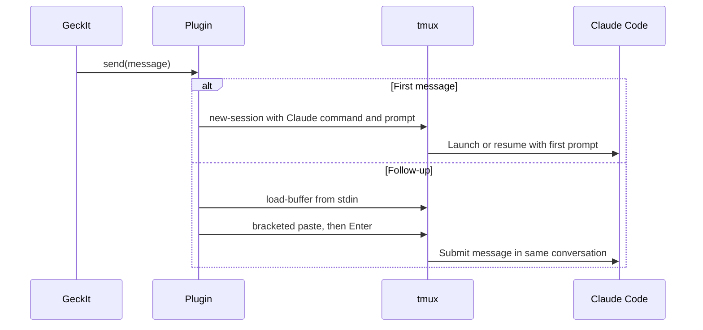
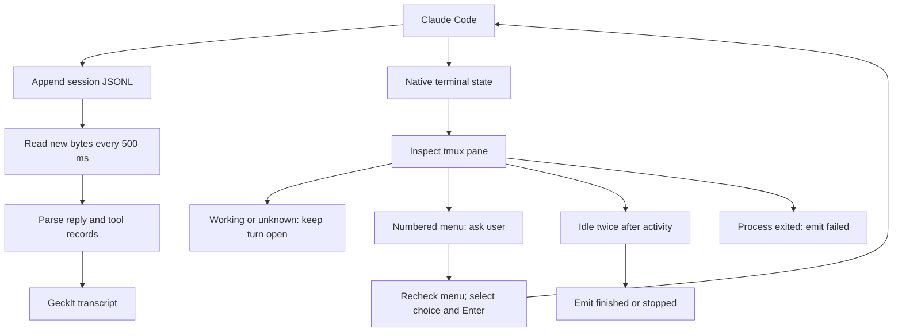

# How the Claude tmux plugin sends messages and reads replies

The updated plugin runs ordinary interactive Claude Code in a detached tmux terminal. **Input uses tmux; replies and tool progress use the session JSONL file; status and approvals use terminal inspection.** It adds no GeckIt HTTP hooks or system prompt.

Implementation: [index.mjs](/private/tmp/geckit-claude-tmux-passive/index.mjs). Reviewable change: [plugin patch](claude-tmux-passive.patch). The first passive version is installed. The non-error synthetic-record correction is installed. A one-hour idle-shutdown update is staged locally; apply it through Settings > Libraries > Apply update.

## Send a first message

`send(text, images, before)` joins instruction blocks, text and image paths into one prompt. The plugin launches:

```text
claude --permission-mode <mode> --settings <settings>
       [--model <model>]
       (--session-id <id> | --resume <id>)
       <prompt>
```

The prompt is shell-quoted as one argument. Settings exclude the global `GECKIT.md` file for this process; they contain no plugin hooks. Existing user hooks and project instructions remain active. On Claude's initial workspace-trust screen, the driver explicitly selects "Yes, I trust this folder".

## Send another message

The same running conversation receives the full message through:

```sh
tmux load-buffer -b <buffer> -
tmux paste-buffer -p -d -b <buffer> -t <session>
tmux send-keys -t <session> Enter
```

`load-buffer` receives text on stdin. Bracketed paste keeps multiline input together; Enter submits it. Comments, instructions and slash commands use this path.



[Send diagram](diagrams/claude-session-management/01-send.svg)

## Read replies and progress

Every 500 ms, the plugin reads new bytes from:

```text
~/.claude/projects/<project-slug>/<session-id>.jsonl
```

On resume it starts at the existing file's end. It buffers incomplete lines, parses complete records and passes them to GeckIt's `readClaude()` parser. Reply and tool items reach the app through `hear({ items, gone, signals })`. Reply text never comes from terminal output. Updates arrive as Claude writes message blocks, without the former token-level hook streaming.

## Know whether Claude finished

The same polling cycle inspects the tmux pane for these native states:

| State | Evidence | Result |
| --- | --- | --- |
| Working | Active spinner or interrupt hint | Keep the turn open |
| Waiting | Selected numbered menu and navigation hints | Show Claude's exact choices in an existing question card |
| Finished | Idle input prompt on two consecutive polls after observed activity | Emit `ended: done` |
| Stopped | Ctrl+C followed by confirmed idle prompt | Emit `ended: stopped` |
| Failed | Process exited or explicitly flagged API failure followed by idle | Emit `ended: failed` |
| Unknown | Layout is unrecognized | Keep working; do not guess completion |

An answer rechecks the current menu, navigates with Up/Down and presses Enter. Stale choices are rejected. Unsupported dialogs require native terminal interaction. Stop sends Ctrl+C. A process check also detects dead panes that tmux retains. GeckIt closes the tmux session after one hour idle following completion. New messages reset the timer; working turns, pending approvals and tracked background tasks prevent shutdown.



[Read and status diagram](diagrams/claude-session-management/02-read.svg)

File silence is not completion. `end_turn` ends a model response, but hooks may continue the conversation. "Finished" means the turn ended, not that the requested work succeeded.

Passive file reading adds nothing to Claude's context. Existing history, project instructions or other integrations may still reveal GeckIt; undetectability is not guaranteed.
