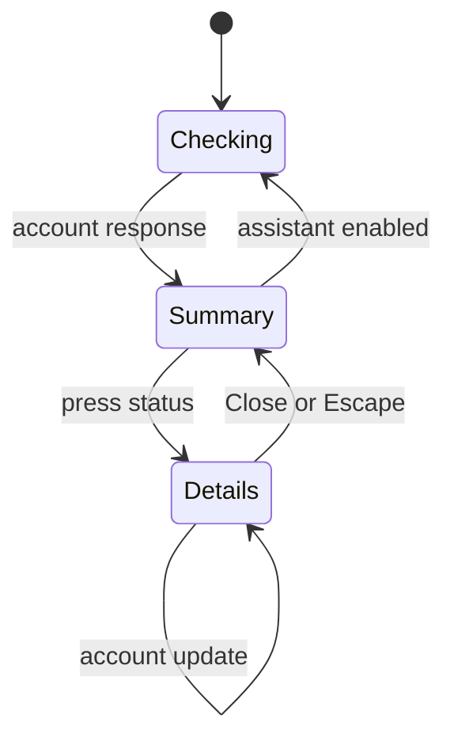

# UX: assistant status

## 1. Purpose
The current bottom bar describes only the selected assistant. Long installation/version prose obscures usage and gives no overview of other enabled assistants.

## 2. Surfaces
| Surface | Addition | When visible |
| --- | --- | --- |
| Desktop status bar | Assistant icon, short name, compact reported usage; Assistants opens all details | Board and conversation |
| Phone Tasks | One persistent Assistants disclosure row above the tab bar, with enabled count and current assistant summary | Tasks board |
| Desktop dialog / phone sheet | Each assistant's plan, login/availability, program version/installation and all reported limits | Click/tap status |

## 3. States
| State | User sees | Next action |
| --- | --- | --- |
| Loading | "Checking..." | Wait or keep working |
| Account unavailable | "Unavailable" | Read details; check installation/login |
| Not installed | "Not installed" | Read provider installation information |
| Signed out | "Sign in required" | Read login command in details |
| Ready | Reported window label and percentage, or "Limits unavailable" | Open full details if needed |
| Host disconnected | "Last measured" with host name and available measurement | Reconnect host through existing host management |
| Details open | "Assistants", one section per enabled assistant, "Close assistants" | Scroll, close, or Escape |

## 4. Transitions

| From | Event | To | Visible result |
| --- | --- | --- | --- |
| Checking | Account resolves automatically | Summary | Own account and usage |
| Checking | Request fails automatically | Summary | "Unavailable" |
| Summary | Click/tap assistant or Assistants | Details | All assistant sections; focus enters dialog |
| Details | Close icon, Escape, outside click, phone sheet dismissal | Summary | Opener regains focus; board position preserved |
| Any | Settings enable/disable assistant automatically | Same surface | Enabled list updates; disabled results do not reappear |
| Any | Existing refresh/event automatically | Same surface | Matching assistant updates only |

## 5. What stays silent
Disabled assistants are absent. Conversation paste/upload errors do not become account status. Details never change the composer selection. Installation paths and reset prose stay out of compact summaries.

## 6. Thresholds and time
Reuse the existing five-minute visible-window account refresh and minute reset-label updates. Desktop summaries scroll horizontally when necessary, with a persistent Assistants action so overflow is discoverable. Phone uses one persistent row above the tab bar to preserve board space regardless of assistant count and keep status reachable on a long board. Long quota names may truncate in this row; the assistant name and reported value remain visible. Do not invent limits when the provider reports none.

## 7. Exact labels
"Assistants", "Checking...", "Unavailable", "Not installed", "Sign in required", "Limits unavailable", "Last measured", "Close assistants". Retain provider-supplied quota names and existing plan/program wording in details.

## 8. Edge cases
Empty settings use the existing Claude fallback. Long names truncate only in summaries and wrap in details. Many quotas scroll inside details. At widths up to 420px, each quota stacks its full name and reset time above its meter and value; neither label nor reset line truncates. SSH Claude accounts retain grouping and host labels; do not merge independent library assistant identities even if they use the same subscription. Failed phone requests remain unavailable until an existing refresh succeeds. Responses after disable/unmount are ignored.

## 9. Deliberately absent
No assistant switching from status: composer owns that action. No expanded multi-row desktop footer: it would consume conversation space. No new polling service or provider protocol.

## 10. Decisions
All assistants are independently visible instead of rotating one automatically; stable identity prevents misattributing quotas. Full metadata moves to details; concise summaries serve at-a-glance comparison. Phone replaces existing selected-provider usage prose with a single disclosure.

## 11. Requirement coverage
FR-001/002: independent summaries and details; FR-003: phone row/sheet; FR-004: explicit states; FR-005: host grouping; FR-006: theme, focus and scrolling; FR-007: shared refresh.

Implementation is authorized by Alex's request to design and implement desktop and mobile together; no separate approval gate is introduced.

## Revision - 2026-10-08

Alex rejected the initial details layout and requested a cross icon and a better page design. This request authorizes implementation of the revision. Replace the visible Done button with a cross icon, accessible label "Close assistants"; Escape/outside click/swipe behavior stays the same. The close control remains in the fixed header on both platforms.

The panel prioritizes assistant identity and plan, then reported quota windows. Each assistant has one compact section. Each quota shows its full name and value, a wide usage bar when a proportion is reported, and reset time beneath. Two quota windows share a row on desktop; mobile uses two columns for short percentage windows and a full-width row for long count/unknown quotas. Long names and values wrap without clipping. Metadata follows limits in a quiet line: CLI version, installation source and measured time, without repeating the assistant's name. Login instructions and unavailable states remain explicit. Independent assistant identities and remote account groupings remain unchanged.

Rejected original layout: large prose-first sections and tiny detached meters made quota comparison difficult; the Done wording suggested task completion. Revision uses a clear dismissal icon and makes usage the visual center.

Revision reviewed in actual component fixtures across desktop and phone, light/dark, 320px narrow screens, long quotas, keyboard focus and scrolling. [Review evidence](../../specs/004-assistant-status/design.md#redesign-verification). Native Electron/iPhone verification remains unavailable.

Spacing correction: desktop panel is 520px wide; a single quota or final odd quota spans the full row. Header, section and card padding is reduced. Short paired quotas remain side by side on both platforms.
