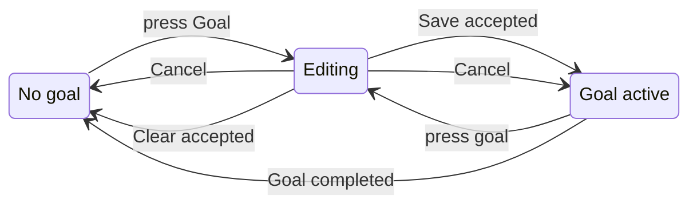

# UX: Goals in an open conversation

## 1. Why

The new-task form can set a goal, but an open Codex conversation has no visible goal control. A person must know and type `/goal` to add or change one. The conversation composer should show the current goal and let the person set, edit, or clear it without changing the message draft.

## 2. What appears

| Surface | Change | When |
| --- | --- | --- |
| Chat composer on Mac and phone | Goal button beside the session controls | In a project conversation |
| Goal editor | Current condition, Save, Cancel, and Clear when a goal exists | After pressing Goal or the current goal |
| Board card | Existing goal text | While a goal exists |

## 3. States

| State | When | What the person sees | Action |
| --- | --- | --- | --- |
| None | The conversation has no goal | "Goal" | Press it to set one |
| Editing | The editor is open | "Goal", the condition field, "Cancel", "Save", and "Clear goal" if there was a goal | Save, clear, or cancel |
| Active | The assistant has a goal | "Goal: <condition>" | Press it to edit or clear |
| Updating | Save or Clear has been pressed | The editor closes; the current control stays until the session confirms the change | Wait or continue chatting |
| Failed | The session rejects the change | The existing goal stays and the chat error appears | Retry |

## 4. Transitions

| From | Event | To | What the person sees |
| --- | --- | --- | --- |
| No goal | Press Goal | Editing | Empty condition field |
| Goal active | Press the goal | Editing | Current condition selected for editing |
| Editing | Press Save with nonempty text and the session accepts | Goal active | Updated goal text |
| Editing | Press Clear goal and the session accepts | No goal | "Goal" |
| Editing | Press Cancel, Escape, or outside | Previous state | No change to the goal or message draft |
| Goal active | Codex completes the goal | No goal | Goal control returns to "Goal"; card moves to In review |
| Editing | Session rejects Save or Clear | Previous state | Existing goal and chat error |

## 5. What stays quiet

| State | Reason |
| --- | --- |
| Native goal token and time counters | They do not help choose or edit the completion condition |
| A successful save | The changed goal text is confirmation enough |

## 6. Time

There is no timeout or debounce. Save and Clear submit once when pressed.

## 7. Wording

| State | Text |
| --- | --- |
| No goal | "Goal" |
| Active | "Goal: <condition>" |
| Editor title | "Goal" |
| Empty field | "What should be true when this is done?" |
| Save | "Save goal" |
| Clear | "Clear goal" |
| Cancel | "Cancel" |

## 8. Edge cases

- Empty or whitespace-only text cannot be saved.
- Long conditions stay whole in the editor and truncate only in the composer button.
- Save and Clear do not consume or rewrite an unsent chat message.
- A goal changed in another Codex client updates from the native goal notification.
- Switching conversations closes the editor so its text cannot be saved to another conversation.
- While Codex is working, changing its goal updates the native goal directly. Clearing it removes the goal without stopping the current turn.

## 9. Not included

| Option | Reason |
| --- | --- |
| A separate Goals screen | The goal belongs to this conversation and its composer already has a goal position |
| Token budget controls | The request is about the completion condition |

## 10. Decisions

| Option | Decision |
| --- | --- |
| Reuse the composer Goal position | Yes |
| Put the condition in the message draft | No; editing a goal must preserve the draft |

The Goal control was already present for Claude. The same position now serves both assistants and opens a focused editor.

## 11. Requirements

| Requirement | Covered by |
| --- | --- |
| Set a goal in an open chat | No goal to Editing to Active |
| Edit a goal in an open chat | Active to Editing to Active |
| Delete a goal in an open chat | Active to Editing to None |
