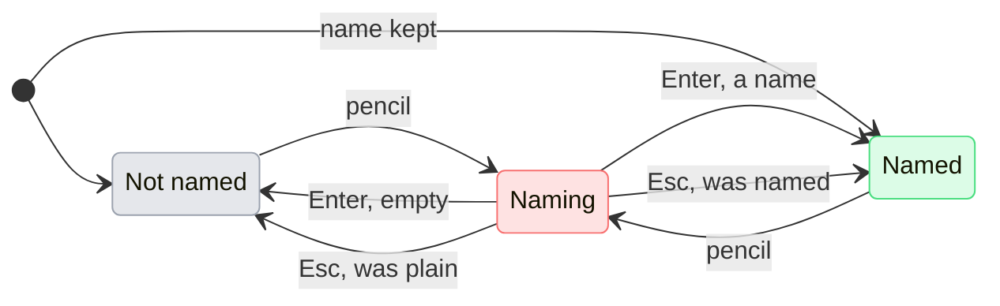

# UX: Names for the Chrome browsers

## 1. Why

Claude in Chrome names every Chrome the extension is connected in "Browser 1", "Browser 2", in the order they connected. The extension lets the person type a name when a browser connects, but the field is easy to miss, and once it is missed there is no place to change it. Somebody with two Chromes, or two profiles of one, then picks between "Browser 1" and "Browser 2" in the Chrome menu under the field and in Claude's questions, and cannot tell which is the work one. GeckIt keeps its own name for each browser, by the browser's `deviceId`, which does not change, and shows it wherever GeckIt shows the browser and wherever Claude writes about it.

## 2. What is added

| Surface | What appears |
|---|---|
| Chrome menu under the field (`chat/Chrome.tsx`) | Each row shows the name given in GeckIt, and under it the extension's own name and "in use". A pencil at the end of the row turns the name into a field. |
| Settings file (`browserNames`) | `deviceId` to name. Nothing else about the browser is kept. |
| `GECKIT.md` (`main/guide.ts`) | A section "Chrome browsers" listing each named `deviceId` with its name, so Claude says the name in replies and puts it on the options when it asks which browser to use. Written only while there is at least one name. |

## 3. States

A row in the Chrome menu is in one of three states.

| State | When | What the person sees | What to do |
|---|---|---|---|
| Not named | No name in GeckIt for this `deviceId` | The extension's name, "Browser 2", as today | Press the pencil to name it |
| Named | A name is kept for this `deviceId` | The name; under it "Browser 2" and "in use" when it is the one used | Press the row to use it, the pencil to change the name |
| Naming | The pencil was pressed | A field holding the current name, selected | Type and press Enter, or Esc to leave it as it was |

## 4. Transitions

| From | Event | To | What the person sees |
|---|---|---|---|
| Not named | Pressed the pencil | Naming | The field, holding "Browser 2", selected |
| Named | Pressed the pencil | Naming | The field, holding the name, selected |
| Naming | Enter or clicked away, with a name typed | Named | The name, "Browser 2" under it; the menu stays open |
| Naming | Enter or clicked away, the field empty | Not named | "Browser 2" again; the name is forgotten |
| Naming | Esc | where it was | What it showed before; the menu stays open |
| Named | The menu closed and opened again | Named | The name, read again from Settings |
| any | A name was kept or forgotten | same | Nothing in the menu; `GECKIT.md` is written again, by itself |

Naming does not pick the browser: pressing the pencil or the field is not pressing the row.

## 5. What stays quiet

- A conversation already running keeps the `GECKIT.md` it read when it started. A name given now reaches Claude from the next start of a conversation. The menu does not say so: the names in the menu are right at once, and a reply that still says "Browser 2" is readable next to it.
- A name for a browser that is no longer connected is kept and not shown anywhere. It comes back when that browser connects again.
- Claude's tool lines (`list_connected_browsers`, `select_browser`) are shown as the tool printed them, with the extension's names.

## 6. Thresholds and time

None. A name is kept the moment Enter is pressed, and `GECKIT.md` is written at the same time, since writing it costs nothing and waiting would let a conversation start with the old one.

## 7. Wording

- Pencil tooltip: "Name this browser"
- Under a named row: "Browser 2" or "Browser 2 · in use"
- Under a row not named: "in use" for the one used, nothing for the others (as today)
- Note under the menu: "A Chrome profile is its own browser. The one picked is used by every conversation. Names given here are GeckIt's own."
- `GECKIT.md`, section "Chrome browsers": "The person has named the Chrome browsers Claude in Chrome connects to. The extension calls them Browser 1, Browser 2 and so on; call each by the name below, by its deviceId, in replies and on the options when asking which browser to use." followed by one line per browser: `` - `<deviceId>`: <name> ``

## 8. Edge cases

- Two browsers given the same name: allowed; the extension's name under each tells them apart.
- A name with a backtick or a line break: the field is one line; a backtick is written into `GECKIT.md` as it is, inside a list line, which reads fine.
- The guide is off in Settings (`guideClaude`): the names still show in the menu; Claude is not told.
- Run from the source: the source copy leaves `GECKIT.md` to the installed app, as it does today, so names given there reach the menu only.
- A conversation on a host: the Chrome menu is not shown for it, as today.

## 9. Deliberately left out

- Rewriting Claude's question cards and tool lines with the names. With the names in `GECKIT.md`, Claude writes them itself, and GeckIt stays out of what the tool said.
- A list of browsers in Settings. The Chrome menu already asks the tool which browsers there are; a second list would show ones that are gone.
- Renaming in the extension from GeckIt. The extension offers no call for it.
- The phone. It has no Chrome menu.

## 10. Decisions

- Where to rename: in the menu row, not in a dialog. The row is where "Browser 2" is read and not understood, so that is where it gets fixed.
- Keyed by `deviceId`, not by the extension's name: "Browser 1" and "Browser 2" follow the order of connecting and can swap.

## 11. Requirements

Closes Alex's request of 2026-09-30: "antropic returns brower 1 and browser 2, but above than I can provide custom geck it names".
