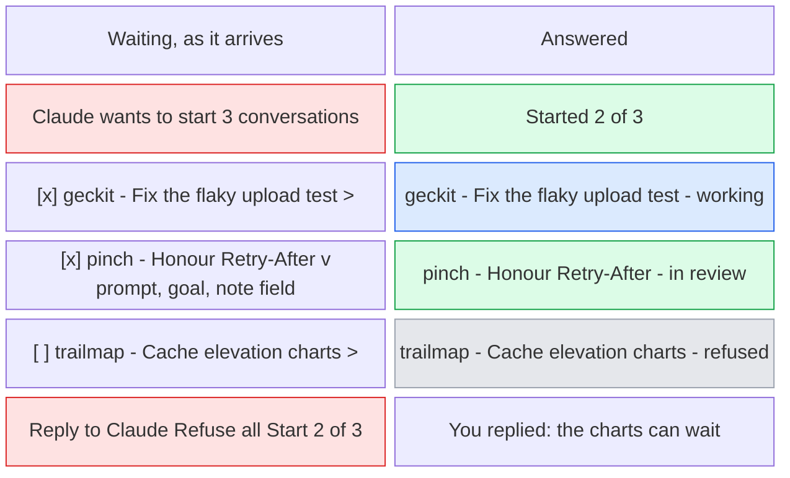
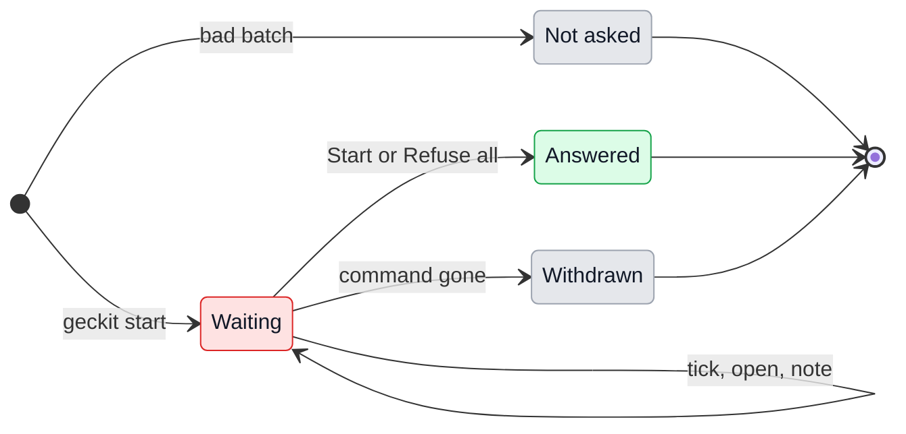
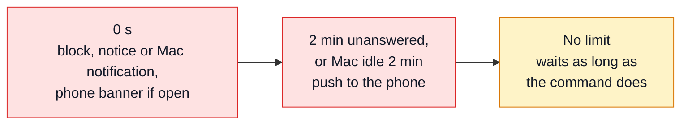

# UX: Claude asks GeckIt to start conversations

## 1. Why

A conversation often finds work that belongs somewhere else: a bug in another project, three follow-ups that should not hold this one open. Today Claude can only say so, and Alex has to open each project, write each task and send it. `geckit start` lets Claude ask GeckIt for those conversations itself, several at once, and nothing starts without Alex's yes. Alex expects to say yes quickly almost every time, so the yes is one press, from the notice or from the conversation that asked, and reading a task in full, leaving one out or adding a note is there for when it is wanted and out of the way when it is not. Every conversation started this way remembers which one asked for it, and the one that asked shows how its children are doing, so the work can be traced both ways, by Alex on the board and by Claude through the CLI.

## 2. What is added

| Surface | What appears | When seen |
|---|---|---|
| `geckit start` | One task, or a batch of up to 20 from `--tasks <file>` or stdin. Waits for Alex's answer, then prints it for every task at once | Always |
| Request block, new, in the asking conversation's transcript (`Transcript.tsx`) | "Claude wants to start 3 conversations": a row per task, ticked, with its project and title, folded. A row opens to its prompt, goal and a note field. Along the bottom "Reply to Claude", "Refuse all" and "Start all", which reads "Start 2 of 3" when a row is unticked | From the moment the batch arrives |
| The same block, answered | Folded to "Started 2 of 3": each started row a link to its conversation with that conversation's status, each refused row marked so | From the answer on |
| Board card of the asking conversation (`Board.tsx`), existing | Waiting: "Asking you" and under it "Wants to start 3 conversations". After: a line "Started 2 - 1 working, 1 in review" | While it waits; then while it has children |
| Board card of a started conversation, existing | "From <parent title>", a link to the parent | Always |
| Conversation head (`Chat.tsx`), and the phone's title, existing | "From <parent title>" beside the project | For a started conversation |
| Notices (`Notices.tsx`), existing | A new kind of notice in the "asks" tone, with a "Start all" button in it on the Mac. Pressing the notice opens the asking conversation at the block | A batch arrives while the Chat window is in front; not while the asking conversation itself is open, which shows the block |
| macOS notification, existing (`notify`) | The same, with the action "Start all"; pressing it opens the asking conversation at the block | A batch arrives while the Chat window is not in front |
| Phone banner, existing | The same notice; pressing it opens the asking conversation at the block | The phone app is open and linked |
| Phone push, new | "Claude wants to start 3 conversations", "Open GeckIt to review them." No task text | The phone app is not open, and 6 allows it |
| Dock badge, existing | Counts waiting batches along with waiting cards | While a batch waits |
| `geckit linked`, `geckit show <id> --last <n>`, new | Parent, children with their status, what was refused; the end of any conversation | Always |
| `GECKIT.md`, existing | "Other conversations", verbatim in 12 | Every session |



## 3. States

A batch is what one `geckit start` sent. It is answered once, as a whole: the ticked tasks start, the unticked ones are refused, and the answer for all of them goes back to Claude together.

| State | When it happens | What Alex sees | What Alex does |
|---|---|---|---|
| Waiting | A batch reached GeckIt from a conversation it knows | The block at the end of the asker's transcript, every row ticked and folded; "Asking you" on its board card; a notice; the badge | "Start all". Or open a row to read it, untick what should not start, add a note, then "Start 2 of 3"; or "Refuse all" |
| Answered | Alex pressed the primary button or "Refuse all", on either device | The block folds to what happened, each started task linked with its status | Nothing, or open a started one |
| Withdrawn | The command that sent it ended before the answer | The block folds to "Claude stopped waiting for these"; nothing started | Nothing |
| Answered elsewhere | The other device answered while this one showed the block | The block folds as Answered, with "on the phone" or "on the Mac" | Nothing |
| Not asked | Unknown project, empty text, more than 20, not run from a Claude Code session in one of Alex's projects, GeckIt not running | Nothing | Nothing; Claude is told why |

A row has its own two states, ticked or not, and open or folded. Neither is an answer: nothing happens until the block's button is pressed.

## 4. Transitions



| From | Event | To | What Alex sees |
|---|---|---|---|
| - | Claude runs `geckit start` from a Claude Code session in one of Alex's projects, with 1 to 20 good tasks | Waiting | The block at the end of the asker's transcript. On the board: "Asking you", "Wants to start 3 conversations". Chat window in front: a notice; otherwise the macOS notification and the Dock bouncing. The phone, if open: its banner and the warning tap |
| - | Anything wrong with the batch, a plain shell with no session, or a session whose folder is not one of Alex's projects | Not asked | Nothing. The command says what is wrong and ends at once |
| Waiting | Alex presses "Start all" in the notice, or its action in the macOS notification | Answered | The notice goes. Every task starts; the new conversations appear In progress, "From" the asker. The block folds. Nothing opens |
| Waiting | Alex presses the notice, the notification, the banner or the push | Waiting | The asking conversation opens, scrolled to the block, with focus on its primary button |
| Waiting | Alex presses a row, or its chevron, or Right with it focused | Waiting | The row opens: the whole prompt, the goal, and "Add a note". Pressing it again, or Left, folds it; a typed note is kept |
| Waiting | Alex unticks a row (its box, or Space with it focused) | Waiting | The row dims. The primary button reads "Start 2 of 3". With every row unticked it is disabled, and "Refuse all" is what is left |
| Waiting | Alex presses "Reply to Claude" | Waiting | The button becomes the field "Reply to Claude (optional)", in the row with Refuse and Start. It goes back with the answer, whatever it is |
| Waiting | Alex presses "Start all" / "Start 2 of 3": by pointer, by Enter where focus lands when the block is opened from a notice, or by Cmd+Enter in a field | Answered | The ticked tasks start at once, each with its note added to its first message as Alex's. The unticked ones are refused. The block folds; the board card drops "Asking you" and gains "Started 2 - 2 working". The command prints every answer, with the reply |
| Waiting | Alex presses "Refuse all" | Answered | The block folds to "Refused all 3", with the reply if typed. The command prints it |
| Waiting | The other device answers. By itself | Answered elsewhere | The block folds, "on the phone"; a note or reply half typed here is dropped |
| Waiting | The command ends before the answer: time limit, stopped, conversation deleted, GeckIt restarted. By itself | Withdrawn | The block folds to "Claude stopped waiting for these"; the notice goes; "Asking you" goes |
| Answered | A started conversation moves: working, in review, blocked, done. By itself | Answered | Its row in the folded block, and the counts on the asker's board card, follow it |
| Answered | Alex presses a started row, or the counts line on the board card | - | The started conversation opens; the counts line opens the asker at the block |

The asker is not stopped while it waits. `GECKIT.md` tells Claude to send what it has in one batch and to run the command in the background, so it works on and is woken when the answer comes.

## 5. What stays silent

| State | Why it is not shown |
|---|---|
| Claude Code's own permission for `geckit start` | GeckIt lets a Bash call to its own `geckit start` through in every mode: the block is the question, and two questions for one decision teach Alex to say yes without reading |
| The prompts, until a row is opened | Alex approves quickly, from titles. A block of three full prompts is a wall to scroll past on the way to the button |
| A note on a task that is refused | It was written for the conversation that will not now exist. The reply is how to tell Claude something about a refusal |
| The task text in the push | A push goes through Apple and Google; the link between the phone and the Mac is sealed end to end. The phone fetches the text over the link once opened |
| Push while Alex is at the Mac | The Mac has told Alex already (6) |
| Each child's title on the asker's board card | A card has one line for this. Counts by status say whether anything needs Alex; the titles are one press away in the block |
| Withdrawn and Answered elsewhere, as notifications | Nothing to do |
| Not asked | Nobody decided anything; Claude has the reason |

## 6. Thresholds and time



| Number | Value | Why |
|---|---|---|
| Tasks in one batch | 1 to 20 | Twenty folded rows fit one screen of the transcript, so the whole batch is seen before "Start all". More, and "Start all" is pressed on trust |
| Title of a task | Claude's `title`, or the first sentence of the prompt; cut at one line | The row is read at a glance. The whole prompt is one press away |
| Rows open on arrival | None in a batch; a single task is shown open | Alex approves quickly (1). A row of a batch is opened when there is a reason to; one task has nothing to choose between, so folding it only hides what it says |
| Mac idle before the push goes at once | 2 minutes without keyboard or mouse | Shorter, and reading at the desk counts as away. Longer, and a walk to the kitchen passes before the phone hears |
| A batch unanswered before the push goes anyway | 2 minutes | Alex at the Mac but in another app may have missed the notification; the phone is the second chance |
| How long a batch waits | As long as the command lives; GeckIt adds no limit | A waiting batch costs nothing, and only the asker knows whether it still wants the answer |
| Claude Code's limit for a foreground command | 2 minutes by default, 10 at most | Why `GECKIT.md` says to run `geckit start` in the background |

## 7. Wording

| State | Text |
|---|---|
| Block title, waiting | "Claude wants to start a conversation" / "Claude wants to start 3 conversations" |
| Row, folded | the project, the title |
| Row, open | under the row, indented to the title: the prompt, whole, on a sunken panel; the goal beside a target mark, or "No goal. It stops after its first answer."; a pencil button "Add a note", which becomes a field "Note for this conversation, added under the message" |
| Row's box, for a screen reader | "Start <title>" |
| Reply | the button "Reply to Claude" at the left of the answer row; pressed, it becomes the field "Reply to Claude (optional)" in the same row, beside Refuse and Start |
| Buttons | "Refuse all"; "Start all", or "Start 2 of 3" when some are unticked; one task: "Refuse", "Start" |
| Block, answered | "Started 3", "Started 2 of 3", "Refused all 3", "Refused"; "on the phone" / "on the Mac" after it when answered there |
| Row, answered | started: the project, the title, and that conversation's status - "working", "in review", "blocked", "done"; refused: the project, the title, "refused" |
| Reply, answered | "You replied: <reply>" |
| Withdrawn | "Claude stopped waiting for these", under it "Nothing was started." |
| Board card, waiting | state "Asking you"; line "Wants to start 3 conversations" |
| Board card, with children | "Started 2 - 1 working, 1 in review" |
| Board card and head of a child | "From <parent title>" |
| Notice and macOS notification | title "Wants to start 3 conversations - geckit, pinch, trailmap" (one: "Wants to start a conversation - geckit"); subtitle the asker's title; body the first task's title; button and action "Start all" |
| Push | "Claude wants to start 3 conversations" (or "a conversation"), "Open GeckIt to review them." |
| A note, in a started conversation's first message | the prompt, a blank line, then "Note: <note>" (the message is the person's own, and GeckIt does not know their name) |
| Command, the answer | a line per task in the order sent: "1 Started 4f1d8e2a-...", "2 Started 7c2e91d0-...: <note>", "3 Refused"; then "Reply: <reply>" if there is one |
| Command, --json | `{ "tasks": [{ "task": 1, "answer": "started", "id": "...", "note": "..." }], "reply": "..." }` |
| Command, not asked | "Task 2: no project called <name>. There are: <names>", "At most 20 tasks at once.", "Task 3 has no text.", "Run this from a Claude Code session.", "This conversation's folder is not one of your projects in GeckIt." |
| Command, GeckIt not running | "GeckIt is not running, so there is nobody to ask." |
| Command, GeckIt quit while waiting | "GeckIt closed before answering." |
| `linked`, a line each | "parent   <id>  <project>  <status>  <title>", "started  <id>  <project>  <status>  <title>", "refused  -  <project>  <title>" |
| `linked`, nothing | "Nothing is linked to this conversation." |
| `linked --json` | `{ "parent": {...} or null, "started": [...], "refused": [...], "replies": [...] }` |

## 8. Edge cases

- **Several conversations ask at once:** each gets its block in its own transcript, a notice, and "Asking you" on its card. They are answered independently; the badge counts them.
- **One conversation asks twice before an answer:** two blocks in its transcript, in order. Claude is told to send one batch, but a second is not refused.
- **One task:** the block has no boxes and nothing to open: "Claude wants to start a conversation", the task with its first message and goal shown at once, "Refuse" and "Start".
- **A long batch:** the rows run down the transcript; the button row stays at the bottom of the block, which is the end of the transcript while it waits.
- **The block is off screen:** the notice, and "Asking you" on the card, both open the conversation scrolled to it.
- **Claude keeps talking while it waits:** the block stays at the end of the transcript, under whatever Claude says after it, so it is never left in the middle to be missed; once answered it goes back to where it was asked, in time order.
- **Two tasks for the same project:** two conversations, both "From" the same parent.
- **The parent is deleted later:** the child's "From" line goes; its first message still says what it was asked.
- **A conversation from a terminal:** GeckIt shows it in the list and on the board if its folder is a project; the block is placed in GeckIt's view of it, kept by GeckIt, since Claude Code's own file has no place for it.
- **Both devices open:** the first answer wins; the other folds with "on the Mac" and drops what was typed there.
- **Break:** the phone opened from a push cannot reach the Mac: its own "Can't reach the Mac" state, and the batch waits. GeckIt quits while a batch waits: nothing of it started; the command prints "GeckIt closed before answering."
- **Stale push:** pressed after the batch was answered or withdrawn: the phone opens on that conversation, folded block and all.
- **Do Not Disturb or notifications off:** the block, the card and the badge are still there.

## 9. Deliberately not done

| Not done | Why |
|---|---|
| A bell or a list of every request | Alex's call. Each request lives in the conversation that asked, which is already on the board as "Asking you" and already has a notice |
| A sheet away from the conversation | The same. The conversation is the context the request was made in |
| Answering each task at a different time | A batch is one decision: Alex approves quickly, and Claude gets one answer to plan with |
| Start from the push | The push carries no text to decide on, and the phone cannot reach the Mac until it is opened |
| The task text in the push | Leaves the sealed link (5) |
| Editing Claude's prompt | The note is added as Alex's words, which keeps who said what clear |
| Mode, model or goal chosen per task | The default mode, as a voice-started conversation has; a goal is Claude's to propose and is shown |
| Starting without asking for some projects | The point is control. Can be a rule later |
| Keeping batches across a restart | The command waiting for the answer does not survive either |

## 10. Forks

### Where a request is answered

| Option | Verdict |
|---|---|
| Native dialog on the Mac (the first build) | No |
| A sheet of its own, reached from a bell (the previous draft) | No |
| In the asking conversation, and "Start all" in the notice | Yes |

**Why:** Alex's call: the request belongs in the chat that made it, with its status on its card, and no bell. Quick approval is one press on the notice; anything more is done where the context is. This reverses the previous draft.

### How a batch is answered

| Option | Verdict |
|---|---|
| Each task on its own, returned together once the last is answered (the previous draft) | No |
| Once for the batch: ticked tasks start, the rest are refused | Yes |

**Why:** Alex approves quickly, so the common case is one press. Leaving some out is an untick, not a second decision.

### What a note and a reply do

| Option | Verdict |
|---|---|
| A comment per task, going to both the task and Claude (the previous draft) | No |
| A note per task, for the conversation it starts; one reply for the batch, for Claude | Yes |

**Why:** a note on a task is about its work ("use the staging data"), so the conversation doing it reads it; a reply is about the batch or a refusal ("the charts can wait"), so Claude reads it. Claude gets the notes too, in the answer, so it knows what was changed.

### Where the parent and the children show

| Option | Verdict |
|---|---|
| On the child: "From" on its card and head | Yes |
| On the parent: counts by status on its card, each child in its folded block | Yes |
| On the parent: every child's title on its card | No, see 5 |
| For Claude: `geckit linked` | Yes |

**Why:** "Status on the card" was asked for. Counts are what the card has room for, and they say whether anything needs Alex. This reverses the earlier "no children on the parent".

### When the phone is told

| Option | Verdict |
|---|---|
| Push at once, every time | No |
| Push if the Mac is idle 2 minutes, or a batch waits 2 minutes | Yes |
| No push | No |

**Why:** at the desk the Mac is enough; away from it the phone is the only way to reach Alex.

### Push infrastructure

| Option | Verdict |
|---|---|
| APNs through Firebase Cloud Messaging, sent by a function in `signal` | Yes |
| A push service of our own | No |

**Why:** `signal` is already a Firebase project the phone and the Mac use. The phone registers for push when paired and hands its token to the Mac over the link; the Mac asks the function to send, with no task text in it.

## 11. Requirements check

| Requirement | Where it is met |
|---|---|
| Claude can create conversations through the GeckIt CLI | 2, 4 |
| The CLI notifies the app; push and in-app notification | 2, 6, 7 |
| Confirmation on GeckIt's side, not Claude Code's | 2, 5 |
| The command waits for the confirmation | 4, 6 |
| Tasks posted in a batch and returned in a batch | 3, 4, 7 |
| Batches from different conversations at once | 8 |
| A started conversation keeps a reference to its parent | 2, 7, 10 |
| Start or refuse with a comment | 4, 7, 10 |
| Linked conversations for the current session, so Claude takes context from any | 2, 7, 12 |
| The instructions are in the profile's instructions | 12 |
| Prompt and goal collapsed, expandable | 2, 4, 6 |
| Start all, refuse all, or start only some | 3, 4, 10 |
| Quick approval | 1, 4, 6 |
| The request inside the chat, status on the card | 2, 4, 10 |
| No notification bell | 9, 10 |

**Missing from the requirements:** whether push is wanted for anything else waiting (permission cards, finished goals); the same infrastructure would carry them.

## 12. What GECKIT.md says

`GECKIT.md` is what GeckIt writes into Claude Code's own folder and imports from `CLAUDE.md`, so every session reads it, in GeckIt and in a terminal. The existing section "Asking GeckIt about the work itself" stays and gains `--last` in its examples; this section follows it, verbatim, with the path written in by GeckIt:

```markdown
## Other conversations

### Asking for new ones

When work belongs in a conversation of its own - another project, or something that should not hold this one open - ask GeckIt to start it rather than doing it here or only mentioning it:

    ~/.geckit/bin/geckit start --project <name> [--title <title>] [--goal <condition>] <text>
    ~/.geckit/bin/geckit start --tasks tasks.json

`tasks.json` is an array of `{ "project": ..., "title": ..., "text": ..., "goal": ... }`, at most 20. The project is its folder's name as `sessions` prints it. The title is what the person reads to decide, so make it say the work in a few words. Write each text so that a session knowing nothing of this one can act on it: what to do, where, and how to tell it is done.

Send everything you have in one batch rather than one call each, and run the command in the background: it waits for the person's answer, which can take hours, and prints one line per task in the order sent - started with its id, or refused - with the person's note on a task if there is one, and their reply to you last. A note on a started task was also given to that conversation. A refusal is an answer: do not ask again for the same thing, and follow the reply.

### Reading linked ones

A conversation started this way remembers the one that asked for it.

    ~/.geckit/bin/geckit linked
    ~/.geckit/bin/geckit show <id> --last 10

`linked` lists, for this conversation, the one it was started from, the ones it started and how each stands, and what it asked for and was refused. `show --last` reads the end of any of them. Look there before starting on anything a linked conversation may already have done or decided, and before telling the person how the work you asked for stands.
```
