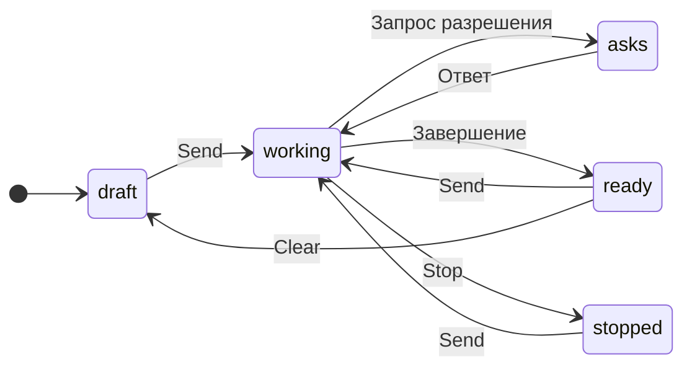

# Codex в приложении для компьютера

## Зачем

Сейчас разговор в GeckIt может вести только Claude Code. Добавляем Codex из установленного CLI, с входом через ChatGPT и сохранением разговоров самим Codex.

## Поверхности

Настройки получают отдельную вкладку Assistants с независимыми флажками Claude Code и Codex. По умолчанию включены оба. Последний включенный флажок нельзя снять. Выключение скрывает разговоры этого провайдера в списке, на доске, в вопросах, поиске и скрытых разговорах, но сохраняет историю, черновики и уже запущенную работу. Открытый разговор выключенного провайдера закрывается. Если выключен провайдер нового разговора, новый использует оставшийся.

Разговоры Codex, начатые вне GeckIt, остаются в Hidden, пока человек не нажмет Show on the board. При первом чтении импортированного разговора GeckIt берет исходный Claude id из `external_agent_session_imports.json` и переносит видимость, заголовок и статус исходного разговора, не перенося модель Claude. Последующие Hide и Show не перезаписываются импортом.

Если локальный Codex daemon уже работает, GeckIt подключается по WebSocket к его Unix control socket. Это позволяет продолжать разговоры на том же backend без второго writer. Если daemon нет, GeckIt запускает свой stdio app-server. Остановка GeckIt закрывает соединение и не останавливает общий daemon. Принудительное отнятие lock у отдельного приложения не поддерживается. Создание и продолжение требуют входа через ChatGPT; daemon с API key не используется для отправки сообщений.

Когда включены оба, значок провайдера появляется рядом с названием каждого разговора и в заголовке открытого разговора. При одном включенном значки и выбор Assistant в новом разговоре скрыты. Для удаленного проекта Claude доступен только если включен; Codex остается локальным.

В разговоре Codex рядом с моделью появляется Reasoning: Default и уровни из каталога выбранной модели. Выбор запоминается для разговора и новых разговоров и действует со следующего сообщения, включая сообщения в очереди. При смене модели недоступный уровень возвращается к Default. Нижняя строка показывает окна квоты, их расход и время сброса, полученные от Codex; неизвестные окна и времена не придумываются. Значения обновляются при открытии, возврате фокуса, периодически и по уведомлению CLI.

Default в селекторе показывает уровень модели, например Default (Low). В строке под разговором отдельно показан Reasoning: High из reasoningEffort, который сообщил Codex. Для загруженного разговора это текущая настройка, для незагруженного - последняя сохраненная. После принятия нового сообщения GeckIt перечитывает настройку через thread/read. Это уровень настройки разговора, а не измерение рассуждений на каждом токене. Если CLI не сообщает уровень, отдельная подпись не показывается.

Следующее сообщение по умолчанию сохраняет reasoning текущего разговора: сохраненный High показан как High в селекторе и используется при продолжении. Отсутствие выбора в вызове backend не передает effort и оставляет настройку Codex. Явный выбор Default передается отдельно как пустая строка, сохраняется в заметке и устанавливает defaultReasoningEffort выбранной модели. Новые разговоры используют выбранную настройку для новых разговоров.

Рядом с текущим reasoning показана Model из ответа Codex. Название берется из каталога, а полный id остается в подсказке; неизвестный id показывается как есть. При открытии существующего разговора селектор следующего сообщения берет его сохраненную модель, если для разговора не выбран override. Выбор другой модели в селекторе не меняет подпись текущей до ответа Codex. Backend использует модель из thread/start или thread/resume и обновляет ее из thread/read после принятия сообщения, а не выдает запрошенный alias за фактическую модель.

Статус работающего разговора на доске и в переключателе называет его провайдера: "Codex is working" для Codex, "Claude is working" для Claude Code. Тот же выбор действует для строки ожидания помощников.

В формах New task и Ask можно выбрать Model; для Codex рядом доступен Reasoning с уровнями выбранной модели. Каталог берется для провайдера и проекта формы, независимо от открытого разговора. Последний выбор сохраняется в общих настройках отдельно для моделей Claude Code и Codex, используется в обеих формах и переживает перезапуск. При смене модели поддерживаемый уровень сохраняется, неподдерживаемый возвращается к Default. Управление доступно и на телефоне; короткое окно компьютера прокручивает форму, чтобы кнопка Start или Ask оставалась доступна.

| Выбрано | Разговоры | Значки | Assistant |
|---|---|---|---|
| Claude Code и Codex | Оба провайдера | Видны | Выбор в новом разговоре |
| Claude Code | Только Claude Code | Скрыты | Скрыт |
| Codex | Только Codex | Скрыты | Скрыт |

| Где | Что добавляется |
|---|---|
| Новый разговор, поле сообщения | Выбор Claude Code или Codex перед режимом и моделью |
| Открытый разговор | Имя выбранного провайдера; смена возможна в новом разговоре |
| Меню модели | Модели выбранного CLI; для каждого провайдера свой последний выбор |
| Строка состояния | Аккаунт выбранного провайдера; показатели Claude не появляются у Codex |
| Карточки разрешений | Запросы Codex на команды, запись файлов и ответы на вопросы |
| Список разговоров | Разговоры обоих CLI из локальных папок проекта; скрытые разговоры Codex можно вернуть |
| Поиск | Текст сообщений и ответов Codex; инструментальные выводы не индексируются |

## Состояния и переходы

| Состояние | Когда | Что видно | Действие |
|---|---|---|---|
| Новый | Нажали Clear или New task | Выбор провайдера | Выбрать, написать и отправить |
| Работает | Отправили сообщение | "Working" | Дождаться ответа или Stop |
| Требует разрешения | CLI запросил действие | Команда или файлы и существующие кнопки разрешения | Разрешить один раз, на разговор или отказать |
| Требует ответа | CLI задал вопросы | Один вопрос за раз | Выбрать или написать ответ |
| Готов | CLI завершил ход, автоматически | Ответ | Отправить следующее сообщение |
| Остановлен | Нажали Stop | "Stopped" | Отправить следующее сообщение |
| Нет входа | Codex не вошел через ChatGPT | "Nobody is signed in. Run codex login in a terminal." | Войти в терминале и проверить снова |

Провайдер сохраняется с разговором. При повторном открытии, очереди, продолжении после перезапуска и переходе в терминал используется тот же CLI. Выбор модели влияет на следующий ход. Manual у Codex запрашивает разрешения на недоверенные команды; Auto выполняет работу в sandbox с разрешениями по запросу; Plan использует sandbox только для чтения.

По запросу "Remove remote button at all" кнопка Remote Control, ее меню и диалог ошибки удалены для всех разговоров, включая Claude.

## Что молчит

Соединение с app-server и восстановление метаданных не добавляют уведомлений. Отдельные процессы, JSON-RPC и идентификаторы провайдера не появляются в поле сообщения.

## Пороги и время

Запросы к локальному CLI ждут 30 секунд, затем показывают ошибку и дают повторить. Это ограничение соединения и управляющих запросов; работающий ход не имеет такого срока. Очередь использует общий лимит разговоров GeckIt.

## Формулировки

Выбор провайдера: "Claude Code", "Codex". Провайдер открытого разговора виден тем же словом. Модель без выбора: "Default". Разрешения и вопросы используют существующие карточки.

## Краевые случаи

Старые разговоры и настройки принадлежат Claude. Модель Claude не передается Codex. Отказ и Stop возвращаются CLI. Обрыв app-server завершает работающие ходы с ошибкой, а история остается у Codex. Повторное открытие берет историю через CLI; изображения отправляются вместе с текстом. Разговоры из терминала появляются в том же списке. В новой задаче из очереди сохраняется провайдер исходной задачи.

## Чего намеренно нет

Codex через SSH: текущий удаленный запуск и восстановление относятся к Claude. Для удаленной папки доступен Claude. Correct и Whisper сохраняют существующее поведение. Вход через OAuth в самом GeckIt не добавляется: пользователь входит установленным CLI.

Цели, Remote Control, управление фоновыми задачами Claude, его меню MCP и Chrome не добавляются Codex. Его настроенные MCP-инструменты выполняет сам CLI, вызовы видны в разговоре. Строка состояния Codex показывает план ChatGPT и версию CLI; квоты Claude к нему не относятся.

## Развилки

Используем app-server: он предоставляет историю, поток ответа и интерактивные разрешения. Запуск codex exec потребовал бы отдельной реализации разрешений. Не переключаем провайдера посреди истории: у каждого CLI свой формат и контекст.

## Сверка

Запрос "check code base and add support for codex in desktop app" закрывается локальными разговорами, выбором провайдера и модели, потоком ответа, разрешениями, остановкой, восстановлением и продолжением в терминале.

## Проверки

Нативный Codex 0.159.3: вход через ChatGPT, каталог моделей с уровнями reasoning, реальные окна квоты, список и история существующих разговоров, создание нового разговора, поток ответа, сохранение, поиск, возобновление и следующий ход в режиме Plan. Отдельная проверка продолжает тот же разговор через второе соединение с daemon, пока первое соединение остается открытым. Тестовые разговоры создаются в `/private/tmp` и удаляются после проверки. Изолированный Electron с тестовыми данными проверяет вкладку Assistants, отключение каждого провайдера, скрытие значков при одном провайдере, восстановление при включении обоих, выбор reasoning, квоту в статусе и отсутствие ошибок окна. В запущенном GeckIt Local сверены 49 импортированных разговоров: 45 видимы, 4 скрыты, расхождений с исходными заметками Claude нет.

Нативный daemon подтвердил reasoningEffort high после первого хода и сохранил high после продолжения без нового выбора. Явный выбор Default переключил его на low.

531 тест, typecheck, lint и сборки desktop и mobile проходят. Повторная проверка Electron показывает High в строке текущего reasoning и в селекторе следующего сообщения. Проверка модели показывает GPT-6.1-Sol в текущем статусе и в селекторе при отличающейся глобальной настройке; выбор Other model меняет только селектор до отправки. Нативное чтение 32 разговоров проекта подтверждает id gpt-6.1-sol. В общем checkout также исправлены типизация optional status/title и проверка отсутствующего backup в тестах параллельной миграции, а также type-only import ее CLI-теста.

No performance problems found.

Ревью по `docs/performance.md`: три пункта не затронуты: выделение под указателем и два пункта об анимациях. Измерение выполнено пассивно в видимом GeckIt Local, без кликов или ввода в пользовательское окно. На доске 281 карточка. После мемоизации значка за 20 секунд выполнен один вызов Card и не зарегистрировано вызовов ProviderIcon. Это проверка поведения текущей сборки, а не сравнение времени до и после изменения при одинаковой активности.

| Пункт | Вердикт | Где | Что проверено |
|---|---|---|---|
| Компоненты на каждый разговор мемоизированы | holds | `ProviderIcon.tsx`, `Board.tsx`, `Sidebar.tsx`, `Switcher.tsx`, `PhoneBoard.tsx` | Значок мемоизирован по id; строки получают showProviders, сравнение карточек и телефона учитывает это значение |
| Обработчики читают актуальное состояние | holds | `useChat.ts`, `Board.tsx` | `send`, `ask` и `startTask` читают провайдера и настройки из `held`; обработчики строк сохраняют `latest` |
| Нет общей работы на каждую строку | holds | `ProviderIcon.tsx`, `useChat.ts` | Значок проверяет префикс одного id; список разрешенных провайдеров фильтруется до рисования строк |
| Неизмененные объекты сохраняют идентичность | holds | `useChat.ts` | `sameAsBefore` сохраняет объект с тем же сериализованным содержимым, включая провайдера |
| Длинные списки сохраняют отсечение вне экрана | holds | `styles.css` | content-visibility и contain-intrinsic-size существующих карточек и строк сохранены |
| Форматтер не создается на каждый вызов | holds | `Status.tsx` | Форматтер времени сброса Codex создан на уровне модуля |
| Фильтрация разговоров находится в useMemo | holds | `useChat.ts`, `HiddenChats.tsx`, `PhoneSettings.tsx` | Фильтры зависят от списка и включенных провайдеров |
| Ввод не вызывает новую работу на каждую строку | holds | `Board.tsx`, `Composer.tsx` | Сравнение карточек учитывает только показываемые значения; фильтры не пересчитываются на ввод |
| Измерено в работающем приложении | holds | GeckIt Local | 281 видимая карточка; 20 секунд precise coverage без синтетического ввода |
| Телефон пересобран | holds | `mobile/` | Общие исходники Chat проверяются сборкой Vite |

Повторное performance-review изменения модели: No performance problems found. Девять пунктов не затронуты. Изменение добавляет одну подпись в статус открытого разговора; новых списков, карточек, hover и анимаций нет, поэтому повторное измерение не требуется.

Проверка форм New task и Ask в изолированном Electron: выбранные Model и Reasoning доходят до отправки, повторное открытие обеих форм и перезагрузка окна сохраняют последний выбор, смена Assistant заменяет каталог, смена модели убирает неподдерживаемый reasoning. Typecheck, lint и сборки desktop/mobile проходят. Performance-review форм: No performance problems found. Каталог запрашивается при смене провайдера или проекта, не при вводе текста. Новых строк на каждый разговор, фильтрации всех разговоров и анимаций нет; существующая мемоизация карточек не меняется, повторное измерение не требуется.

| Пункт | Вердикт | Где | Что проверено |
|---|---|---|---|
| Неизмененные объекты сохраняют идентичность | holds | `useChat.ts` | Используется существующее поле model, sameAsBefore сохраняет неизмененные строки |
| Нет форматтера на каждый вызов | holds | `Status.tsx` | Название выбирается из готового каталога, Intl не добавлен |
| Ввод не вызывает новую работу на каждую строку | holds | `Status.tsx`, `useChat.ts` | Одна проверка модели и поиск в коротком каталоге для открытого разговора, без обхода разговоров |
| Телефон пересобран | holds | `mobile/` | Сборка после изменения общих Chat источников прошла |
