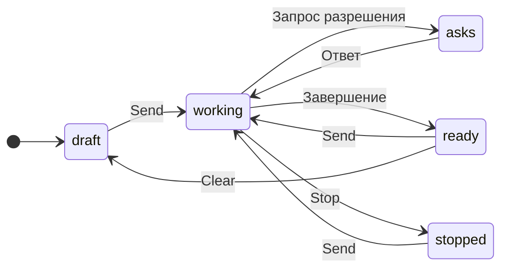
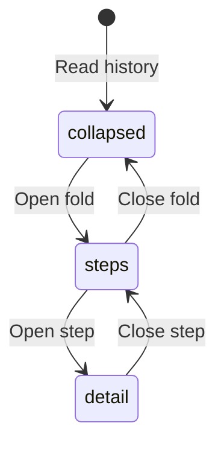

# Codex в приложении для компьютера

## Зачем

Сейчас разговор в GeckIt может вести только Claude Code. Добавляем Codex из установленного CLI, с входом через ChatGPT и сохранением разговоров самим Codex.

## Поверхности

Настройки получают отдельную вкладку Assistants с двумя строками Claude Code и Codex в общей рамке. В каждой строке указана подписка, справа расположен переключатель; нажатие на всю строку меняет выбор. Заголовок поясняет, что выбор действует для Chat, Correct и Shortcuts. Под списком кратко сказано о скрытии разговоров, паузе shortcuts и необходимости оставить одного ассистента. По умолчанию включены оба. Последний включенный переключатель нельзя выключить. Выключение скрывает разговоры этого провайдера в списке, на доске, в вопросах, поиске и скрытых разговорах, но сохраняет историю, черновики и уже запущенную работу. Открытый разговор выключенного провайдера закрывается. Если выключен провайдер нового разговора, новый использует оставшийся.

Разговоры Codex, начатые вне GeckIt, остаются в Hidden, пока человек не нажмет Show on the board. При первом чтении импортированного разговора GeckIt берет исходный Claude id из `external_agent_session_imports.json` и переносит видимость, заголовок и статус исходного разговора, не перенося модель Claude. Импорт сохраняет членство на доске только по исходным `here` или `shown`; отсутствие исходной заметки или заметка только о просмотре не добавляет разговор в задачи. Уже скрытые разговоры остаются скрытыми. Последующие Hide и Show не перезаписываются ни автоматическим импортом, ни повторной миграцией метаданных. Новых элементов и формулировок нет: внешний разговор доступен в Hidden как "Started by another app", действие "Show on the board" добавляет его на доску, Hide возвращает в Hidden. Проверка происходит при чтении списка, без нового таймера или уведомления.

Проверка импорта, 2026-10-05: реальные Board и HiddenChats со стилями GeckIt проверены в Chrome на данных из `importedNote`, в светлой и темной темах, при 1568 x 906 и 900 x 600. Внешние и только просмотренные разговоры отсутствуют на доске; исходные задачи и явно добавленные разговоры остаются. Проверены Show через Enter, Hide из меню, закрытие через Escape, фокус, прокрутка и отсутствие горизонтального переполнения. Снимок: `/private/tmp/geckit-import-review/light-hidden.png`. Доступ Computer Use к GeckIt Local отклонен автоматической проверкой: "Computer Use was not approved to use GeckIt Local"; живую карточку и перезапуск приложения не меняли. Ранее ошибочно добавленную карточку можно убрать через Hide, ее текущий `shown` не сбрасывается автоматически, поскольку старые метаданные не отличают импорт от явного Show.

Если локальный Codex daemon уже работает, GeckIt подключается по WebSocket к его Unix control socket. Это позволяет продолжать разговоры на том же backend без второго writer. Если daemon нет, GeckIt запускает свой stdio app-server. Остановка GeckIt закрывает соединение и не останавливает общий daemon. Принудительное отнятие lock у отдельного приложения не поддерживается. Создание и продолжение требуют входа через ChatGPT; daemon с API key не используется для отправки сообщений.

Когда включены оба, небольшой приглушенный значок провайдера появляется в правом нижнем углу карточки на доске; в списках и заголовке открытого разговора используется тот же значок размером 12px. При одном включенном значки и выбор Assistant в новом разговоре скрыты. Для удаленного проекта Claude доступен только если включен; Codex остается локальным.

В разговоре Codex рядом с моделью появляется Reasoning: Default и уровни из каталога выбранной модели. Выбор запоминается для разговора и новых разговоров и действует со следующего сообщения, включая сообщения в очереди. При смене модели недоступный уровень возвращается к Default. Нижняя строка показывает окна квоты, их расход и время сброса, полученные от Codex; неизвестные окна и времена не придумываются. Значения обновляются при открытии, возврате фокуса, периодически и по уведомлению CLI.

Default в селекторе показывает уровень модели, например Default (Low). В строке под разговором отдельно показан Reasoning: High из reasoningEffort, который сообщил Codex. Для загруженного разговора это текущая настройка, для незагруженного - последняя сохраненная. После принятия нового сообщения GeckIt перечитывает настройку через thread/read. Это уровень настройки разговора, а не измерение рассуждений на каждом токене. Если CLI не сообщает уровень, отдельная подпись не показывается.

Следующее сообщение по умолчанию сохраняет reasoning текущего разговора: сохраненный High показан как High в селекторе и используется при продолжении. Отсутствие выбора в вызове backend не передает effort и оставляет настройку Codex. Явный выбор Default передается отдельно как пустая строка, сохраняется в заметке и устанавливает defaultReasoningEffort выбранной модели. Новые разговоры используют выбранную настройку для новых разговоров.

Рядом с текущим reasoning показана Model из ответа Codex. Название берется из каталога, а полный id остается в подсказке; неизвестный id показывается как есть. При открытии существующего разговора селектор следующего сообщения берет его сохраненную модель, если для разговора не выбран override. Выбор другой модели в селекторе не меняет подпись текущей до ответа Codex. Backend использует модель из thread/start или thread/resume и обновляет ее из thread/read после принятия сообщения, а не выдает запрошенный alias за фактическую модель.

Статус работающего разговора на доске и в переключателе называет его провайдера: "Codex is working" для Codex, "Claude is working" для Claude Code. Тот же выбор действует для строки ожидания помощников.

В формах New task и Ask можно выбрать Model; для Codex рядом доступен Reasoning с уровнями выбранной модели. Каталог берется для провайдера и проекта формы, независимо от открытого разговора. Последний выбор сохраняется в общих настройках отдельно для моделей Claude Code и Codex, используется в обеих формах и переживает перезапуск. При смене модели поддерживаемый уровень сохраняется, неподдерживаемый возвращается к Default. Управление доступно и на телефоне; короткое окно компьютера прокручивает форму, чтобы кнопка Start или Ask оставалась доступна.

Model и Reasoning следующего сообщения в Composer сохраняются отдельно от метаданных текущего хода, по id разговора, пока окно открыто. Обновления streaming не возвращают селекторы к текущей модели или reasoning. Переключение между разговорами сохраняет выбор каждого; сообщение в очереди получает выбранные значения. Нижняя строка продолжает показывать фактические Model и Reasoning текущего хода. После отправки и перезапуска сохраненная настройка разговора берется из backend.

В Shortcuts каждый сохраненный prompt имеет свой Assistant и Model; для Codex доступен Reasoning из каталога выбранной модели. Новая заготовка берет последние настройки новых разговоров. Save as a shortcut сохраняет провайдера исходного разговора, выбранную или фактическую модель и текущий reasoning. Старые shortcuts без provider продолжают использовать Claude Code. Выбор остается в самом shortcut, поэтому ручной запуск и расписание используют одни значения.

Если ассистент shortcut отключен в Settings, Run в списке и меню bar недоступен; расписание пропускает запуск и не подменяет ассистента другим. Сохраненный shortcut остается доступен для редактирования и снова запускается после включения ассистента. Codex работает только с локальными папками. Goal доступен для обоих ассистентов; Codex получает его через нативный протокол до первого хода. При смене Assistant подставляется модель нового провайдера, при смене модели неподдерживаемый reasoning возвращается к Default.

В окне Correct доступны Claude Code и Codex из включенных в Settings ассистентов. При двух включенных Assistant можно выбрать внизу окна; при одном остается подпись выбранного ассистента. Выбор запоминается отдельно от Chat. Каталог Model запрашивается только при открытии меню; последняя модель сохраняется отдельно для Claude и Codex. Если выбранный ассистент отключен, Correct использует оставшегося и его модель. Проверка действует и в main, поэтому устаревший запрос окна не запускает отключенный CLI.

Каждая коррекция Codex идет через вход ChatGPT в новый временный thread, который не сохраняется в истории и не появляется на доске. Рабочая папка временная, sandbox только для чтения, shell и web search выключены. Reasoning каждого запроса явно выбирается как минимальный поддерживаемый уровень фактической модели из каталога; для GPT-6-Luna это Low. Выбор действует и для Default или alias, независимо от глобальных настроек Codex и reasoning в Chat. Если каталог не сообщает уровни модели, запрос использует Low. Коррекции ждут друг друга; ответ без commentary заменяет исходный текст и копируется как прежде. Через 90 секунд активный ход прерывается, окно показывает ошибку и позволяет повторить.

| Выбрано | Разговоры | Значки | Assistant |
|---|---|---|---|
| Claude Code и Codex | Оба провайдера | Видны | Выбор в новом разговоре |
| Claude Code | Только Claude Code | Скрыты | Скрыт |
| Codex | Только Codex | Скрыты | Скрыт |

| Где | Что добавляется |
|---|---|
| Новый разговор, поле сообщения | Выбор Claude Code или Codex перед режимом и моделью |
| Открытый разговор | Имя выбранного провайдера; смена возможна в новом разговоре |
| Меню модели | Модели выбранного CLI; для каждого провайдера свой последний выбор |
| Строка состояния | Аккаунт выбранного провайдера; показатели Claude не появляются у Codex |
| Карточки разрешений | Запросы Codex на команды, запись файлов и ответы на вопросы |
| Список разговоров | Разговоры обоих CLI из локальных папок проекта; скрытые разговоры Codex можно вернуть |
| Поиск | Текст сообщений и ответов Codex; инструментальные выводы не индексируются |

## Состояния и переходы

| Состояние | Когда | Что видно | Действие |
|---|---|---|---|
| Новый | Нажали Clear или New task | Выбор провайдера | Выбрать, написать и отправить |
| Работает | Отправили сообщение | "Working" | Дождаться ответа или Stop |
| Требует разрешения | CLI запросил действие | Команда или файлы и существующие кнопки разрешения | Разрешить один раз, на разговор или отказать |
| Требует ответа | CLI задал вопросы | Один вопрос за раз | Выбрать или написать ответ |
| Готов | CLI завершил ход, автоматически | Ответ | Отправить следующее сообщение |
| Остановлен | Нажали Stop | "Stopped" | Отправить следующее сообщение |
| Нет входа | Codex не вошел через ChatGPT | "Nobody is signed in. Run codex login in a terminal." | Войти в терминале и проверить снова |

Провайдер сохраняется с разговором. При повторном открытии, очереди, продолжении после перезапуска и переходе в терминал используется тот же CLI. Выбор модели влияет на следующий ход. Manual у Codex запрашивает разрешения на недоверенные команды; Auto выполняет работу в sandbox с разрешениями по запросу; Plan использует sandbox только для чтения.

По запросу "Remove remote button at all" кнопка Remote Control, ее меню и диалог ошибки удалены для всех разговоров, включая Claude.

## Что молчит

Соединение с app-server и восстановление метаданных не добавляют уведомлений. Отдельные процессы, JSON-RPC и идентификаторы провайдера не появляются в поле сообщения.

## Imported transcript tool records

### Purpose and surfaces

Claude conversations imported by Codex encode historical tool calls and results inside assistant messages. The transcript currently displays their transport markers and question JSON as prose. Opening an imported conversation on desktop or phone must show the existing expandable steps instead. This repairs transcript presentation; it adds no new controls or actions.

### States

| State | When | What is shown | Action |
|---|---|---|---|
| Collapsed history | A complete imported call is read | Existing "1 step" / "N steps" fold | Open the fold |
| Tool step | The fold is open | Existing tool summary, such as "Ran npm test" or "Read package.json" | Open the step to inspect input and output |
| Historical question | An imported AskUserQuestion call is read | "Asked: <first question>"; all questions and choices in the expandable detail | Read it; send a new message to continue the conversation |
| Result without a call | A page starts with an imported result, or the call is missing | "Imported tool result" with expandable output | Read the output |
| Unrecognized record | A wrapper is incomplete or malformed | Original message text | Read or copy the original |

### Transitions

| From | Event | To | What is shown |
|---|---|---|---|
| Saved conversation | History loads, automatically | Collapsed history | Existing step count; surrounding prose stays in order |
| Collapsed history | Click or keyboard-activate the fold | Tool steps | Completed summaries, with no running indicator |
| Tool steps | Click or keyboard-activate a step | Detail | Original input and paired result, or readable historical questions and choices |
| Detail | Activate the step again | Tool steps | Summary only |
| Tool steps | Activate the fold again | Collapsed history | Existing step count |

### Silence, timing and wording

Complete `[external_agent_tool_call: ...]` and `[external_agent_tool_result]` wrappers are presentation metadata and do not appear as prose. The standalone `<EXTERNAL SESSION IMPORTED>` boundary is silent. A result is attached only to the immediately preceding imported call; otherwise it remains a separate result step. No matching by guessed tool name or output content.

No timers or numeric thresholds are added. Existing transcript paging and step folding apply. Tool wording reuses the Claude tool summaries. Fallback wording is "Used <tool>", "Asked you a question" for question input that cannot be decoded, and "Imported tool result" for an orphan result.

### Edge cases and decisions

- Multiple calls, results and prose inside one assistant message keep their order and deterministic IDs. A user message or native tool step prevents result pairing across it.
- Calls without results remain historical steps. They never become pending approvals, unanswered question cards or live work.
- Invalid question JSON remains available in the expandable detail. Unknown tools keep their name and input.
- Empty results and multiline output are retained. An incomplete wrapper remains original prose.
- Wrappers in fenced code examples and all user-authored message text remain literal. Only assistant history is decoded; live streaming is unchanged.
- Reopening does not modify Codex's files, execute tools, or send answers. Phone history uses the same normalized items and existing step grouping.

The chosen presentation uses existing step rows, rather than new historical approval cards: imported records have no live request to answer. This covers Alex's 2026-10-06 request to implement and push the raw imported-tool-text fix. It extends the existing Codex transcript behavior and requires no new feature-list entry.

Verification, 2026-10-06: the actual screenshot conversation was normalized from its saved import and rendered with GeckIt's Transcript and stylesheet in an isolated browser preview. Full-screen light/dark review at 1352 x 618 and phone-sized light/dark review at 390 x 844 covered collapsed steps, expanded call/output, both questions and descriptions, Enter to expand/collapse, visible focus and long-detail scrolling. No page-level horizontal overflow. The installed app and phone app were not restarted or deployed for this check. Renderer and shared UI code are unchanged; the performance checklist has no touched component, formatter, animation or callback items. Native streaming remains unchanged, and normalization runs only when history is read.

Validation: 626 tests pass with one worker, including import decoding and app-server history integration; typecheck, exact `npm run lint`, desktop build and Mermaid rendering pass. The existing settings file-watcher test timed out in one concurrent suite run and passed in the earlier run and the final serial run.

## Пороги и время

Запросы к локальному CLI ждут 30 секунд, затем показывают ошибку и дают повторить. Это ограничение соединения и управляющих запросов; работающий ход не имеет такого срока. Очередь использует общий лимит разговоров GeckIt.

## Формулировки

Выбор провайдера: "Claude Code", "Codex". Провайдер открытого разговора виден тем же словом. Модель без выбора: "Default". Разрешения и вопросы используют существующие карточки.

## Краевые случаи

Старые разговоры и настройки принадлежат Claude. Модель Claude не передается Codex. Отказ и Stop возвращаются CLI. Обрыв app-server завершает работающие ходы с ошибкой, а история остается у Codex. Повторное открытие берет историю через CLI; изображения отправляются вместе с текстом. Разговоры из терминала появляются в том же списке. В новой задаче из очереди сохраняется провайдер исходной задачи.

## Чего намеренно нет

Codex через SSH: текущий удаленный запуск и восстановление относятся к Claude. Для удаленной папки доступен Claude. Whisper сохраняет существующее поведение. Вход через OAuth в самом GeckIt не добавляется: пользователь входит установленным CLI.

Цели, Remote Control, управление фоновыми задачами Claude, его меню MCP и Chrome не добавляются Codex. Его настроенные MCP-инструменты выполняет сам CLI, вызовы видны в разговоре. Строка состояния Codex показывает план ChatGPT и версию CLI; квоты Claude к нему не относятся.

## Развилки

Используем app-server: он предоставляет историю, поток ответа и интерактивные разрешения. Запуск codex exec потребовал бы отдельной реализации разрешений. Не переключаем провайдера посреди истории: у каждого CLI свой формат и контекст.

## Сверка

Запрос "check code base and add support for codex in desktop app" закрывается локальными разговорами, выбором провайдера и модели, потоком ответа, разрешениями, остановкой, восстановлением и продолжением в терминале.

## Проверки

Нативный Codex 0.159.3: вход через ChatGPT, каталог моделей с уровнями reasoning, реальные окна квоты, список и история существующих разговоров, создание нового разговора, поток ответа, сохранение, поиск, возобновление и следующий ход в режиме Plan. Отдельная проверка продолжает тот же разговор через второе соединение с daemon, пока первое соединение остается открытым. Тестовые разговоры создаются в `/private/tmp` и удаляются после проверки. Изолированный Electron с тестовыми данными проверяет вкладку Assistants, отключение каждого провайдера, скрытие значков при одном провайдере, восстановление при включении обоих, выбор reasoning, квоту в статусе и отсутствие ошибок окна. В запущенном GeckIt Local сверены 49 импортированных разговоров: 45 видимы, 4 скрыты, расхождений с исходными заметками Claude нет.

Нативный daemon подтвердил reasoningEffort high после первого хода и сохранил high после продолжения без нового выбора. Явный выбор Default переключил его на low.

544 теста, typecheck, lint и сборки desktop и mobile проходят. Повторная проверка Electron показывает High в строке текущего reasoning и в селекторе следующего сообщения. Проверка модели показывает GPT-6.1-Sol в текущем статусе и в селекторе при отличающейся глобальной настройке; выбор Other model меняет только селектор до отправки. Нативное чтение 32 разговоров проекта подтверждает id gpt-6.1-sol. В общем checkout также исправлены типизация optional status/title и проверка отсутствующего backup в тестах параллельной миграции, а также type-only import ее CLI-теста.

No performance problems found.

Ревью по `docs/performance.md`: три пункта не затронуты: выделение под указателем и два пункта об анимациях. Измерение выполнено пассивно в видимом GeckIt Local, без кликов или ввода в пользовательское окно. На доске 281 карточка. После мемоизации значка за 20 секунд выполнен один вызов Card и не зарегистрировано вызовов ProviderIcon. Это проверка поведения текущей сборки, а не сравнение времени до и после изменения при одинаковой активности.

| Пункт | Вердикт | Где | Что проверено |
|---|---|---|---|
| Компоненты на каждый разговор мемоизированы | holds | `ProviderIcon.tsx`, `Board.tsx`, `Sidebar.tsx`, `Switcher.tsx`, `PhoneBoard.tsx` | Значок мемоизирован по id; строки получают showProviders, сравнение карточек и телефона учитывает это значение |
| Обработчики читают актуальное состояние | holds | `useChat.ts`, `Board.tsx` | `send`, `ask` и `startTask` читают провайдера и настройки из `held`; обработчики строк сохраняют `latest` |
| Нет общей работы на каждую строку | holds | `ProviderIcon.tsx`, `useChat.ts` | Значок проверяет префикс одного id; список разрешенных провайдеров фильтруется до рисования строк |
| Неизмененные объекты сохраняют идентичность | holds | `useChat.ts` | `sameAsBefore` сохраняет объект с тем же сериализованным содержимым, включая провайдера |
| Длинные списки сохраняют отсечение вне экрана | holds | `styles.css` | content-visibility и contain-intrinsic-size существующих карточек и строк сохранены |
| Форматтер не создается на каждый вызов | holds | `Status.tsx` | Форматтер времени сброса Codex создан на уровне модуля |
| Фильтрация разговоров находится в useMemo | holds | `useChat.ts`, `HiddenChats.tsx`, `PhoneSettings.tsx` | Фильтры зависят от списка и включенных провайдеров |
| Ввод не вызывает новую работу на каждую строку | holds | `Board.tsx`, `Composer.tsx` | Сравнение карточек учитывает только показываемые значения; фильтры не пересчитываются на ввод |
| Измерено в работающем приложении | holds | GeckIt Local | 281 видимая карточка; 20 секунд precise coverage без синтетического ввода |
| Телефон пересобран | holds | `mobile/` | Общие исходники Chat проверяются сборкой Vite |

Повторное performance-review изменения модели: No performance problems found. Девять пунктов не затронуты. Изменение добавляет одну подпись в статус открытого разговора; новых списков, карточек, hover и анимаций нет, поэтому повторное измерение не требуется.

Проверка форм New task и Ask в изолированном Electron: выбранные Model и Reasoning доходят до отправки, повторное открытие обеих форм и перезагрузка окна сохраняют последний выбор, смена Assistant заменяет каталог, смена модели убирает неподдерживаемый reasoning. Typecheck, lint и сборки desktop/mobile проходят. Performance-review форм: No performance problems found. Каталог запрашивается при смене провайдера или проекта, не при вводе текста. Новых строк на каждый разговор, фильтрации всех разговоров и анимаций нет; существующая мемоизация карточек не меняется, повторное измерение не требуется.

| Пункт | Вердикт | Где | Что проверено |
|---|---|---|---|
| Неизмененные объекты сохраняют идентичность | holds | `useChat.ts` | Используется существующее поле model, sameAsBefore сохраняет неизмененные строки |
| Нет форматтера на каждый вызов | holds | `Status.tsx` | Название выбирается из готового каталога, Intl не добавлен |
| Ввод не вызывает новую работу на каждую строку | holds | `Status.tsx`, `useChat.ts` | Одна проверка модели и поиск в коротком каталоге для открытого разговора, без обхода разговоров |
| Телефон пересобран | holds | `mobile/` | Сборка после изменения общих Chat источников прошла |

Проверка Correct: реальный Codex вернул "The cat is sleepy." без сохраненного разговора. Изолированный Electron подтвердил выбор Codex, его каталог Model, отправку выбранной модели и переключение на оставшегося ассистента при отключении каждого провайдера. Тесты проверяют маршрутизацию моделей, временные threads, очередь, отказ при входе через API key, таймаут и повторную коррекцию после него.

Performance-review Correct: No performance problems found. Двенадцать пунктов не затронуты: нет новых компонентов на каждый разговор, длинных списков, форматтеров, hover и анимаций; Chat и телефон не менялись. Ввод пересчитывает только два ассистента и короткий каталог моделей окна, не запрашивает CLI и не обходит разговоры. Повторное измерение не требуется.

| Пункт | Вердикт | Где | Что проверено |
|---|---|---|---|
| Ввод не вызывает новую работу на каждую строку | holds | `panel/Correct.tsx` | Каталог запрашивается только при открытии меню; изменения текста не обходят список разговоров |

Performance-review расположения значков: No performance problems found. Девять пунктов не затронуты. Изолированный Electron проверил длинные заголовки, карточку без текста ответа и карточку с дочерними разговорами: значок 12px стоит справа внизу, последняя строка оставляет для него 20px. Typecheck, lint и сборки desktop/mobile проходят.

| Пункт | Вердикт | Где | Что проверено |
|---|---|---|---|
| Компоненты на каждый разговор мемоизированы | holds | `Board.tsx`, `ProviderIcon.tsx` | Перестановка значка не меняет props и сравнение Card; ProviderIcon сохраняет memo по id |
| Длинные списки сохраняют отсечение вне экрана | holds | `styles.css` | content-visibility и contain-intrinsic-size сохранены, абсолютный значок остается внутри карточки |
| Измерено в работающем приложении | holds | GeckIt Local | 349 карточек, 20 секунд пассивного precise coverage в видимом окне; вызовы ProviderIcon не зарегистрированы, это проверка после изменения, не сравнение времени до и после |
| Телефон пересобран | holds | `mobile/` | Общий ProviderIcon проверен сборкой телефона |

Проверка первоначальной интеграции Shortcuts: 544 теста проходили, в том числе ручной запуск и расписание Codex с выбранными Model и Reasoning, явный Default, сохранение старых Claude shortcuts, пропуск отключенных ассистентов и Codex на SSH. Позднее Goal добавлен для Codex. Изолированный Electron подтвердил выбор обоих ассистентов, смену каталогов, сброс неподдерживаемого reasoning, сохранение после открытия и перезагрузки окна, восстановление отключенного shortcut через смену Assistant, Save as a shortcut с текущими Model и Reasoning и доступность Save в коротком окне.

Performance-review Shortcuts: No performance problems found. Одиннадцать пунктов не затронуты: новых карточек, результатов поиска, hover, форматтеров и анимаций нет. Повторное измерение не требуется.

| Пункт | Вердикт | Где | Что проверено |
|---|---|---|---|
| Ввод не вызывает новую работу на каждую строку | holds | `ShortcutList.tsx` | Каталог редактора зависит только от проекта, ассистента и его доступности; ввод prompt не запрашивает CLI и не обходит разговоры |
| Телефон пересобран | holds | `mobile/` | Общие Chat источники и ShortcutDraft проверены сборкой телефона |

Регрессия выбора Model и Reasoning: до исправления обновление chat:sessions возвращало выбранный Other model к GPT-6.1-Sol. После исправления изолированный Electron удерживает Other model и Low через три обновления работающего разговора; нижняя строка остается GPT-6.1-Sol и High. Отправка во время работы передает gpt-other и low, переход в другой разговор и обратно сохраняет выбор. 145 связанных тестов, typecheck, lint и сборки desktop/mobile проходят.

Performance-review выбора следующего сообщения: No performance problems found. Девять пунктов не затронуты; новых карточек, hover и анимаций нет, повторное измерение не требуется.

| Пункт | Вердикт | Где | Что проверено |
|---|---|---|---|
| Неизмененные объекты сохраняют идентичность | holds | `useChat.ts` | Выбор меняет отдельный Map, не переписывает объекты разговоров; sameAsBefore остается прежним |
| Обработчики читают актуальное состояние | holds | `useChat.ts` | send читает Model и Reasoning из held, обновляемого при каждом изменении выбора |
| Ввод не вызывает новую работу на каждую строку | holds | `useChat.ts` | Одно получение Map по id открытого разговора; Map копируется только при выборе в селекторе |
| Телефон пересобран | holds | `mobile/` | Общий useChat проверен сборкой телефона |

Проверка обновленной страницы Assistants: изолированный Electron подтвердил светлую и темную темы, отсутствие горизонтального переполнения и доступность Done в окне 720 на 520, нажатие на название строки и переключение клавишей Space. Отключение каждого ассистента скрывает его разговоры и значки, повторное включение восстанавливает их; последний переключатель недоступен. Typecheck, lint и сборки desktop/mobile проходят.

Performance-review страницы Assistants: No performance problems found. Двенадцать пунктов не затронуты. Две строки настроек не зависят от числа разговоров, не добавляют запросов CLI, фильтрации, форматтеров или анимаций. Повторное измерение не требуется.

| Пункт | Вердикт | Где | Что проверено |
|---|---|---|---|
| Телефон пересобран | holds | `mobile/` | Общий stylesheet проверен сборкой телефона |

Проверка reasoning коррекции: 46 связанных тестов проходят, включая неупорядоченные уровни, Minimal, None, модель Default и alias. Typecheck, lint и сборка desktop проходят. Реальный GPT-6-Luna подтвердил requested Low и actual Low через thread/read и вернул "The cat is sleepy.". GeckIt Local перезапущен с изменением. Изменение только в main, renderer не менялся.
