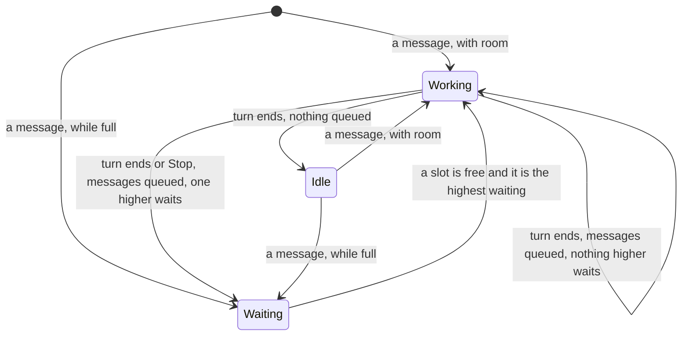

# UX: A limit on conversations working at once

## 1. Why

Every task Alex starts runs at once. With ten started in a morning, ten conversations work side by side: the plan's five-hour window runs out by noon, the machine is slow, and ten results arrive together for review. He wants to write tasks and messages down when he thinks of them, have them wait until fewer conversations are working, and decide by the order of the board which goes first.

## 2. What is added

| Surface | What appears | When seen |
|---|---|---|
| Settings, Chat (`SettingsDialog.tsx`), existing | "Conversations working at once": No limit, 1 to 10; 6 until changed | Always |
| Board, In progress column (`Board.tsx`), existing | The column keeps the order it is dragged into, with a line where a dragged card would land. The count in its head reads "2 of 3 working" when a limit is set. There is no separate queue: a conversation whose messages wait is a card like any other | Always |
| Card, existing | "Waiting for a slot" where "Claude is working" would stand, and "N queued" beside it | While its messages wait for a slot |
| Queued messages under the transcript, existing | "1 queued, waiting for a slot: 3 of 3 conversations working, the limit in Settings. The first goes when one of them stops." Each message can be changed or taken back as before | While they wait for a slot |
| Queued messages under the transcript, desktop and phone | When two or more messages wait, each row has a reorder handle. Drag a handle to place the message before or after another row; a line shows the landing place. With the handle focused, Up and Down move the message one place. The order changes immediately and is saved with the queue | While at least two messages wait |
| Composer, New task and Ask forms, existing | Send and Start read "Queue", with "3 of 3 working. This waits until one of them stops." | When the limit is full and the message would wait |
| Request block (`Request.tsx`), existing | A task started while full says "queued" on its row, and the head "Started 1, queued 1" | When a started task waits for a slot |
| Phone board, existing | "Waiting for a slot" on the row. In progress keeps the board's order, and a row held, then moved up or down, lifts and takes a new place there; held near the top or bottom it scrolls the list. In the bar beside the icons, a pill "2/6", green while one works and in the warning colour when full; pressing it picks the limit. Settings, New tasks, has "Working at once". A message queued for a slot says why on a line over the field, as the Mac's composer does | As on the card |

Nothing is kept apart from the conversations. A task started while full is a conversation at once, on the board, with its first message (and goal) queued inside it. It has no file in `~/.claude/projects` and no `claude` running until its first message goes; GeckIt keeps it in its notes so a restart does not lose it.

## 3. The rule

A conversation holds a slot only while Claude works in it. What the count says is what the cards say: "2 of 3 working" is two cards with "Claude is working".

When a job is done, GeckIt waits a random 3 to 10 seconds, then looks at the cards from the top of In progress and starts those with queued messages, as many as there is room for. Answering the conversation that just finished within that pause goes at once, since its slot is free.

A conversation waits for a slot when it has queued messages and no turn running. A free slot goes to the waiting conversation highest in In progress, as the board is ordered. When one gets a slot, its first queued message is sent.

Inside that conversation, queued messages go in the order shown. Moving a queued message only changes messages still waiting; it does not interrupt a running turn. A message already sent cannot be moved. If a queued message is sent or removed during a drag, dropping it makes no change.

Desktop and phone show a message in the transcript only after the host has assigned it to a turn. Pressing Send clears the draft as before; the host then confirms either the transcript item or the queued row. A message waiting behind active work or for a slot appears only in the queue, without briefly looking sent. The UI does not predict the host's decision: its working state or slot count may change while the request is in flight. Failed submission restores text and attachments to the draft with the existing error.

A turn that ends with messages of its own queued does not simply go on to its next message: after the pause the board is looked at from the top, and a conversation higher up with queued messages goes first. Pressing Stop is a job ending the same way.

The limit is for tasks. A general question asked with Ask is never counted and never waits.

Moving cards changes nothing by itself. The order only decides who takes the next free slot.

What needs Alex is drawn on top of In progress under "Needs you", the one waiting longest first: asking him, finished and unread, stopped by an error or the plan, or marked Blocked. Under it, "Working" holds what Claude or a command after ! is running now, so the cards that hold a slot are seen without scrolling. The rest follows under "In your order". A lifted card keeps its place in the order, which still holds every card, so lifting it changes nothing about who takes a slot. It goes back to its place once it no longer needs him, and one that is open stays on top until it is closed, so it does not move while he reads it. A card dragged lands among the ordered ones; there is no order inside "Needs you" or "Working". The phone draws the same three groups. A dot for a finished and unread conversation is blue, as Mail marks unread mail, not green, so green on the board always means working.

A turn that ended in an error leaves its queued messages for Alex; writing to it again makes them its own to send again. A conversation cut off by GeckIt closing keeps its queued messages until Continue, or until the next start sends them.

## 4. States

| State | When it happens | What Alex sees | What to do |
|---|---|---|---|
| No limit | "Conversations working at once" is No limit | Everything goes at once, as before | Nothing |
| Room | Fewer slots held than the limit | Send sends | Nothing |
| Full | As many slots held as the limit | Send reads "Queue", with why | Write; it waits |
| Waiting for a slot | A conversation has queued messages and no turn running, while full | The card and the transcript say "Waiting for a slot" | Drag the card higher to have it go sooner, or take the messages back |
| Slot freed | A turn ended | The highest waiting conversation starts working | Nothing |

## 5. Transitions

| From | Trigger | To | What changes |
|---|---|---|---|
| Idle | Alex writes, and slots are free | Working | As before |
| Idle | Alex writes, while full | Waiting | The message shows as queued, the card says "Waiting for a slot" |
| Working | Alex writes | Working | Queued behind the turn, as before |
| Working | The turn ends with nothing queued | Idle | The slot goes to the highest waiting conversation |
| Working | The turn ends, or Stop, with messages queued | Waiting, or Working | The highest waiting conversation on the board takes the slot, which may be this one |
| Waiting | A slot is free and nothing waiting is higher | Working | Its first queued message is sent |
| Waiting | Alex takes the last queued message back | Idle | Nothing waits |
| Any | The limit is raised or taken off | | Whatever it makes room for goes at once |

## 6. What stays silent

| Not said | Why |
|---|---|
| A notice when a waiting conversation starts | It moves to "Claude is working" on its card, which is where he looks |
| A warning that answering a permission card goes over the limit | An answer in the middle of a turn is never held; the head already says "4 of 3 working" |

## 7. Edge cases

| Case | What happens |
|---|---|
| Top card has queued messages, the third is working with one queued, and Alex presses Stop on the third | The top card's first message goes; the third waits, with "Waiting for a slot" |
| The same, with nothing queued above | The third goes on to its own next message |
| Alex writes to a conversation that has just finished, while full | It waits for a slot like any other message: the slot went on when the turn ended |
| A send request is in flight while a turn starts or the last free slot is taken | The host decides the destination; a queued message never appears as a temporary transcript item |
| Two messages to the same waiting conversation | Both wait, in order; when it gets a slot the first goes, and the second when that turn ends |
| A task with a goal, started while full | The conversation shows the task and `/goal` queued; the task goes when it gets a slot, and the goal waits for the next look like any other queued message |
| Claude's request is answered while full | The approved tasks become conversations waiting for a slot; the command answers "Queued <id>" for each |
| GeckIt quits with conversations waiting | They come back on the board with their queued messages, and wait for a slot again |
| The limit is lowered below what is working | Nothing stops; nothing more starts until fewer hold a slot |
