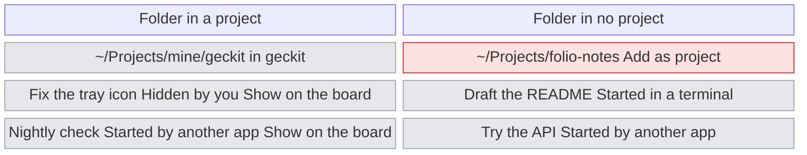
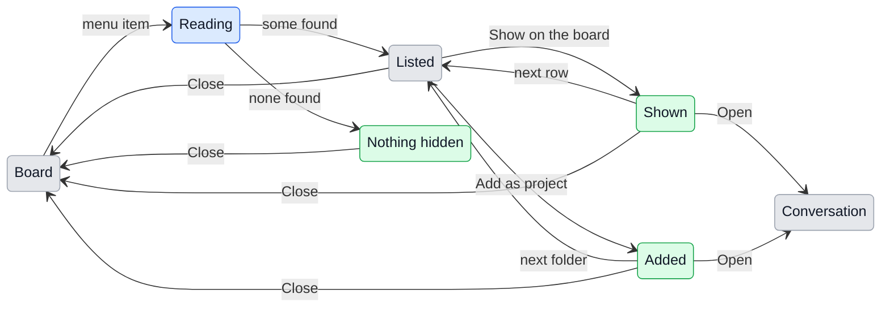

# UX: Hidden conversations

## 1. Why

The board lists only what Claude Code has kept under the exact folder of a project, and only what was started in a terminal or in GeckIt. Everything else is kept on the Mac but invisible from GeckIt: a conversation started in `geckit/client` when the project is `geckit`, one started in a folder that is not a project, one started by another app or a script (`entrypoint: sdk-cli`), and one Alex hid with "Hide from this list" and now wants back. Today there is no way to find out that they exist, and no way to bring one back except `claude --resume` in a terminal. On this Mac that is most of what was kept: of 359 conversations in the last 30 days, 222 were started through the SDK and 26 of the 62 folders are not projects.

## 2. What is added

| Surface | What appears | When seen |
|---|---|---|
| Top bar (`Board.tsx`), existing | An icon button, the eye struck through, after Shortcuts and Keyboard shortcuts and before Settings; its tooltip "Hidden conversations: kept by Claude Code on this Mac and not on the board" | Always, in the board and in the list |
| Project menu (Cmd+K, `Projects.tsx`), existing | An item "Hidden conversations..." under "Add a project..." | Always |
| Hidden conversations dialog, new, over the board like "Delete conversations" | Conversations the board does not list, grouped by folder, newest folder first | When the item is chosen |
| Folder group in the dialog | The folder, the project it belongs to if any, and "Add as project" when it belongs to none | Always |
| Row in the dialog | Title, the last thing said, when, why it is hidden, and "Show on the board" when its folder belongs to a project | Always |
| Board card, existing | The subfolder after the project name, as "geckit / client", when the conversation was started below the project folder | Only for such conversations |

In a project's folder the action is on the row, one conversation at a time. In a folder of no project the action is on the folder, since the board has no place for a conversation without a project.

## 3. States

| State | When it happens | What the person sees | What to do |
|---|---|---|---|
| Reading | The dialog opened, the folders are being read | The title and "Reading conversations..." | Nothing, it is over in a moment |
| Listed | Something is hidden | Folder groups with their rows | "Show on the board" on a row, or "Add as project" on a folder, or close |
| Nothing hidden | Nothing in the last 30 days is off the board | "Nothing is hidden. Every conversation from the last 30 days is on the board." | Close |
| Shown | "Show on the board" was pressed | The row stays, its action replaced by "On the board. Open" | "Open" to go to it, or carry on |
| Added | "Add as project" was pressed | The folder's header says "Added as a project", every row in it says "On the board. Open" | "Open" on any row, or carry on |
| In another profile | The row's project is not in the profile being looked at | After "Show on the board": "On the board of Work. Switch" | "Switch" to that profile, or carry on |

## 4. Transitions

| From | Event | To | What the person sees |
|---|---|---|---|
| Board | Chose "Hidden conversations..." with the button in the top bar or in the project menu | Reading | The dialog, "Reading conversations..." |
| Reading | Reading finished with something found, by itself | Listed | Folder groups, newest first |
| Reading | Reading finished with nothing found, by itself | Nothing hidden | "Nothing is hidden. Every conversation from the last 30 days is on the board." |
| Listed | Pressed "Show on the board" on a row | Shown | The row's action becomes "On the board. Open"; behind the dialog the card appears in its column |
| Listed | Pressed "Add as project" on a folder | Added | The header becomes "Added as a project", every row "On the board. Open"; the project is in the project menu |
| Shown or Added | Pressed "Open" | Conversation | The dialog closes and the conversation opens over the board |
| Shown or Added | Went on with another row or folder | Listed | Nothing more, the done rows keep their "On the board" |
| Listed | Pressed "Show older" at the end | Reading, then Listed | The older ones below the recent ones |
| Any in the dialog | Close, Escape or a press outside | Board | The board with the conversations brought back on it; rows that were shown leave the dialog for next time |
| Board | "Hide from this list" on a card that was brought back | Board | The card goes, and is in the dialog again next time |
| Board | "Take it off the list" on a project that was added here | Board | Its cards go, and its folder is in the dialog again next time |

Everything done here is undone with what the board already has: "Hide from this list" for a conversation, "Take it off the list" for a project.

## 5. What stays quiet

| State | Why it is not shown |
|---|---|
| How many are hidden, in the menu item | Counting means reading every folder each time Cmd+K opens, and the menu is for switching projects quickly |
| Conversations in temporary folders (`/private/tmp`, `/private/var/folders`, `/tmp`) | They are helpers' scratch folders and test runs, the folder is gone within days, and nothing can be resumed there: 59 of the 359 recent ones on this Mac |
| Conversations whose folder no longer exists | They cannot be resumed and the folder cannot be added |
| Conversations GeckIt itself ran and that are on the board | They are not hidden |
| A conversation started in a terminal while the dialog is open | It appears the next time the dialog is opened; watching the disk is a separate change |

## 6. Numbers and time

| Number | Value | Why |
|---|---|---|
| How far back the dialog reads | 30 days | What is looked for is something remembered as recent; older ones are behind "Show older" rather than filling the list |
| Rows per folder before "N more" | 5 | A folder a script writes to every night would push every other folder off the screen |
| Temporary folders | left out | See section 5 |

## 7. Wording

| State | Text |
|---|---|
| Menu item | "Hidden conversations..." |
| Dialog title | "Hidden conversations" |
| Dialog line under the title | "Kept by Claude Code on this Mac and not on the board." |
| Reading | "Reading conversations..." |
| Nothing hidden | "Nothing is hidden. Every conversation from the last 30 days is on the board." |
| Folder in a project | "in geckit" |
| Folder in no project, action | "Add as project" |
| Folder, added | "Added as a project" |
| Row reason, hidden with the menu | "Hidden by you" |
| Row reason, SDK entrypoint | "Started by another app" |
| Row reason, folder in no project | "Started in a terminal" |
| Row action | "Show on the board" |
| Row, done | "On the board. Open" |
| Row, done, other profile | "On the board of Work. Switch" |
| Folder, more rows | "5 more" |
| End of list | "Show older" |

## 8. Edge cases

- **Nothing hidden:** the "Nothing hidden" state, no groups.
- **Everything at once:** a folder with 40 SDK conversations from a nightly script shows 5 and "35 more", so it does not bury the others.
- **Nested projects:** with both `~/Projects` and `~/Projects/mine/geckit` as projects, a conversation in `geckit/client` belongs to `geckit`, the deepest project above it.
- **Subfolder:** a conversation in `geckit/client` is on the board as "geckit / client" without going through the dialog (section 10); opened, it runs in `geckit/client`, since that is where Claude Code keeps it.
- **Two reasons:** hidden by Alex and started by another app, the row says "Hidden by you", the reason Alex can recall.
- **Pressed twice:** the second press is on "On the board. Open", which opens it.
- **The folder is removed while the dialog is open:** "Add as project" still adds it, and the project menu shows it the way it shows any project whose folder is gone.
- **Stale:** the dialog reads the disk every time it opens, so it is never older than its opening.

## 9. What is deliberately not done

| Not done | Why |
|---|---|
| Putting one conversation on the board without its folder being a project | The board, the profiles, the colours and the counts are all by project; a card of no project has no column in any of them |
| Showing hidden conversations on the board itself, greyed out, behind a toggle | 359 recent against about 30 on the board would bury it, and the toggle would be left on |
| Listing temporary folders under a collapsed group | Nothing in them can be resumed or added, so the group would only be scrolled past |
| A count or a dot when something new is hidden | Most of what is hidden is hidden on purpose or made by scripts; a signal for it would always be on |
| Watching the disk for new conversations | A separate change, useful for the board as well; the dialog reads on opening |

## 10. Forks

### A conversation in a subfolder of a project

| Option | Verdict |
|---|---|
| In the dialog, shown on the board one at a time | no |
| On the board by itself, as "project / subfolder" | yes |

**Why:** a conversation in `geckit/client` is geckit work; making Alex bring back each one by hand means the dialog fills with the conversations of every project's subfolders, and the board keeps missing what was started there tomorrow. This changes what the board lists today.

### Where the action is for a folder of no project

| Option | Verdict |
|---|---|
| "Show on the board" on the row, which quietly adds the folder as a project | no |
| "Add as project" on the folder | yes |

**Why:** adding a project brings every conversation of that folder onto the board and into the project menu; a row's button that does that does more than it says.

### Where the dialog is opened from

| Option | Verdict |
|---|---|
| An icon button in the top bar, beside Shortcuts, Keyboard shortcuts and Settings | yes |
| The project menu, under "Add a project..." | yes, as well |
| A row under the search results | no |
| "Hidden" at the left end of the bottom bar | no |
| Settings | no |

**Why:** the icons in the top bar are already the places that open over the board, each a dialog of its own, and the hidden conversations are one more such place; the bar is the same in the board and the list, so it is in sight in both. It is how a Mac app keeps its places: in the toolbar, a tool among tools. The bottom bar is where a Mac app says how things stand, as Finder's says how many items and how much space: a word there reads as news, "something is hidden", and not as a way in, which is how it read when it was tried. A row under the search results is seen only by someone already searching. The project menu alone was not found, since nobody opens a menu of projects to look for a conversation; it keeps the item for whoever is there.

This reverses the earlier "no" to a button in the board's header, given because the header was full: the header has one more icon of the same kind as its neighbours, and nothing else moved. It stays there too, beside "which projects are on my board", and the header is full already.

## 11. Requirements check

| Requirement | Where it is covered |
|---|---|
| See conversations GeckIt does not show | Sections 2, 3 |
| Put one on the board when its folder is a project | Section 4, "Show on the board" |
| Bring in a folder that is not a project | Section 4, "Add as project" |

**What the requirements do not say yet:** that a subfolder's conversations belong to the project above it (section 10), and that temporary folders are left out (section 5).
