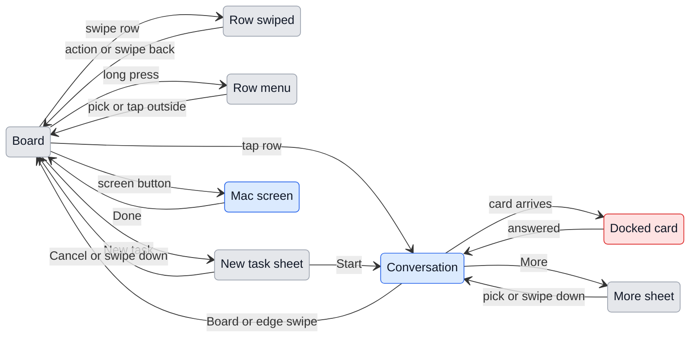

# The iPhone app, made for a hand

## 1. Why

The phone shows the Mac's Chat window shrunk to 390 points. Text is 11 to 13 px where iOS reads at 15 to 17, and the controls a thumb has to hit are 22 to 36 points where iOS asks for 44: Back is 22 by 36, Send 28 by 28, Status 47 by 25. Menus are desktop popovers that open under a finger, New task is a desktop dialog that mentions Cmd+Enter and dropping files, and nothing responds to a swipe or a long press, which is how an iPhone is driven. The one job the app exists for, answering a session that waits on the person, takes four taps and a hunt: find the card among identical "Waiting for you" rows, open it, scroll to the card, hit a small button.

This document decides what the app becomes; `phone.md` still decides how it connects, and its states and wording stand unless a row below replaces them.

## 2. What changes

| Surface | Today | Becomes |
|---|---|---|
| Type | 11 to 13 px, the Mac's face | iOS text styles in the system face: 34 large title, 17 body and headline, 15 secondary, 13 footnote |
| Touch targets | 22 to 36 points | 44 points at least, everywhere |
| Board header | A segmented control and + | Large title "GeckIt" that shrinks on scroll, the Mac's screen and New task at the right, the segmented control under the title |
| Board rows | Bordered desktop cards | Rows of one inset list: state dot, title in two lines, the last thing said in two lines, project and time |
| Sessions that ask | "Waiting for you", like any idle one | A "Needs you" group at the top of In progress, each row with the ask and Allow once and No on it |
| Empty column | Blank | One line: "Nothing in review." |
| Plan usage | A bar pinned to the bottom | The list's footer; a banner only when a window is at 90% |
| Conversation header | Back icon, cut title, "Status" text | "Board" back button, title with the project under it, More button |
| Where it stands, Links, Rename, Stop | Status popover; Links only when there are links | One action sheet from More |
| Messages | The person's in a grey block, full width | The person's in a bubble at the right; Claude's text full width |
| A permission card | Scrolls with the transcript | Docked above the composer until answered; the answer stays in the transcript as a line |
| Composer | Two-line placeholder, 28-point Send, red Stop | "Message" field, 44-point round Send, Stop as a round grey square |
| Mode, Project | Desktop popovers | Bottom sheets |
| New task | Desktop dialog | Full-height sheet: Cancel, "New task", Start |
| Pairing | Centered text and a button | App icon, the three steps, Scan at the bottom where the thumb is |
| Dropped | A bar over the header, hiding Back | A pill under the header |
| Notices | The Mac's in-window notice | A banner from the top, like an iOS notification; tap opens the conversation |
| The Mac's screen | Not there | A screen of its own from the board: the Mac's main display, live, to look at and not to touch |

## 3. Gestures

The app answers to the same gestures the system apps do, and every gesture has a visible way to do the same thing, because a gesture nobody sees is only a shortcut.

| Where | Gesture | Does | Visible twin |
|---|---|---|---|
| Board row | Swipe left | Shows Done (green) and More; a full swipe marks it Done | More in the conversation |
| Board row | Swipe right | Shows In review (amber, the Mac's colour for review); a full swipe marks it | More in the conversation |
| Board row | Long press | Preview of the last reply, and a menu: In review, Blocked, Done, No status, Rename, Stop | More in the conversation |
| Board row that asks | Long press | The same menu, headed by Allow once and No | The buttons on the row |
| Conversation | Swipe from the left edge | Back to the board | Board button |
| Message, either side's | Long press | The system's own text menu: select, Copy, Look Up | none |
| Code block | Long press | The same system menu | none |
| Tool line | Tap | Opens what it ran and printed | the line itself |
| Sheet, action sheet | Swipe down | Closes it, nothing chosen | Cancel |
| The Mac's screen | Pinch, drag, double tap | Closer, move over it, in to 2.5 times and back to fit | Fit |
| The Mac's screen | Tap | Hides the bar over it, and brings it back | the arrow at the top right |
| Docked permission card | none | A card is never swiped away: an ask needs an answer | Allow once, Allow this session, No |

Each full swipe and each long press gives a light tap of the Taptic Engine; a card arriving gives a warning tap.

## 4. States

States are `phone.md`'s. New or changed:

| State | When | What the person sees | What they do |
|---|---|---|---|
| Needs you | A session waits on a permission card or a question | The row in the Needs you group: amber dot, "Needs an answer", the command or question in one line, Allow once and No | Answers from the row, or opens it |
| Docked card | An open conversation waits on a card | The card above the composer, the composer under it greyed | Allow once, Allow this session or No |
| Column empty | No row in the chosen column | "Nothing in progress.", "Nothing in review." or "Nothing done yet." | Picks another column or starts a task |
| Swiped | A row swiped part way | The actions behind it | Taps one, or swipes back |
| Menu open | A row long-pressed | The row lifted, the menu under it, the rest blurred | Picks, or taps outside |
| Usage high | A plan window at 90% or more | A banner at the top of the board: "5-hour window at 92%. Resets at 14:00." | Nothing; it goes when the window resets |
| Screen asked for | The screen opened, the Mac not yet sending | A spinner on black: "Asking the Mac for its screen" | Waits, or Done |
| Screen live | The first frame arrived | The Mac's screen, "Mac" and a red "Live" in the bar | Looks, zooms, Done |
| Screen refused | The Mac has not allowed GeckIt to record its screen, or the link has no picture | What the Mac said, and Try again | Allows it on the Mac, then Try again, or Done |

## 5. Transitions

| From | Event | To | What the person sees |
|---|---|---|---|
| Board | Swipes a row left past half its width | Board | The row slides out of the column, the count moves; "Done" is kept on the Mac too |
| Board | Swipes a row right past half | Board | The same, into In review |
| Board | Swipes a row part way and lets go | Row swiped | The actions stay open until a tap anywhere |
| Board | Long presses a row | Row menu | The row lifts, a tap, the menu |
| Board | Taps Allow once on a Needs you row | Board | The row leaves the group and shows "Working"; nothing opens |
| Board | Taps New task | New task sheet | The sheet rises, the keyboard with it, the field focused |
| New task sheet | Taps Start | Conversation | The new conversation, the first message sent |
| New task sheet | Swipes down or taps Cancel with text typed | New task sheet | An action sheet: "Discard this task?" with Discard and Cancel |
| Conversation | A card arrives, by itself | Docked card | The card rises above the composer; a warning tap |
| Docked card | Answers | Conversation | The card goes; the transcript gets "Allowed: ..." or "Denied: ..." |
| Conversation | Swipes from the left edge | Board | The conversation follows the finger off to the right |
| Conversation | Taps More | More sheet | In review, Blocked, Done, No status, Links, Rename, Stop |
| Any | A notice arrives for another conversation, by itself | Same | A banner for 4 s; tap opens that conversation, swipe up dismisses |
| Board | Taps the screen button | Mac screen | Black, a spinner, "Asking the Mac for its screen"; the Mac starts sending |
| Mac screen | The first frame arrives, by itself | Mac screen | The picture, fitted to the width; "Live" in the bar |
| Mac screen | The Mac refuses, by itself | Mac screen | The Mac's reason in its own words, and Try again |
| Mac screen | Taps Done | Board | The screen goes; the Mac stops sending at once |

## 6. What stays quiet

| Not shown | Why |
|---|---|
| Model, git, context size, cost | As in `phone.md`: desk facts |
| Plan usage under 90% | Read on the list's footer when wanted; a pinned bar spends a line of every screen |
| "Waiting for you" on sessions that finished a turn | The dot and the time say it; the words are kept for Needs an answer |
| Swipe hints | A row does not wiggle to teach swiping; the long-press menu and More say the same |
| Swiping between columns | Sideways swipes belong to the rows; the columns change by the segmented control only |
| That the Mac is being watched, on the Mac | The phone is the person's own; a sign on the Mac would tell them what they already know. macOS draws its own recording mark in the menu bar anyway |
| Frame rate, bitrate, resolution | Nothing the person can change or needs to know; text staying sharp is what matters |

## 7. Numbers

| Number | Value | Why |
|---|---|---|
| Smallest touch target | 44 points | Apple's minimum for a finger |
| Body text | 17 points | iOS body at the default Dynamic Type size; follows the phone's text size setting |
| Full swipe | Past half the row's width | Where Mail and Reminders commit |
| Usage banner | At 90% of a window | Below it nothing the person does changes; above it a long task may stop |
| Notice banner | 4 s | Long enough to read a title; iOS banners stay about as long |
| Rows in Needs you before it folds | 3, then "2 more" | Three asks fit above the fold with the rest of the column visible |
| Mac screen frame rate | 15 per second at most | A screen of text changes a line at a time; more frames spend the link and the Mac's fan for nothing |
| Mac screen bitrate | 3 Mbit/s at most | Enough for sharp text at 2560 wide; the link lowers it by itself when the network is worse |
| Mac screen size | 2560 by 1600 at most | The main display of most Macs, without the extra pixels of a 5K one that a phone cannot show |
| Zoom | 1 to 5 times; double tap to 2.5 | At 5 times, 11-point text on the Mac reads at body size on the phone |

## 8. Wording

| Where | Text |
|---|---|
| Board title | "GeckIt" |
| Needs you group | "Needs you" |
| Row that asks | "Needs an answer" |
| Row working | "Working" |
| Empty columns | "Nothing in progress.", "Nothing in review.", "Nothing done yet." |
| Usage footer | "5-hour window 7%, week 44%" |
| Usage banner | "5-hour window at 92%. Resets at 14:00." |
| Back | "Board" |
| Composer | "Message" |
| Composer while working | "Send more: it waits until Claude finishes" |
| New task sheet | "Cancel", "New task", "Start"; fields "Project", "What to do", "Goal" |
| Goal footnote | "Without a goal, it stops when Claude is done." |
| Discard | "Discard this task?", "Discard", "Cancel" |
| Pairing | "GeckIt", then "1. Open GeckIt on your Mac", "2. Settings, then turn on Phone", "3. Scan the code", button "Scan" |
| Swipe actions | "Done", "In review", "More" |
| Needs you folded | "2 more" |
| Mac screen | "Mac", "Live", "Fit", "Done"; "Asking the Mac for its screen"; "Try again" |
| Mac screen refused | "The Mac has not allowed GeckIt to record its screen. On the Mac: System Settings, Privacy & Security, Screen & System Audio Recording, turn on GeckIt, then quit and reopen it." |

Every other string is `phone.md`'s.

## 9. Edge cases

- **Swiped while the Mac changes it:** the Mac's status wins and the row moves where the Mac says; a swipe is a request like any other.
- **Full swipe with the link down:** the row springs back and the status line says "Not sent: the Mac could not be reached".
- **Allow once from the row while the same card is answered on the Mac:** the Mac's answer came first; the row simply updates.
- **Two cards in one session:** the docked card shows the first; the second docks when the first is answered.
- **Keyboard open when a card docks:** the keyboard stays; the card sits on top of the composer, above the keyboard.
- **Larger text from iOS settings:** rows grow; titles stay two lines, the last reply goes to one.
- **Screen asked for with the link down:** the call fails at once and the screen shows the reason with Try again.
- **Two phones watching:** the Mac captures once and sends to both; it stops when the last one closes its screen.
- **The link drops while watching:** the Mac stops capturing with the link; the phone reconnects as usual and the screen is asked for again with Try again.
- **More than one display:** the main one only (see section 10).

## 10. Deliberately not there

| Not done | Why |
|---|---|
| A tab bar for the columns | Tabs are separate places in an app; the columns are views of one list |
| Pull to refresh | Everything is live; a pull would do nothing |
| Swipe to delete | Deleting is left to the Mac, where the history lives |
| Bubbles for Claude's replies | Code and tables need the full width |
| A red Stop | Red is for what destroys; Stop only interrupts |
| The Mac's face (the app font) on the phone | The system face is what iOS text sizes and Dynamic Type are drawn for |
| Controlling the Mac from the phone | Clicks and keys on the Mac are a remote desktop, with its own permission (Accessibility) and its own risks; the screen is for seeing what a session did |
| Choosing a display or a window | Most Macs have one display, and the one that matters is the main one; a picker is a screen for a case nobody has yet |
| The Mac's sound | Sessions do not make sound worth hearing |

## 11. Forks

### Where the ask is answered

| Option | Verdict |
|---|---|
| Only inside the conversation | No: four taps to the one thing the person opens the app for |
| On the row, Allow once and No | Yes |
| On the row, all three answers | No: three buttons do not fit a row at 44 points; Allow this session is in the long press and in the conversation |

### How the status is set

| Option | Verdict |
|---|---|
| Only from a menu | No: the commonest move, marking Done, takes three taps |
| Swipes, with the menu as the visible twin | Yes |

## 12. Requirements

| Requirement | Where |
|---|---|
| Apple UX and UI | Sections 2, 3, 7 |
| iOS swipes for settings | Section 3: swipe left for Done, right for In review; the status is what "settings" of a session means here |
| Long press | Section 3: rows, asks, messages, code |
| See what is on the Mac's screen | Sections 2, 4, 5, 7: view only, the main display |

**Missing from the request:** whether "settings" meant the app's own settings screen; the app has none (`phone.md`, section 9), so swipes set a session's status, which is what can be changed per session from the phone.
