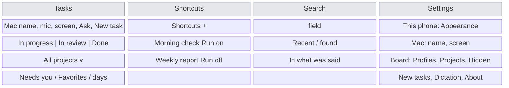
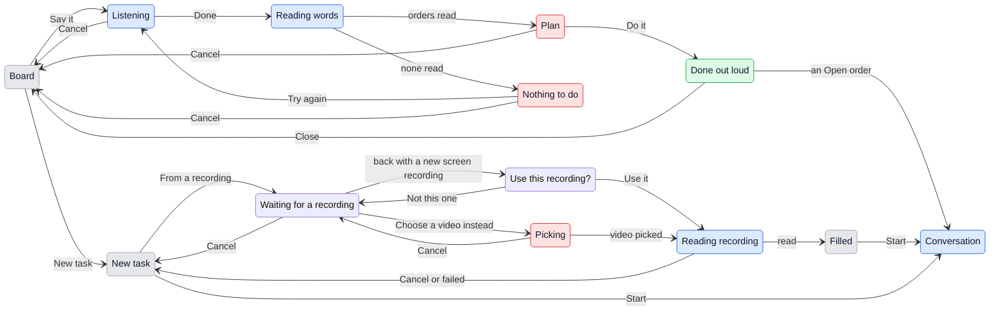

# The phone does what the Mac's board does

## 1. Why

On the phone Alex can look at the board, answer cards and start a task by typing it, and that is all. Everything else the Mac's board head offers is missing: the Shortcuts and their timetables, the search across what was said, favorites, profiles and the project picker, adding a project, Settings, the theme, starting a task by recording the screen or by saying it, and telling GeckIt out loud what to start, answer or mark. Away from the desk those are exactly the things wanted: "run the morning check now", "what did the radar one say about the index", "only Formula today", "start this, and mark the other one done". `phone.md` section 9 left Settings out because they were the Mac's; this document takes the parts of them that make sense in a hand and leaves the rest where it was. The conversation view is not touched.

## 2. What is added

| Surface | What appears | When |
|---|---|---|
| Tab bar (new), at the bottom of every top-level screen | Four tabs: Tasks, Shortcuts, Search, Settings | Connected, and no conversation open |
| Tasks tab (the board from `phone-design.md`) | Unchanged, plus what is below | Tasks chosen |
| Board header, existing | A microphone, "Say it", before the screen button | Always on the board |
| New task button, existing | Tap opens the form as today; a long press opens "Write it", "Say it" and "From a recording" | Always on the board |
| Scope button (new), under the segmented control | The profile or project the board is narrowed to: "All projects", "Formula", "geckit", or "3 projects" | Always on the board |
| Scope sheet (new) | Profiles with a check on the one in use, then the projects with a check on each chosen, then "Add a project" | The scope button is pressed |
| Favorites group (new), on the board | The column's starred conversations, under Needs you and above the days, each row with a filled star by its project | The column holds a favorite |
| Row menu (long press), existing | "Add to favorites" or "Remove from favorites", and "Make a shortcut" | Always |
| New task sheet, existing | Under the field: "Dictate" and "From a recording". After a recording, its frames with the pictures and "From a 0:42 recording. Claude gets the video too." with an x | Always; the line after a recording |
| Ask sheet, existing | The same two buttons | Always |
| Say it sheet (new) | A breathing microphone, the words as iOS hears them, Done; then what will be done, one line each, with Do it and Cancel; then what was done | Say it is pressed |
| Recording sheet (new) | First how to record from Control Center, in four steps, with "Choose a video instead"; back in GeckIt the screen recording made since then is offered as "Use this recording?" with a picture from its middle and its length, "Not this one" and "Use it"; then what the recording is going through: "Listening to it", "Taking frames", "Sending the video to the Mac", each with a check once done | From a recording was pressed |
| Shortcuts tab (new) | The shortcuts as an inset list: name, project, when it runs next or "By hand", a Run button on each, a switch for its timetable; + in the bar | Shortcuts chosen |
| Shortcut sheet (new) | Name, Project, Prompt, Goal, Mode, Repeats with its time, Timetable on, Run now, Delete | A shortcut or + is pressed, or Make a shortcut |
| Search tab (new) | A search field at the top, taking the keyboard; conversations used last while it is empty; found by name, then "In what was said" with the line that matched | Search chosen |
| Settings tab (new) | Groups: This phone (Appearance), Mac (the Mac in use, its screen), Board (Profiles, Projects, Hidden conversations), New tasks (Mode), Dictation (Your language), About | Settings chosen |
| Profiles screen (new) | The profiles; each opens its name and its projects with ticks, Delete profile; New profile at the end | Profiles is pressed |
| Projects screen (new) | Each project with its colour; swipe or More forgets it; Add a project | Projects is pressed |
| Add a project (new) | The Mac's folders from its home down, one level at a time, git repositories marked; "Add this folder" at the bottom | Add a project is pressed |
| Hidden conversations screen (new) | The Mac's `HiddenChats` list as rows, each with Bring back | Hidden conversations is pressed |

## 3. States

| State | When | What Alex sees | What Alex does |
|---|---|---|---|
| Narrowed | A profile or some projects are chosen on this phone | The scope button says which; columns, counts, search, shortcuts and the project lists hold those projects only | Works, or widens it from the same button |
| Empty profile | The profile in use on the phone has no projects | "No projects in Formula. Tick some in Settings, Profiles." | Ticks some, or chooses All projects |
| Listening | Say it is pressed, or Dictate in a form | The mic breathing and the words growing | Talks, then Done |
| Not allowed to listen | iOS refused the microphone or Speech Recognition | iOS's reason, as the composer says it | Allows it in iOS Settings |
| Reading what was said | Done was pressed with words heard | "Reading what you said" and a spinner | Waits, or Cancel |
| Plan | The Mac read the words as orders | One line per thing that will happen, the words that will be sent in full | Do it, or Cancel |
| Nothing to do | The Mac read no order in them | The Mac's own reason, and Try again | Says it again, or Cancel |
| Done out loud | Do it was pressed | What was done, one line each; Close | Closes it; a conversation it opened is open |
| Waiting for a recording | From a recording was pressed | The four steps to record from Control Center; Photos access asked for the first time | Leaves to record, Choose a video instead, or Cancel |
| Offered | GeckIt is in front again and a screen recording was made since the sheet opened | "Use this recording?", its picture and length | Use it, Not this one (waits for the next), or Cancel |
| Picking a recording | Choose a video instead was pressed | iOS's own video picker | Picks one, or Cancel back to waiting |
| Reading the recording | Use it, or a video was picked | The three steps with checks | Waits, or Cancel |
| Filled | The recording was read | The form with the words at the end of the field, the frames among the pictures, the recording line | Reads it over, Start |
| No words in it | The recording has no speech | The form with the frames and "Nothing was said in it. Write what to do." | Writes it, Start |
| Shortcuts empty | No shortcut in the scope | "No shortcuts. A shortcut is a prompt you run by hand or on a timetable." and New shortcut | Makes one |
| Running a shortcut | Run was pressed | The button turns to a spinner, then the new conversation opens | Nothing |
| Search empty | Nothing matches | "Nothing called that, and nothing said like it." | Types something else |
| Folder browser | Add a project | The folders in the Mac's home | Goes down, back up, or Add this folder |

## 4. Transitions

| From | Event | To | What Alex sees |
|---|---|---|---|
| Any tab | Presses another tab | That tab | Its screen, scrolled where it was left; a light tap |
| Board | Presses the scope button | Scope sheet | Profiles, projects, Add a project |
| Scope sheet | Presses a profile | Board, narrowed | The sheet closes; the columns hold its projects; kept on this phone only |
| Scope sheet | Presses a project | Scope sheet | Its check comes and goes; the board under the sheet follows |
| Board | Long presses a row, Add to favorites | Board | The row moves into Favorites with a star; the Mac's list has it among its favorites too |
| Board | Presses Say it | Listening | The sheet rises, the mic breathes, "Listening" |
| Listening | Presses Done with words | Reading what was said | "Reading what you said" |
| Listening | Presses Done with nothing heard | Listening | "Nothing heard yet." under the mic; listening goes on |
| Listening | iOS stops listening by itself after about a minute | Listening, stopped | The words stay; Done reads them |
| Reading what was said | The Mac answers with orders, by itself | Plan | The lines; a light tap |
| Reading what was said | The Mac finds no order, by itself | Nothing to do | Its reason, Try again |
| Plan | Presses Do it | Done out loud | What was done; a success tap |
| Done out loud | Carried out an Open order, by itself | Conversation | That conversation over the board once Close is pressed |
| Board | Long presses New task | The ways menu | Write it, Say it, From a recording |
| New task | Presses Dictate | Listening, in the field | The field fills after what was typed; Dictate turns to Stop |
| New task | Presses From a recording | Waiting for a recording | The four steps; Photos access asked the first time |
| Waiting for a recording | Records from Control Center and comes back | Offered | "Use this recording?" as soon as GeckIt is in front |
| Offered | Presses Use it | Reading the recording | The three steps |
| Offered | Presses Not this one | Waiting for a recording | The next recording made is offered instead |
| Waiting for a recording | Presses Choose a video instead | Picking | iOS's picker, videos only |
| Picking | Picks a video | Reading the recording | The three steps; the first check within seconds |
| Reading the recording | The video is read and sent, by itself | Filled | The form, with the words, frames and recording line |
| Reading the recording | Presses Cancel | New task | The form as it was; nothing is kept on the Mac |
| Filled | Presses the x on the recording line | New task | The frames and the line go; the words stay |
| Shortcuts | Presses Run | Conversation | The new conversation, working |
| Shortcuts | Flips a timetable switch | Shortcuts | "Paused" or the next run; the Mac's menu bar changes with it |
| Shortcuts | Presses a row or + | Shortcut sheet | The fields; Save in the bar |
| Shortcut sheet | Presses Save | Shortcuts | The row, updated |
| Shortcut sheet | Presses Delete, then Delete in the confirmation | Shortcuts | The row gone |
| Search | Types | Search | The rows found by name at once, what was said a moment later |
| Search | Presses a row | Conversation | It opens; Back leads to the Search tab |
| Settings | Presses Appearance, picks Dark | Settings | This phone goes dark; the Mac stays as it is |
| Projects | Presses Add a project, goes down to a folder, Add this folder | Projects | The folder among the projects, with its colour, here and on the Mac |
| Projects | Swipes a project, Forget | Projects | It goes from the list here and on the Mac; its conversations stay on disk |
| Hidden conversations | Presses Bring back | Hidden conversations | The row goes; the conversation is on the board |

## 5. What stays quiet

| Not shown | Why |
|---|---|
| The profile the Mac is in | The phone chooses its own; the two are looked at by different eyes at different times |
| Keys, vendors, Open files with, Updates, the Phone switch, Claude Code's own guide | Configuration of the Mac, nothing done from a hand |
| Keyboard shortcuts | A phone has no keyboard to press them on |
| Where the video is on the Mac | Claude is told it, as on the Mac; the form says only that Claude gets it |
| Each step of uploading a video | The three steps are enough; a percentage shows only on the last, and only past 5 s |
| A shortcut run on a timetable while the phone is closed | It is a new conversation on the board, which says it |

## 6. Numbers

| Number | Value | Why |
|---|---|---|
| Frames from a recording | 8, spread over its length, the last one kept | The Mac's `MOST_FRAMES`: each costs about a page of text |
| Frame size | 1568 px on the long side | What Claude reads a picture at; more is sent and not seen |
| A video sent whole | Up to 200 MB | A two-minute screen recording is 30 to 80 MB; past 200 MB the upload takes minutes on a phone network, and the frames and words go without it |
| Video piece | 512 KB | Small enough that the link keeps answering cards while it goes |
| Upload percentage | After 5 s | A short upload needs no number |
| Search waits after typing | 150 ms | The Mac's search does the same |
| Recent in an empty search | 50 | The Mac's switcher shows the same |

## 7. Wording

| Where | Text |
|---|---|
| Tabs | "Tasks", "Shortcuts", "Search", "Settings" |
| Say it button | aria "Say it" |
| Ways menu | "Write it" - "Project, what to do, a goal"; "Say it" - "Tell GeckIt what to start, answer or mark"; "From a recording" - "A screen recording or a video; its words and frames become the task" |
| Say it, listening | Title "Say it"; "Listening"; under it "Start a task, say something in one, stop, mark or open one." |
| Say it, nothing heard | "Nothing heard yet." |
| Say it, reading | "Reading what you said" |
| Say it, plan | Title "This will be done"; buttons "Do it", "Cancel" |
| Say it, done | Title "Done"; button "Close" |
| Say it, nothing to do | the Mac's reason; button "Try again" |
| Recording steps | "Listening to it", "Taking frames", "Sending the video to the Mac" |
| Recording line | "From a 0:42 recording. Claude gets the video too." |
| Recording, video not sent (over 200 MB, or the link dropped while sending) | "From a 0:42 recording. Claude gets the frames, not the video." |
| No words | "Nothing was said in it. Write what to do." |
| Scope, all | "All projects" |
| Scope, some | "3 projects" |
| Scope sheet | Headings "Profile", "Projects"; "Add a project" |
| Favorites group | "Favorites" |
| Row menu | "Add to favorites", "Remove from favorites", "Make a shortcut" |
| Shortcuts empty | "No shortcuts. A shortcut is a prompt you run by hand or on a timetable." with "New shortcut" |
| Shortcut row, by hand | "By hand" |
| Shortcut row, paused | "Paused" |
| Shortcut row, timed | "Every weekday at 09:00, next today at 09:00" (the Mac's `describeCron` and `describeTime`) |
| Shortcut sheet | "New shortcut" or its name; "Save"; fields "Name", "Project", "Prompt", "Goal", "Mode", "Repeats", "At"; "Run now"; "Delete shortcut" |
| Delete shortcut | "Delete "Morning check"?" with "Delete" |
| Search field | "Conversations and what was said" |
| Search, what was said | heading "In what was said" |
| Search empty | "Nothing called that, and nothing said like it." |
| Appearance | "System", "Light", "Dark"; note "On this phone only." |
| Profiles | "All projects" first; "New profile"; "Delete profile" |
| Projects, add | "Add a project"; browser title "Choose a folder"; button "Add this folder"; a git folder's line "Git repository" |
| Forget a project | "Forget" - "Its conversations stay on the Mac" |
| Hidden | "Bring back" |
| About | "GeckIt on the Mac", "Claude Code" with their versions |

## 8. Edge cases

- **The Mac is older than this app:** a call it does not know says "No such call"; the tab or button that needs it says "Update GeckIt on the Mac for this." instead of failing silently.
- **Say it while a card waits:** answering is one of the orders only as "say"; permission cards are answered from the board.
- **Say it and the Mac's own capsule at once:** the Mac holds one plan waiting for a yes; the later reading replaces the earlier, and Do it on the other says "There is nothing waiting to be done".
- **An Open order from the phone** opens the conversation on the phone, not on the Mac's screen.
- **A recording with no audio track** (iOS screen recording with the microphone off): No words in it.
- **Link drops mid-upload:** the upload stops, the form gets the words and frames and says "Claude gets the frames, not the video."
- **A favorite deleted on the Mac** leaves the list as the Mac already does it.
- **A profile deleted on the Mac while the phone uses it:** the phone goes back to All projects.
- **Two phones:** each keeps its own theme and scope; shortcuts, favorites, profiles and projects are the Mac's and shared.
- **A project added from the phone that is not a folder any more** by the time it is added: the Mac's own check refuses it and the browser says so.

## 9. Deliberately not there

| Not done | Why |
|---|---|
| Recording the phone's screen from inside the app | iOS lets an app record only itself; the system's screen recording is in Control Center and lands in Photos, where the picker reaches it |
| Recording the Mac's screen from the phone | Nobody is in front of the Mac to show or say anything |
| Dragging favorites into an order | A reorder on a phone is a separate edit mode for a list of three; the order they were starred in stands |
| Editing keys, vendors and update channel | Section 5 |
| A tab for the Mac's screen | It is looked at seldom; it stays a button on the board |
| Voice orders that answer permission cards | An allow said out loud and misheard runs a command nobody read |

## 10. Forks

### Where the new places go

| Option | Verdict |
|---|---|
| More buttons in the board header | No: five icons already fill it, and a sixth pushes the title out |
| One More sheet with everything in it | No: two taps to anything, and nothing says what is there |
| A tab bar | Yes |

**Why:** iOS apps put their top-level places in a tab bar; it says what is there without a tap, and the conversation still covers everything.

### Theme and scope: the phone's or the Mac's

| Option | Verdict |
|---|---|
| The Mac's, as every other setting | No: dark on the phone at night would turn the Mac dark at the desk |
| The phone's own | Yes |

**Why:** they are how a screen is looked at, not what is on the Mac. Profiles themselves, as lists of projects, stay the Mac's.

### Words from a recording

| Option | Verdict |
|---|---|
| Send the video to the Mac to be transcribed | No: needs an OpenRouter key and the whole video before a word comes back |
| iOS speech recognition on the file, on the phone | Yes |

**Why:** it needs no key, it is what dictation on the phone already uses, and it runs while the video is still being sent.

## 11. Requirements

| Requirement | Where |
|---|---|
| Shortcuts | Shortcuts tab, Shortcut sheet, Make a shortcut |
| Jobs | Shortcut timetables: Repeats, the switch, next run |
| Spotlight | Search tab |
| Favorite tasks | Favorites group, row menu |
| Settings | Settings tab |
| Theme | Appearance |
| Selecting new projects | Scope sheet, Add a project |
| Profiles | Scope sheet, Profiles screen |
| Task from a screen recording | From a recording |
| Task from voice | Dictate in the form, Say it |
| Voice to manage tasks | Say it |
| No chat view changes | The conversation is untouched |

**Missing from the request:** whether the shortcuts should be runnable from the iPhone's own Shortcuts app or a widget; left out, it needs App Intents in a native target.
