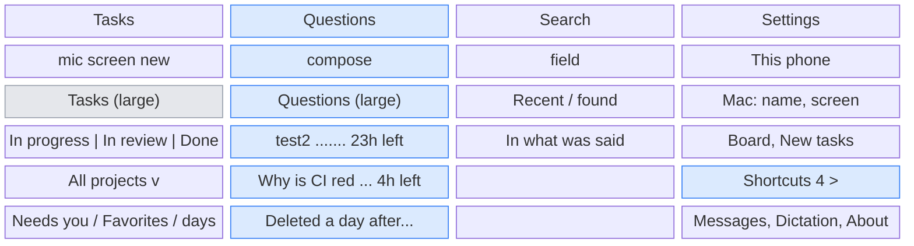
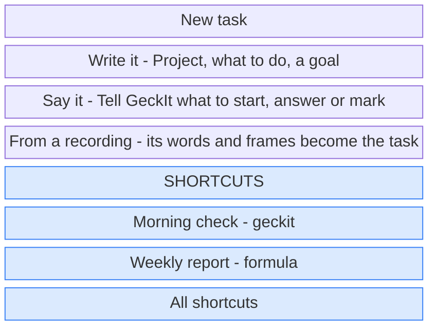
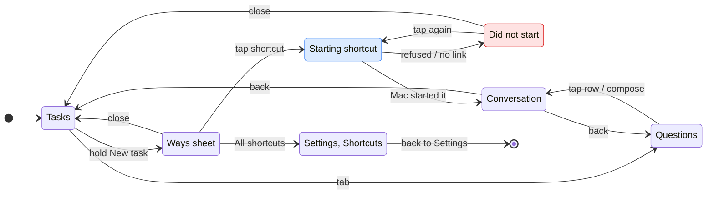

# UX: The phone's tabs are Tasks, Questions, Search and Settings

## 1. Why

The Tasks tab carries three things that are not tasks. Its large title is the Mac's name with a picker, which takes the most visible line on the phone for something chosen once a month; Settings already has the same picker under Mac. The questions (Ask) sit at the very bottom of the list, under every day group, so a question asked a minute ago is found by scrolling past a hundred Done rows, and the chat icon that starts one looks like a fourth way to start a task. And Shortcuts has a whole tab for something that is a way to start a task and is run a few times a week, while questions, used daily, have none.

## 2. What is added

| Surface | What changes | When |
|---|---|---|
| Tab bar (`PhoneHome.tsx`) | Tasks, Questions, Search, Settings. Shortcuts goes, Questions takes its place | Always |
| Tasks, large title (`PhoneBoard.tsx`) | "Tasks", no picker, no arrow. The small title on scroll is "Tasks" too | Always |
| Tasks, header | Four icons: Shortcuts, Say it, The Mac's screen, New task. "Ask a question" goes. Shortcuts opens the same list as Settings, Shortcuts, over the board, with "< Tasks" to go back; tapping the Tasks tab again goes back too | Always |
| Tasks, list | The Questions group and its note go from the bottom | Always |
| New task, long press sheet (existing) | Under Write it, Say it, From a recording: a "Shortcuts" part with each shortcut as a row, name and project; a tap runs it. Last row "All shortcuts", which opens the list over the board | The board's projects hold a shortcut |
| Questions tab (new) | Large title "Questions", a compose icon in the header, the questions newest first, each with "23h left" on the right and a bin, the note "Each is deleted a day after its last answer." | Questions chosen |
| Questions tab icon | A dot, as Tasks has for Needs an answer | A question has an answer not read yet, and another tab is chosen |
| Settings, new group "Shortcuts" between New tasks and Messages | One cell, "Shortcuts" with the count, opening the list the Shortcuts tab shows today: Run, the timetable switch, + in the bar, the note on timetables | Always |
| Settings, Mac group (existing) | Unchanged; it is now the only place a Mac is chosen | Paired |

Blue is what is new or moved.

The long press on New task:

## 3. States

| State | When | What Alex sees | What Alex does |
|---|---|---|---|
| No questions | None kept | Questions tab: "No questions. Ask one from the pencil above; each is kept a day after its last answer." | Asks one, or leaves |
| Answering | A question's turn is running | The row's dot is the working dot and the right edge says "now", as on Tasks | Waits, or opens it |
| Answer not read | The turn ended and the question was not opened since | The row's dot filled; a dot on the Questions tab icon if another tab is chosen | Opens it |
| Shortcut starting | A shortcut row was tapped in the long press sheet | The sheet stays, the row shows a spinner in place of its project | Waits |
| Shortcut started | The Mac answered with the new conversation | The sheet closes, the conversation opens, as Run does today | Reads, or goes back to Tasks |
| Shortcut failed | The Mac refused or the link was down | The sheet stays, the row reads "Did not start. Tap to try again." | Taps again, or closes |
| No shortcuts | None in the board's projects | The long press sheet has no Shortcuts part; Settings, Shortcuts shows today's empty text | Makes one in Settings or from a row's menu |

## 4. Transitions

| From | Event | To | What Alex sees |
|---|---|---|---|
| Tasks | Holds New task 0.5 s | Ways sheet | The sheet with the three ways and the shortcuts, a light tap |
| Ways sheet | Taps a shortcut | Starting shortcut | A spinner on that row, a light tap |
| Starting shortcut | The Mac answers with a session, by itself | Conversation | The sheet closes, the new conversation opens |
| Starting shortcut | The Mac refuses, or 20 s pass, by itself | Did not start | "Did not start. Tap to try again." on the row |
| Did not start | Taps the row | Starting shortcut | The spinner again |
| Ways sheet / Did not start | Swipes it down, or taps outside | Tasks | The board as it was |
| Ways sheet | Taps "All shortcuts" | Settings, Shortcuts | The Settings tab chosen, pushed to Shortcuts; Back leads to Settings, not to Tasks |
| Settings, Shortcuts | Back | Settings | Settings |
| Any tab | Taps Questions | Questions | The list; the tab icon's dot goes |
| Questions | Taps compose | Conversation | The Ask sheet as today; after sending, the question opens |
| Questions | Taps a row | Conversation | That question |
| Conversation (a question) | Back | Questions | The list, scrolled where it was |
| Questions | Taps a bin | Delete sheet | "Delete "test2"?" with Delete, as today |
| A question reaches a day after its last answer, by itself | | Gone | The row goes; nothing else |
| Tasks row menu | Make a shortcut | Shortcut sheet over Tasks | As today; after Save, Tasks. The new shortcut is in the long press sheet from then on |

## 5. What stays quiet

| What the app knows | Why it is not shown |
|---|---|
| Which Mac the board is from | One Mac is the case nearly always, and Settings says it. When the link drops, the reconnect pill already names the Mac ("Reconnecting to Alexs MacBook Pro"), which is the only moment the name matters |
| When a shortcut runs next | It is in Settings, Shortcuts. The long press sheet is for starting one now, and a time on each row would make it a timetable |
| A shortcut's timetable being on or off | Same: set in Settings |
| A question still answering, on the Questions tab icon | The dot is for something to read. Answering is not |
| Questions on the Tasks tab | They have their own tab now; a count there would pull them back |

## 6. Numbers

| Number | Value | Why |
|---|---|---|
| Hold to open the ways sheet | 0.5 s | Unchanged (`PRESS`) |
| Shortcuts in the long press sheet | At most 6, in the order kept in Settings, then "All shortcuts" | Three ways, a heading, six rows and All shortcuts fit a 6.1-inch screen without the sheet scrolling |
| Shortcut start taken as failed | 20 s | As long as connecting to the Mac is given (`phone.md` section 7) |
| A question kept | A day after its last answer | Unchanged (`questions.md`) |

## 7. Wording

| Where | Text |
|---|---|
| Tab | "Questions" |
| Tasks, large and small title | "Tasks" |
| Questions, large title | "Questions" |
| Questions, compose icon label | "Ask a question" |
| Questions, empty | "No questions. Ask one from the pencil above; each is kept a day after its last answer." |
| Questions, note under the list | "Each is deleted a day after its last answer." |
| Ways sheet, heading | "Shortcuts" |
| Ways sheet, a shortcut row | "<name>", under it "<project>" |
| Ways sheet, last row | "All shortcuts" |
| Ways sheet, failed row | "Did not start. Tap to try again." |
| Settings, group and cell | "Shortcuts", value the count |
| Settings, Shortcuts page title | "Shortcuts" |

## 8. Edge cases

| Case | What happens |
|---|---|
| The phone was on the Shortcuts tab when the app last closed | It opens on Tasks; the kept tab is not one of the four |
| More than 6 shortcuts | The first 6 in their order, then All shortcuts |
| The board is narrowed to a profile | The ways sheet lists that profile's shortcuts only, as the Shortcuts tab does today |
| A question needs an answer (a permission card) | It is a question, so it shows on Questions with the Needs an answer dot, and the Questions tab gets the dot; Tasks does not |
| Two Macs paired, the link drops | The pill names the Mac it lost; switching is Settings, Mac |
| Not paired (the Mac's own dev window in phone layout) | Title "Tasks" as everywhere; the Mac group in Settings is absent as today |
| Link down while a shortcut is tapped | It fails after 20 s at most, earlier if the link says so, with the failed row |

## 9. Deliberately not there

| Option | Why not |
|---|---|
| A strip of shortcut capsules above the columns | It pushes the list down on every visit to save one hold a few times a week |
| Shortcuts as a group inside the Tasks list | They are not tasks and have no column; they would sit in In progress, In review and Done alike |
| Keeping the Mac picker in the title with one Mac hidden | The title changing shape by how many Macs are paired is worse than one place for it |
| Questions as a fourth segment next to In progress, In review, Done | They are not a column of the board; they cannot be moved between columns |
| A Shortcuts cell at the top of Settings | Settings opens on This phone; shortcuts are edited seldom and sit by New tasks, which they are |

## 10. Forks

| Question | Verdict | Why |
|---|---|---|
| Where a shortcut is run | Long press on New task | A shortcut is a way to start a task, and that sheet already holds the others |
| Where a shortcut is made and edited | Settings, Shortcuts, and a row's Make a shortcut | Seldom done; the row menu keeps making one from a conversation one step away |
| Where the Mac is chosen | Settings, Mac only | Already there; the title was a second copy |
| Does the ask icon stay on Tasks as a shortcut to Questions | No | Two ways to the same sheet in two tabs, and the chat icon read as a way to start a task |

## 11. Requirements

Changes `phone-parity.md` section 2: the Shortcuts tab row becomes Settings, Shortcuts and the ways sheet; the tab bar row lists Questions. `questions.md` phone rows move from the bottom of Tasks to the Questions tab, unchanged otherwise.
