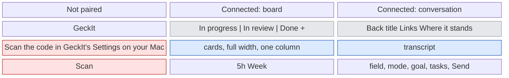
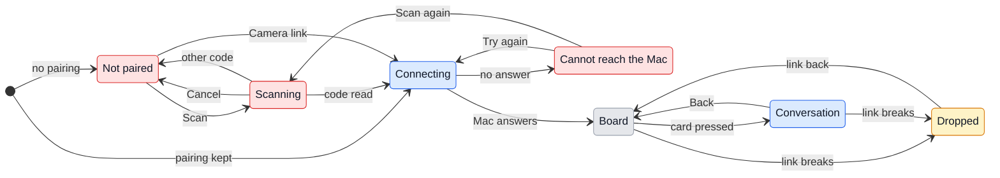

# UX: GeckIt on the phone

## 1. Why

Away from the Mac, Alex cannot see which conversations are working, which ones wait for Alex, and what they finished, and a session that stopped on a permission card stays stopped until Alex is back at the desk. Remote Control in the Claude app covers one conversation at a time and knows nothing of the board, the goals or the cards. Alex wants an app of their own: open it, scan a code on the Mac once, and from then on manage the conversations from the phone, with the phone talking to the Mac directly rather than through somebody's service.

## 2. What is added

The phone runs its own GeckIt app, which shows the same Chat window the Mac shows. It reaches the Mac directly (WebRTC), finds it through a small signaling function on weroost, and falls back to a relay only when the two networks cannot see each other. It is one person's tool: their Mac, their phones.

| Surface | What appears | When |
|---|---|---|
| Settings on the Mac (existing) | A "Phone" switch; while it is on, a QR code, how many phones are connected, and New code | Always; the QR only while on |
| Pairing screen in the app (new) | The app's name, one line of what to do, and Scan | The app has no pairing |
| Scanner in the app (new) | The camera, full screen, with Cancel | Scan is pressed |
| Connecting screen in the app (new) | "Connecting to the Mac" | Between a scan or a launch and the first answer from the Mac |
| Cannot reach the Mac (new) | What stands in the way, Try again, and Scan again | The Mac did not answer |
| Board in the app (existing Board, phone layout) | One column at a time, chosen by a segmented control at the top: In progress, In review, Done, each with its count. Cards take the whole width | Connected |
| Board header in the app | The segmented control and New task. The sidebar toggle, dictation, orders, keyboard shortcuts and Settings are not there | Always in the app |
| Conversation in the app (existing Chat, phone layout) | Takes the whole screen. Header: Back to the board, the title on one line, Links, Where it stands. The rest of the desktop header is not there | A card is pressed |
| Composer in the app (existing) | The field, the mode (Manual / Auto / Plan), the goal, the background tasks, Send / Stop. Model, MCP and Chrome are not there | In a conversation |
| Status line in the app (existing) | The plan's two windows only: 5h and Week | Always |
| Connection banner (new) | One line at the top when the link to the Mac dropped | Link is down |
| Notice (existing) | The Mac's in-window notice, "Finished - demo" or "Needs an answer - demo", dropping from the top | Another conversation finishes or asks; never the one on screen |

## 3. States

| State | When | What the person sees | What they do |
|---|---|---|---|
| Not paired | First launch, or after Scan again | "Scan the code in GeckIt's Settings on your Mac." and Scan | Presses Scan |
| Scanning | Scan pressed | The camera | Points it at the QR on the Mac, or Cancel |
| Not a GeckIt code | The camera read a code that is not GeckIt's | The pairing screen, with "That is not a GeckIt code." under its line; the system scanner closes once it reads anything | Presses Scan again |
| Connecting | A code was scanned, a GeckIt code was opened from the Camera app, or the app was opened with a pairing | "Connecting to the Mac" | Nothing; it goes on by itself |
| Cannot reach the Mac | No answer within the time below | "The Mac did not answer. GeckIt has to be open there, with Phone turned on in Settings." with Try again and Scan again | Opens GeckIt on the Mac, or scans a new code |
| Board | Connected | The column last chosen, with its cards | Picks a column, opens a card, starts a task |
| Conversation | A card is pressed | The transcript, live, and the composer | Reads, answers a card, writes, stops, marks, goes back |
| Asks | A session waits on a permission card or a question | The card in the conversation, as on the Mac; "Waiting for you" on the board card | Answers it |
| Not sent | A message could not reach the Mac | The text still in the field; "Not sent: the Mac could not be reached" in the status line | Sends it again |
| Dropped | The link to the Mac broke while connected | "Not connected to the Mac. Trying again." over the page, the page as it was underneath | Nothing; it reconnects by itself |
| Paired on the Mac | The switch is on | The QR, and "No phone connected" or "1 phone connected" | Scans it, or presses New code |

## 4. Transitions

| From | Event | To | What the person sees |
|---|---|---|---|
| Not paired | Presses Scan | Scanning | The camera; the first time, iOS asks for the camera |
| Scanning | Presses Cancel | Not paired, or Connecting when a pairing is kept | The pairing screen, or "Connecting to the Mac" |
| Scanning | Reads a code that is not GeckIt's, by itself | Not a GeckIt code | The pairing screen with "That is not a GeckIt code." |
| Any | The iPhone Camera app reads the Mac's code and the person presses its banner, then Open | Connecting | iOS asks "Open in GeckIt?" first; then "Connecting to the Mac", and the new pairing replaces the old one |
| Scanning | Reads GeckIt's code, by itself | Connecting | "Connecting to the Mac"; the pairing is kept on the phone |
| Connecting | The Mac answers, by itself | Board | The board |
| Connecting | No answer in 20 s, by itself | Cannot reach the Mac | The reason, Try again, Scan again |
| Cannot reach the Mac | Presses Try again | Connecting | "Connecting to the Mac" |
| Cannot reach the Mac | Presses Scan again | Scanning | The camera; the old pairing is dropped once a new code is read |
| App opened | A pairing is kept | Connecting | "Connecting to the Mac", then the board |
| Board | Presses a segment | Board | That column's cards; the choice is kept for the next opening |
| Board | Presses a card | Conversation | The conversation over the whole screen |
| Board | Presses New task | Conversation (new) | The New task form, as on the Mac |
| Conversation | Presses Back | Board | The board, on the column they left |
| Conversation | A permission card arrives, by itself | Asks | The card at the end of the transcript |
| Asks | Presses Allow once / for the session / No | Conversation | The card goes; the work goes on |
| Conversation | Presses Send | Conversation | Their message in the transcript; "Working" |
| Any connected | The link breaks, by itself | Dropped | The banner |
| Dropped | The link is back, by itself | Board | The page starts over on the board as it stands now |
| App sent to the background | iOS suspends it, by itself | Dropped on return | Nothing while away; on return the banner for as long as reconnecting takes |
| Mac: switch on | Presses the switch | Paired on the Mac | The QR and "No phone connected" |
| Mac: Paired | A phone connects, by itself | Paired on the Mac | "1 phone connected" |
| Mac: Paired | Presses New code | Paired on the Mac | A new QR; every phone connected drops, and each has to scan again |
| Mac: Paired | Turns the switch off | Off | Nothing more; phones drop and cannot reach it |

## 5. What stays quiet

| State | Why not shown |
|---|---|
| Direct or through the relay | Nothing the person does differs; it is a network fact |
| The signaling function on weroost | It only introduces the two ends; once connected it is not used |
| The Mac's own window being open or not | Nothing on the phone depends on it |
| Git branch, context size, cost | Desk facts: nothing the person acts on from a phone |
| Background tasks' output | Opened on demand from the tasks button only, as on the Mac |
| A drop shorter than the reconnect | The banner shows once the link has broken, and goes when it is back |

## 6. Numbers

| Number | Value | Why |
|---|---|---|
| Waiting for the Mac to answer | 20 s | The Mac asks the signaling function every 10 s at most, then gathers its routes; 20 s covers one missed ask and the gathering |
| One ask to the signaling function | Held up to 10 s | Its functions end at 15 s; 10 s leaves room to answer |
| An offer kept on weroost | 60 s | Longer than the 20 s the phone waits; an older one is from a phone that gave up |
| Key in the QR | 32 random bytes | It is the only thing that lets a phone in; it also encrypts what passes through weroost |
| Reconnect after a drop | At once, then 2, 5, 10, 30 s, then every 30 s | A drop from switching networks mends in seconds; a Mac that is asleep should not be asked every second |
| Largest message | 64 MB | A pasted photo from the phone camera is up to ~12 MB, base64 adds a third |

## 7. Wording

| State | Text |
|---|---|
| Not paired | "Scan the code in GeckIt's Settings on your Mac." |
| Not a GeckIt code | "That is not a GeckIt code." |
| Connecting | "Connecting to the Mac" |
| Cannot reach the Mac | "The Mac did not answer. GeckIt has to be open there, with Phone turned on in Settings." |
| Dropped | "Not connected to the Mac. Trying again." |
| Not sent | "Not sent: the Mac could not be reached" |
| Settings switch | "Open the conversations on your phone" |
| Settings hint | "Scan the code with the GeckIt app on your iPhone. The phone talks to this Mac directly, and only with the key in this code." |
| Settings, nobody | "No phone connected" |
| Settings, some | "1 phone connected", "2 phones connected" |
| Settings, New code | "New code" with the explanation "Phones paired with the old code will have to scan again." |
| Settings, signaling down | "The pairing service did not answer. Phones cannot find this Mac until it does." |

## 8. Edge cases

- **Two phones:** both scan the same code; both connect and see the same thing.
- **The Mac and the phone at once:** both see the same session; an answer from either removes the card from both.
- **Mac asleep or GeckIt closed:** the phone waits 20 s and says so; nothing is queued on weroost for later.
- **Drop mid-send:** the message goes as a request over the link; if it fails, nothing is in the transcript, the text and pictures go back into the field, and the status line says it was not sent.
- **Stale copy:** after a drop the page starts over rather than patching, so nothing on screen is older than the reconnect.
- **Code photographed by someone else:** it is a key; New code on the Mac makes the old one worthless.
- **Networks that block a direct link:** the relay carries it, when one is configured; without it, Cannot reach the Mac.

## 9. Deliberately not there

| Not done | Why |
|---|---|
| Tailscale or another VPN | A VPN app on the phone, and on iOS it takes the one VPN slot |
| Push notifications | Need Apple's push service and a sender; the first version is for looking and answering while the app is open |
| Settings on the phone | They are the Mac's: keys, apps to open files with, shortcuts |
| Model, MCP and Chrome pickers on the phone | A model change rereads the whole conversation; MCP and Chrome are configuration for the desk |
| Terminal, Finder, open file | They act on the Mac's screen, which nobody is looking at |
| A list of paired phones with names | One person's phones; New code is the whole of revoking |
| Android | Only an iPhone is in use |

## 10. Forks

### How the phone reaches the Mac

| Option | Verdict |
|---|---|
| Tailscale and a web page | No: a VPN app on the phone, and not an app of their own |
| A relay server carrying everything | No: every byte through a server |
| WebRTC directly, a relay only when the networks cannot see each other | Yes |

**Why:** it is direct in most networks, needs no app beyond GeckIt's, and the relay only carries traffic when there is no other way. The first version over Tailscale is kept in the history (commit ef6e2e5).

### How the board fits a phone

| Option | Verdict |
|---|---|
| Three narrow columns side by side | No: titles cut to one word |
| Columns scrolled sideways, one per screen | No: nothing says there are more columns |
| One column, chosen by a segmented control with counts | Yes |

**Why:** the counts say at a glance where things stand, and a segmented control is how iOS switches between views of one list.

### Reload or patch after a drop

| Option | Verdict |
|---|---|
| Keep the page and ask for everything again | No: every open conversation would have to be asked for |
| Start the page over | Yes |

**Why:** the link carries changes, not state, so after a gap the only honest copy is a new one.

## 11. Requirements

| Requirement | Where |
|---|---|
| An own app on the phone | The GeckIt app (section 2) |
| Start it, scan a QR, manage | Not paired, Scanning, Connecting, Board |
| See sessions' progress | Board, Conversation |
| Manage sessions | Asks, Send, Stop, mode, Where it stands |
| Peer-to-peer to the Mac | WebRTC; weroost only introduces the two ends |

**Missing from the request:** whether a notification is wanted when a card arrives while the app is closed; left out of this version (section 9).
