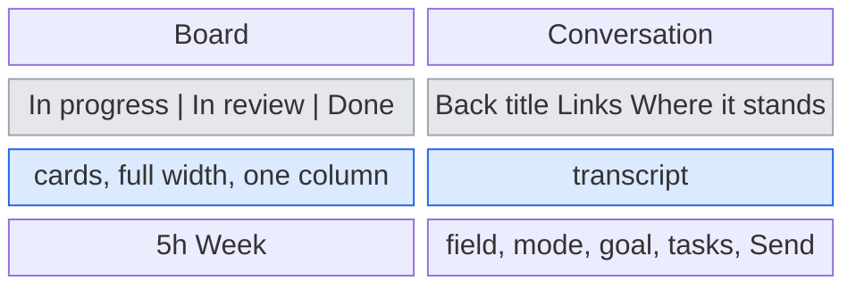
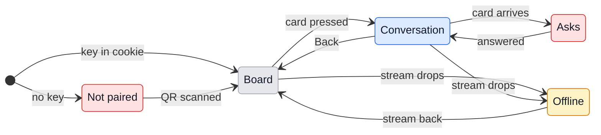

# UX: GeckIt on the phone

## 1. Why

Away from the Mac, Alex cannot see which conversations are working, which ones wait for him, and what they finished, and a session that stopped on a permission card stays stopped until he is back at the desk. Remote Control in the Claude app covers one conversation at a time and knows nothing of the board, the goals or the cards.

## 2. What is added

The phone opens the same Chat window the Mac shows, served by GeckIt over Tailscale and added to the home screen. It is one person's tool: his Mac, his phone, his tailnet.

| Surface | What appears | When |
|---|---|---|
| Settings on the Mac (existing) | A "Phone" switch, and while it is on a QR code of the link with Copy the link, or the reason it cannot be reached | Always; the QR only while on |
| Board on the phone (existing Board, phone layout) | One column at a time, chosen by a segmented control at the top: In progress, In review, Done, each with its count. Cards take the whole width | Home screen app opened |
| Board header on the phone | The segmented control and New task. The sidebar toggle, dictation, orders, keyboard shortcuts and Settings are not there | Always on the phone |
| Conversation on the phone (existing Chat, phone layout) | Takes the whole screen. Header: Back to the board, the title on one line, Links, Where it stands. The rest of the desktop header is not there | A card is pressed |
| Composer on the phone (existing) | The field, the mode (Manual / Auto / Plan), the goal, the background tasks, Send / Stop. Model, MCP and Chrome are not there | In a conversation |
| Status line on the phone (existing) | The plan's two windows only: 5h and Week | On the board |
| Connection banner (new) | One line at the top when the phone cannot reach the Mac | Stream to the Mac is down |
| Notice (existing) | The Mac's in-window notice, "Finished - demo" or "Needs an answer - demo", dropping from the top | Another conversation finishes or asks; never the one on screen |

## 3. States

| State | When | What he sees | What he does |
|---|---|---|---|
| Not paired | The page is opened without the key, or the key changed | "Open the link GeckIt shows in Settings." | Scans the QR on the Mac |
| Board | Paired, stream up | The column last chosen, with its cards | Picks a column, opens a card, starts a task |
| Conversation | A card is pressed | The transcript, live, and the composer | Reads, answers a card, writes, stops, marks, goes back |
| Asks | A session waits on a permission card or a question | The card in the conversation, as on the Mac; "Waiting for you" on the board card | Answers it |
| Not sent | A message could not reach the Mac | The text still in the field; "Not sent: the Mac could not be reached" in the status line | Sends it again |
| Offline | The event stream to the Mac is down | "Not connected to the Mac. Trying again." over the page, the page as it was underneath | Nothing; it comes back by itself, or he checks Tailscale and the Mac |
| Mac off | GeckIt is closed or the Mac sleeps | The browser's own "cannot open the page", or Offline if the page was open | Wakes the Mac or opens GeckIt |

## 4. Transitions

| From | Event | To | What he sees |
|---|---|---|---|
| Not paired | Opens the link from the QR | Board | The board; the key is kept for a year |
| Board | Presses a segment | Board | That column's cards; the choice is kept for the next opening |
| Board | Presses a card | Conversation | The conversation over the whole screen |
| Board | Presses New task | Conversation (new) | The New task form, as on the Mac |
| Conversation | Presses Back | Board | The board, on the column he left |
| Conversation | A permission card arrives, by itself | Asks | The card at the end of the transcript |
| Asks | Presses Allow once / for the session / No | Conversation | The card goes; the work goes on |
| Conversation | Presses Send | Conversation | His message in the transcript; "Working" |
| Conversation | Presses Stop | Conversation | The turn stops, as on the Mac |
| Any | Stream to the Mac drops, by itself | Offline | The banner |
| Offline | Stream comes back, by itself | The page reloads onto Board | The board as it stands now |

## 5. What stays quiet

| State | Why not shown |
|---|---|
| The Mac's own window being open or not | Nothing on the phone depends on it |
| Git branch, context size, cost | Desk facts: nothing he acts on from a phone |
| Background tasks' output | Opened on demand from the tasks button only, as on the Mac |
| A short drop under a second, such as switching Wi-Fi to cellular | EventSource reconnects by itself; the banner shows only once the stream has errored |

## 6. Numbers

| Number | Value | Why |
|---|---|---|
| Key lifetime in the cookie | 1 year | A phone is paired once; a key that expires means scanning a QR at the desk, which is exactly where he is not |
| Keep-alive on the stream | 25 s | Below the 30 s idle cut of common proxies and of Safari on cellular |
| Largest request | 64 MB | A pasted photo from the phone camera is up to ~12 MB, base64 adds a third |

## 7. Wording

| State | Text |
|---|---|
| Not paired | "Open the link GeckIt shows in Settings." |
| Offline | "Not connected to the Mac. Trying again." |
| Not sent | "Not sent: the Mac could not be reached" |
| Settings switch | "Open the conversations on your phone" |
| Settings hint | "Over Tailscale, which has to be signed in on this Mac and on the phone, with HTTPS turned on for the tailnet. Only your own devices reach it, and only with the key in the link." |
| Settings QR | "Point the phone's camera at it, then Share, Add to Home Screen." |
| Tailscale missing | "Tailscale is not installed on this Mac." |
| Tailscale signed out | "Tailscale is not signed in on this Mac." |

## 8. Edge cases

- **Empty column:** the column is empty under its segment, as on the Mac.
- **Everything at once:** several sessions ask together; each board card says "Waiting for you", and the In progress count is what he scans.
- **Drop mid-send:** the message is sent over a request, not over the stream; if the request fails, nothing is in the transcript, the text and pictures go back into the field, and the status line says it was not sent.
- **Repeat:** an answer pressed twice goes once; the Mac drops an answer to a card that is gone.
- **Stale copy:** after a drop the page reloads rather than patching, so nothing on screen is older than the reconnect.
- **The Mac and the phone at once:** both see the same session; an answer from either removes the card from both.

## 9. Deliberately not there

| Not done | Why |
|---|---|
| A native iOS app | The web app reuses the whole Chat window; a native one would be a second client to keep in step |
| Push notifications | Need a push service and keys; the first version is for looking and answering while it is open |
| Settings on the phone | They are the Mac's: keys, apps to open files with, shortcuts |
| Model, MCP and Chrome pickers on the phone | A model change rereads the whole conversation; MCP and Chrome are configuration for the desk |
| Terminal, Finder, open file | They act on the Mac's screen, which nobody is looking at |
| Reaching it without Tailscale | It would need our own relay and pairing; this is for one person |

## 10. Forks

### How the board fits a phone

| Option | Verdict |
|---|---|
| Three narrow columns side by side | No: titles cut to one word, as the first screenshot showed |
| Columns scrolled sideways, one per screen | No: nothing says there are more columns |
| One column, chosen by a segmented control with counts | Yes |

**Why:** the counts say at a glance where things stand, and a segmented control is how iOS switches between views of one list.

### Reload or patch after a drop

| Option | Verdict |
|---|---|
| Keep the page and ask for everything again | No: every open conversation would have to be asked for |
| Reload the page | Yes |

**Why:** the stream carries changes, not state, so after a gap the only honest copy is a new one.

## 11. Requirements

| Requirement | Where |
|---|---|
| See sessions' progress from the phone | Board, Conversation |
| Manage sessions from the phone | Asks, Send, Stop, mode, Where it stands |
| Peer-to-peer to the Mac | Tailscale; nothing of ours in between |

**Missing from the request:** whether answering cards is enough, or a notification is wanted when one arrives; left out of this version (section 9).
