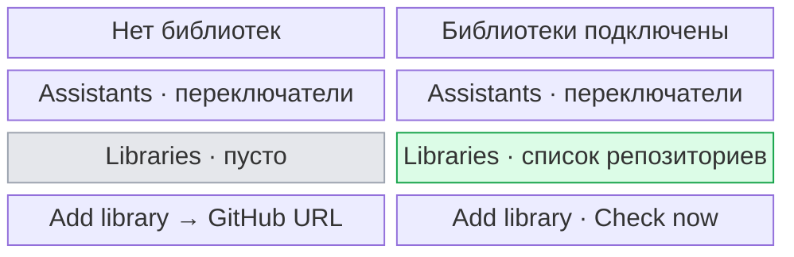
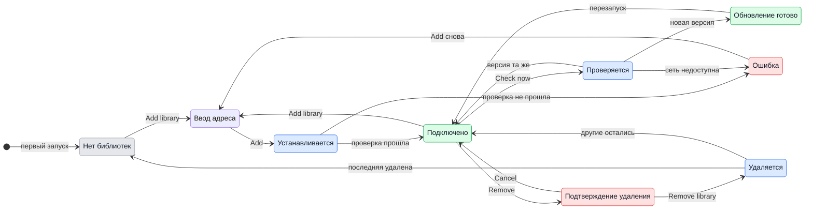

# UX: библиотеки провайдеров

## 1. Зачем

Репозитории провайдеров должны иметь своё место в Settings: список подключённых источников, добавление следующего и управление обновлениями. Alex хочет подключить несколько библиотек и получать их новые версии автоматически.

## 2. Что добавляется

| Поверхность | Что появляется | Когда видно |
|---|---|---|
| Settings > Assistants | Компактные строки встроенных ассистентов; инструкции GeckIt раскрываются по запросу | Всегда |
| Settings > Assistants | Codex Mirror как отдельная строка и переключатель рядом с Codex | Когда библиотека Codex Mirror подключена |
| Settings > Assistants | Выбор Claude Stream или Claude tmux как транспорта по умолчанию для новых бесед | Когда подключена библиотека Claude tmux |
| Settings > Libraries | Список репозиториев с именем провайдера, адресом и состоянием обновления | После первой установки |
| Settings > Libraries | Компактный список, переключатель Automatic updates, Check now и Add library | На компьютере |
| Settings > Libraries | Remove у каждой библиотеки, с подтверждением в той же строке | Когда библиотека подключена |
| Settings > Libraries | Пустое состояние | Пока библиотек нет |
| Settings > Libraries | Ошибка установки или ручной проверки около действия | Когда действие не удалось |

## 3. Состояния

| Состояние | Когда наступает | Что видит пользователь | Что ему делать |
|---|---|---|---|
| Пусто | Нет подключённых репозиториев | «No libraries installed.» | Нажать Add library |
| Ввод адреса | Нажат Add library | Поле URL, Add и Cancel вместо пустого состояния | Вставить адрес и нажать Add |
| Установка | Нажат Add, `git clone` ещё работает | «Adding library…» у кнопки | Ничего, действие закончится само |
| Подключено | Провайдер загружен | Строка с именем, иконкой и адресом | Включить или выключить ассистента выше, если нужно |
| Транспорт Claude | Подключён `claude-tmux` с семейством `claude` | Claude остаётся одной идентичностью ассистента; Settings > Assistants показывает выбор Stream/tmux для новых бесед. В Composer остаётся выбор транспорта текущей беседы. | Выбрать tmux, чтобы новые локальные беседы Claude использовали подключённый транспорт |
| Проверка | Нажат Check now | «Checking…» у кнопки | Ничего, действие закончится само |
| Обновление готово | Новая версия проверена и записана | «Update ready» у строки | Перезапустить GeckIt, когда удобно |
| Подтверждение удаления | Нажат Remove у библиотеки | «Remove <name>? Its installed copy moves to Trash. Restart GeckIt to unload its code.» и кнопки Remove library, Cancel | Подтвердить или отменить |
| Удаление | Подтверждено удаление, файлы ещё удаляются | «Removing…» у кнопки | Дождаться результата |
| Удалено | Установленная копия перемещена в Trash | Строка исчезает, «Restart GeckIt to unload removed libraries.» | Перезапустить, когда удобно |
| Ошибка удаления | Файлы нельзя удалить | Строка остаётся, ошибка возле списка | Повторить |
| Ошибка установки | Адрес или репозиторий не прошёл проверку | Текст ошибки под полем | Исправить адрес или повторить |
| Ошибка ручной проверки | Хотя бы один репозиторий не удалось проверить | «Could not check every library. Try again.» | Нажать Check now позже |

## 4. Переходы

| Из | Событие | В | Что видит пользователь |
|---|---|---|---|
| Пусто или подключено | Нажал Add library | Ввод адреса | URL, Add и Cancel |
| Ввод адреса | Нажал Add с адресом GitHub | Установка | «Adding library…» |
| Установка | Репозиторий скачан, манифест и интерфейс прошли проверку | Подключено | Новая строка библиотеки |
| Установка | Скачивание или проверка не удались | Ошибка | Ошибка под полем, адрес остаётся |
| Ошибка | Изменил адрес или нажал Add ещё раз | Установка | «Adding library…» |
| Подключено | Само, без пользователя, при старте и раз в день, если Automatic updates включены | Проверка | Ничего |
| Подключено | Нажал Check now | Проверка | «Checking…» |
| Проверка | Версия та же | Подключено | Ничего при автоматической проверке; «Libraries are up to date.» при ручной |
| Проверка | Новая версия прошла проверку | Обновление готово | «Update ready» |
| Проверка | Сеть или новая версия не прошла проверку | Подключено или ошибка | Ничего при автоматической проверке; ошибка при ручной |
| Обновление готово | Закрыл и открыл GeckIt | Подключено | Загружается новая версия; отметка исчезает |
| Подключено | Нажал Remove | Подтверждение удаления | У строки вопрос, Remove library и Cancel |
| Подтверждение удаления | Нажал Cancel | Подключено | Строка снова обычная |
| Подтверждение удаления | Нажал Remove library | Удаляется | «Removing…» |
| Удаляется | Файлы удалены | Подключено или пусто | Строка исчезла, статус просит перезапустить GeckIt |
| Удаляется | Ошибка файловой системы | Ошибка удаления | Строка остаётся, ошибку можно повторить |

## 5. Что молчит

| Состояние | Почему не показываем |
|---|---|
| Фоновая проверка без новой версии | Пользователь не может и не должен за ней следить |
| Ошибка фоновой проверки из-за сети | Старая рабочая версия остаётся; следующая проверка повторится сама |
| Git commit и служебный путь копии | Для решения пользователя важны репозиторий и необходимость перезапуска |

## 6. Пороги и время

| Число | Значение | Почему столько |
|---|---|---|
| 24 часа | Интервал фоновой проверки при работающем приложении | Достаточно для обновлений кода, не создаёт постоянных сетевых запросов |
| 120 секунд | Предел скачивания одного репозитория | Не оставляет установку или ручную проверку зависшей навсегда |

## 7. Формулировки

| Состояние | Текст |
|---|---|
| Пусто | «No libraries installed.» |
| Подсказка | «Providers from GitHub. Updates load after restart.» |
| Установка | «Adding library…» |
| Проверка | «Checking…» |
| Обновление готово | «Update ready» |
| Подтверждение удаления | «Remove <name>? Its installed copy moves to Trash. Restart GeckIt to unload its code.» |
| Удаление | «Removing…» |
| Удалено | «Restart GeckIt to unload removed libraries.» |
| Ошибка удаления | «Could not remove <name>. Try again.» |
| Проверено без обновлений | «Libraries are up to date.» |
| Ошибка ручной проверки | «Could not check every library. Try again.» |
| Безопасность | «Provider code runs on this computer. Add a repository you trust.» |

## 8. Краевые случаи

- **Пусто:** одна короткая строка вместо пустого контейнера.
- **Всё сразу:** несколько репозиториев стоят отдельными строками; длинный адрес обрезается визуально, целиком остаётся в `title`.
- **Небольшое окно:** навигация и содержимое прокручиваются внутри диалога, нижние действия остаются видимыми; после Add library форма прокручивается в видимую область.
- **Обрыв:** старая версия остаётся рабочей; ручная проверка показывает ошибку, фоновая молчит.
- **Повтор:** Add блокируется, пока идёт установка; существующий репозиторий не устанавливается второй раз.
- **Устаревшая копия:** новая версия пишется отдельно и подменяет файлы только после проверки; действующие беседы продолжают работать на уже загруженном коде до перезапуска.
- **Два провайдера одного семейства:** ограничения интерфейса провайдеров сохраняются, в частности один заменитель Codex.
- **Claude tmux:** это альтернативный транспорт существующего Claude Code, а не отдельный AI-ассистент. Не показывать его как независимую строку или дополнительное имя в выборе Assistant. При установленной библиотеке показать в Settings > Assistants выбор транспорта по умолчанию для новых бесед; в Composer оставить выбор транспорта текущей беседы. Установка сохраняет текущий выбор Stream/tmux, пока пользователь сам его не изменит.
- **Codex Mirror:** после обновления прежней библиотеки-заменителя Codex остаётся включён, если он был включён; Mirror появляется отдельным включённым ассистентом. Выключение одного не выключает другой. Обе строки бесед могут вести к одной сессии Codex.
- **Удаление библиотеки:** установленная копия отправляется в Trash, ожидающее обновление удаляется. GeckIt не удаляет свои заметки о беседах; файлы бесед провайдер держит сам. Ассистент исчезает из выбора сразу; работающий процесс может закончить текущий ответ, код выгружается после перезапуска. Повторная установка той же библиотеки требует перезапуска.

## 9. Чего намеренно нет

| Не делаем | Почему |
|---|---|
| Автоматический перезапуск | Он может оборвать работающие беседы |
| Автоматическое переключение действующих сессий на скачанный код | Оно меняло бы поведение посреди ответа |
| Каталог или рейтинг публичных репозиториев | Пользователь приносит конкретные URL; каталог требует модерации и доверия |

## 10. Развилки

### Когда применять обновление

| Вариант | Вердикт |
|---|---|
| Во время работы GeckIt | Нет |
| После следующего запуска | Да |

**Почему:** интерфейс провайдера управляет процессами и сессиями. Подмена активного объекта посреди ответа может потерять события или управление.

### Где держать библиотеки

| Вариант | Вердикт |
|---|---|
| Под каждым встроенным ассистентом | Нет |
| Отдельная секция Libraries в Settings | Да |

**Почему:** один репозиторий может быть самостоятельным провайдером или заменой встроенного. Список источников показывает связь с GitHub независимо от переключателей ассистентов.

## 11. Сверка с требованиями

| Требование | Где закрыто |
|---|---|
| Подключить несколько библиотек | Разделы 2, 3, 8 |
| Автоматически получать обновления | Разделы 4, 5, 6, 10 |
| Улучшить экран из скриншота | Разделы 2, 7, 10 |

**Чего не хватает в требованиях:** интервал проверки и момент применения обновления выбраны здесь.

## Main integration - 2026-10-08

Alex authorized moving Libraries and independent external providers into main. Preserve the documented installation, assistant selection, update and removal flows. This integration has no Agent VPN settings, status, admission checks or native routing dependency. Builtin providers remain available alongside installed libraries. Preserve newer main fixes for session recovery, imported transcripts and phone favorites.

### Integration verification

- Validation passed: 668 tests across 58 files, node/web typecheck, source/test lint, desktop and mobile builds, external Codex provider example test and whitespace check.
- Full-context preview review covered Libraries and Assistants in light/dark themes, installation input, empty state, update indicators and removal confirmation. Model details covered complete, partial, loading and unavailable metadata, long identifiers and phone layout at 390 x 844. Desktop model details and Assistants were inspected at 1280 x 720.
- Keyboard review confirmed URL autofocus, disabled empty submission, cancellation, visible focus, Escape closure with restored opener focus and scrolling to model pricing/quotas while retaining the title. Fixtures use in-memory settings; no live library was installed or removed.
- Static performance review found the existing board/phone row memoization, stable conversation identity and memoized list ordering retained. Library rows use memoization with stable callbacks and offscreen content visibility; typing the repository URL does not invalidate unchanged row props. Provider icons are memoized by primitive props. Polling runs only while visible; formatter construction remains outside render loops. No new infinite animation was introduced. The mobile bundle was rebuilt.
- Needs measuring: library-list rendering in the running integrated Electron app. Native runtime profiling, live installation/update, physical iPhone and released-installer availability were not verified. Browser fixtures establish visual behavior, not native runtime performance.

### Failed removal diagnosis - 2026-10-08

Alex reported a failed Codex Mirror removal in the actual Libraries screen. Keep the installed row and confirmation on failure, and preserve files and conversation history. The error must expose the actionable failure reason instead of hiding it behind a generic retry message.

- File/removal failure: "Could not remove <name>. <reason>". Strip Electron invocation wrappers; if no usable reason is available, retain "Could not remove <name>. Try again."
- If the running main process does not yet have the library-removal handler: "Restart GeckIt to finish updating library management, then try again." The running renderer can update before the main process restarts; retrying alone cannot load the new handler.
- Successful removal still moves the library to Trash and requests restart to unload its code.

The running app was verified on 2026-10-08: its library-removal handler was registered, a disposable-folder Trash probe passed, and retrying the reported Codex Mirror removal through that handler succeeded. The installed directory disappeared, `providerPlugins` became empty, `providerRemovalPending` became true and builtin Codex remained enabled. Conversation deletion was not invoked. The earlier screenshot failure could not be reproduced after the main process restarted; its underlying exception was hidden by the old generic error message.

### Claude tmux discoverability - 2026-10-08

Alex installed `geckit-claude-tmux` and expected another assistant. Its manifest declares `id: claude-tmux`, `family: claude`, `transport: tmux`; this extends Claude Code's existing identity. Settings saved the plugin and kept Claude enabled, but `chatTransport` remained `stream`. The independent assistant filters correctly omit another Claude row, leaving the composer transport choice as the only visible entry point.

Settings > Assistants now shows **Default transport: Stream/tmux** under Claude when that library is installed. Changing it controls new local conversations; the composer continues to control an individual conversation, and existing sessions keep their saved transport. Installation itself keeps the person's current Stream/tmux choice.

Browser fixture review covered the full Settings dialog in light and dark themes at the default size and at 900 x 600. The selector menu and keyboard selection of tmux worked, the long removal error wrapped without clipping, and the failure retained the library row and confirmation. The running GeckIt Local window was unavailable to visual review because computer-use access was not approved; its installed manifest and saved settings were read directly. Native runtime behavior after restart remains unverified.

### Claude tmux conversation ownership

Alex reported tmux cards for conversations that were not created in GeckIt. The library shares Claude's native transcript directory, but that directory does not establish tmux ownership. Only sessions created with the tmux assistant in GeckIt, or explicitly restored under that assistant, belong to its history. Persisted GeckIt notes establish ownership across restarts; an active GeckIt conversation remains visible before its transcript reaches disk.

| From | Event | To | What the user sees |
|---|---|---|---|
| Unrelated Claude history | Board refresh, search or Hidden listing, automatically | Unrelated Claude history | No duplicate tmux card or result; builtin Claude retains its existing history behavior |
| New tmux conversation | User starts a task with Claude Code (tmux) | Owned tmux conversation | One tmux card, including while its first message waits for a slot |
| Owned tmux conversation | GeckIt restarts or refreshes, automatically | Owned tmux conversation | Existing tmux card and history |
| Owned tmux conversation | User hides it | Hidden tmux conversation | Card leaves the board and is available in Hidden |
| Hidden tmux conversation | User restores it | Owned tmux conversation | Same tmux card returns |

Unrelated transcripts stay silent in tmux search and Hidden as well as on the board. No new copy, controls, timing thresholds, theme rules or layout are introduced. Existing hide, restore, fork and delete behavior applies to owned conversations. Filtering does not delete transcripts or notes. A shared native Claude ID alone must never create a second assistant identity.

Verification of the isolated correction: all three ownership regressions pass, covering board/search/Hidden, persistence, new/forked conversations and queued conversations. Typecheck, targeted lint and desktop build pass. The full isolated suite was interrupted after more than two minutes without completing; a full-suite pass is not claimed. Native full-window light/dark, keyboard, scrolling and target viewport review was unavailable because Computer Use access to GeckIt was denied. Renderer components and styling were not changed.
