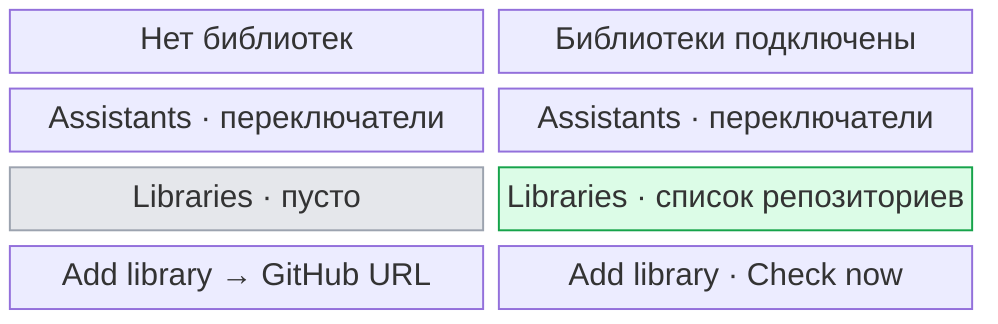
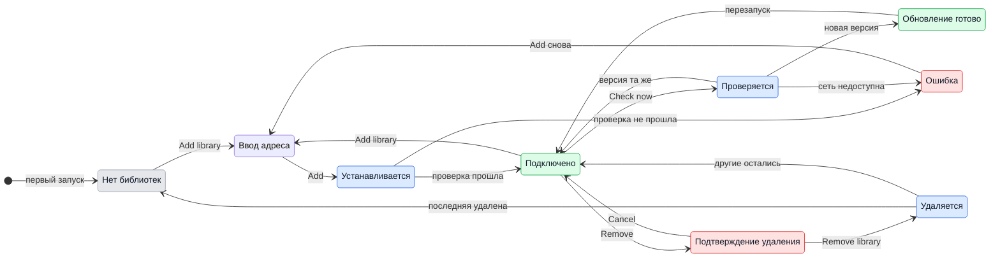
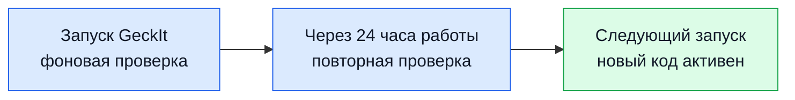

# UX: библиотеки провайдеров

## 1. Зачем

Репозитории провайдеров должны иметь своё место в Settings: список подключённых источников, добавление следующего и управление обновлениями. Alex хочет подключить несколько библиотек и получать их новые версии автоматически.

## 2. Что добавляется

| Поверхность | Что появляется | Когда видно |
|---|---|---|
| Settings > Assistants | Компактные строки встроенных ассистентов; инструкции GeckIt раскрываются по запросу | Всегда |
| Settings > Assistants | Codex Mirror как отдельная строка и переключатель рядом с Codex | Когда библиотека Codex Mirror подключена |
| Settings > Libraries | Список репозиториев с именем провайдера, адресом и состоянием обновления | После первой установки |
| Settings > Libraries | Компактный список, переключатель Automatic updates, Check now и Add library | На компьютере |
| Settings > Libraries | Remove у каждой библиотеки, с подтверждением в той же строке | Когда библиотека подключена |
| Settings > Libraries | Пустое состояние | Пока библиотек нет |
| Settings > Libraries | Ошибка установки или ручной проверки около действия | Когда действие не удалось |

## 3. Состояния

| Состояние | Когда наступает | Что видит пользователь | Что ему делать |
|---|---|---|---|
| Пусто | Нет подключённых репозиториев | «No libraries installed.» | Нажать Add library |
| Ввод адреса | Нажат Add library | Поле URL, Add и Cancel вместо пустого состояния | Вставить адрес и нажать Add |
| Установка | Нажат Add, `git clone` ещё работает | «Adding library…» у кнопки | Ничего, действие закончится само |
| Подключено | Провайдер загружен | Строка с именем, иконкой и адресом | Включить или выключить ассистента выше, если нужно |
| Проверка | Нажат Check now | «Checking…» у кнопки | Ничего, действие закончится само |
| Обновление готово | Новая версия проверена и записана | «Update ready» у строки | Перезапустить GeckIt, когда удобно |
| Подтверждение удаления | Нажат Remove у библиотеки | «Remove <name>? Its installed copy moves to Trash. Restart GeckIt to unload its code.» и кнопки Remove library, Cancel | Подтвердить или отменить |
| Удаление | Подтверждено удаление, файлы ещё удаляются | «Removing…» у кнопки | Дождаться результата |
| Удалено | Установленная копия перемещена в Trash | Строка исчезает, «Restart GeckIt to unload removed libraries.» | Перезапустить, когда удобно |
| Ошибка удаления | Файлы нельзя удалить | Строка остаётся, ошибка возле списка | Повторить |
| Ошибка установки | Адрес или репозиторий не прошёл проверку | Текст ошибки под полем | Исправить адрес или повторить |
| Ошибка ручной проверки | Хотя бы один репозиторий не удалось проверить | «Could not check every library. Try again.» | Нажать Check now позже |

## 4. Переходы

| Из | Событие | В | Что видит пользователь |
|---|---|---|---|
| Пусто или подключено | Нажал Add library | Ввод адреса | URL, Add и Cancel |
| Ввод адреса | Нажал Add с адресом GitHub | Установка | «Adding library…» |
| Установка | Репозиторий скачан, манифест и интерфейс прошли проверку | Подключено | Новая строка библиотеки |
| Установка | Скачивание или проверка не удались | Ошибка | Ошибка под полем, адрес остаётся |
| Ошибка | Изменил адрес или нажал Add ещё раз | Установка | «Adding library…» |
| Подключено | Само, без пользователя, при старте и раз в день, если Automatic updates включены | Проверка | Ничего |
| Подключено | Нажал Check now | Проверка | «Checking…» |
| Проверка | Версия та же | Подключено | Ничего при автоматической проверке; «Libraries are up to date.» при ручной |
| Проверка | Новая версия прошла проверку | Обновление готово | «Update ready» |
| Проверка | Сеть или новая версия не прошла проверку | Подключено или ошибка | Ничего при автоматической проверке; ошибка при ручной |
| Обновление готово | Закрыл и открыл GeckIt | Подключено | Загружается новая версия; отметка исчезает |
| Подключено | Нажал Remove | Подтверждение удаления | У строки вопрос, Remove library и Cancel |
| Подтверждение удаления | Нажал Cancel | Подключено | Строка снова обычная |
| Подтверждение удаления | Нажал Remove library | Удаляется | «Removing…» |
| Удаляется | Файлы удалены | Подключено или пусто | Строка исчезла, статус просит перезапустить GeckIt |
| Удаляется | Ошибка файловой системы | Ошибка удаления | Строка остаётся, ошибку можно повторить |

## 5. Что молчит

| Состояние | Почему не показываем |
|---|---|
| Фоновая проверка без новой версии | Пользователь не может и не должен за ней следить |
| Ошибка фоновой проверки из-за сети | Старая рабочая версия остаётся; следующая проверка повторится сама |
| Git commit и служебный путь копии | Для решения пользователя важны репозиторий и необходимость перезапуска |

## 6. Пороги и время

| Число | Значение | Почему столько |
|---|---|---|
| 24 часа | Интервал фоновой проверки при работающем приложении | Достаточно для обновлений кода, не создаёт постоянных сетевых запросов |
| 120 секунд | Предел скачивания одного репозитория | Не оставляет установку или ручную проверку зависшей навсегда |

## 7. Формулировки

| Состояние | Текст |
|---|---|
| Пусто | «No libraries installed.» |
| Подсказка | «Providers from GitHub. Updates load after restart.» |
| Установка | «Adding library…» |
| Проверка | «Checking…» |
| Обновление готово | «Update ready» |
| Подтверждение удаления | «Remove <name>? Its installed copy moves to Trash. Restart GeckIt to unload its code.» |
| Удаление | «Removing…» |
| Удалено | «Restart GeckIt to unload removed libraries.» |
| Ошибка удаления | «Could not remove <name>. Try again.» |
| Проверено без обновлений | «Libraries are up to date.» |
| Ошибка ручной проверки | «Could not check every library. Try again.» |
| Безопасность | «Provider code runs on this computer. Add a repository you trust.» |

## 8. Краевые случаи

- **Пусто:** одна короткая строка вместо пустого контейнера.
- **Всё сразу:** несколько репозиториев стоят отдельными строками; длинный адрес обрезается визуально, целиком остаётся в `title`.
- **Небольшое окно:** навигация и содержимое прокручиваются внутри диалога, нижние действия остаются видимыми; после Add library форма прокручивается в видимую область.
- **Обрыв:** старая версия остаётся рабочей; ручная проверка показывает ошибку, фоновая молчит.
- **Повтор:** Add блокируется, пока идёт установка; существующий репозиторий не устанавливается второй раз.
- **Устаревшая копия:** новая версия пишется отдельно и подменяет файлы только после проверки; действующие беседы продолжают работать на уже загруженном коде до перезапуска.
- **Два провайдера одного семейства:** ограничения интерфейса провайдеров сохраняются, в частности один заменитель Codex.
- **Codex Mirror:** после обновления прежней библиотеки-заменителя Codex остаётся включён, если он был включён; Mirror появляется отдельным включённым ассистентом. Выключение одного не выключает другой. Обе строки бесед могут вести к одной сессии Codex.
- **Удаление библиотеки:** установленная копия отправляется в Trash, ожидающее обновление удаляется. GeckIt не удаляет свои заметки о беседах; файлы бесед провайдер держит сам. Ассистент исчезает из выбора сразу; работающий процесс может закончить текущий ответ, код выгружается после перезапуска. Повторная установка той же библиотеки требует перезапуска.

## 9. Чего намеренно нет

| Не делаем | Почему |
|---|---|
| Автоматический перезапуск | Он может оборвать работающие беседы |
| Автоматическое переключение действующих сессий на скачанный код | Оно меняло бы поведение посреди ответа |
| Каталог или рейтинг публичных репозиториев | Пользователь приносит конкретные URL; каталог требует модерации и доверия |

## 10. Развилки

### Когда применять обновление

| Вариант | Вердикт |
|---|---|
| Во время работы GeckIt | Нет |
| После следующего запуска | Да |

**Почему:** интерфейс провайдера управляет процессами и сессиями. Подмена активного объекта посреди ответа может потерять события или управление.

### Где держать библиотеки

| Вариант | Вердикт |
|---|---|
| Под каждым встроенным ассистентом | Нет |
| Отдельная секция Libraries в Settings | Да |

**Почему:** один репозиторий может быть самостоятельным провайдером или заменой встроенного. Список источников показывает связь с GitHub независимо от переключателей ассистентов.

## 11. Сверка с требованиями

| Требование | Где закрыто |
|---|---|
| Подключить несколько библиотек | Разделы 2, 3, 8 |
| Автоматически получать обновления | Разделы 4, 5, 6, 10 |
| Улучшить экран из скриншота | Разделы 2, 7, 10 |

**Чего не хватает в требованиях:** интервал проверки и момент применения обновления выбраны здесь.
