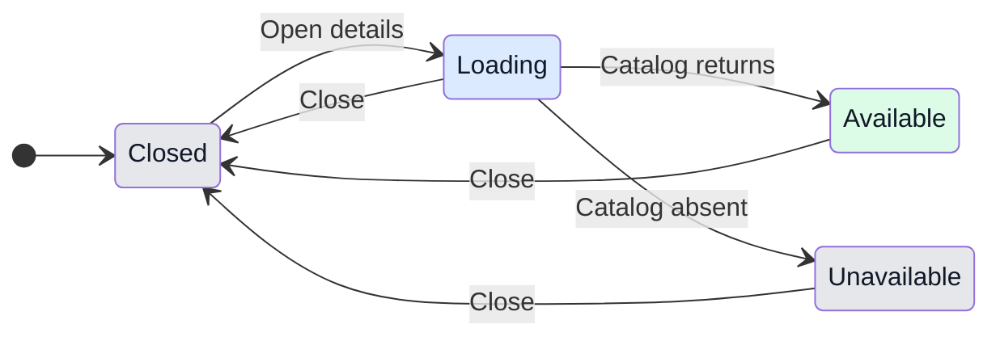

# Provider usage and model details

## 1. Purpose

People need limits and model capabilities for whichever assistant they select, including libraries. Plugins must report their own quotas, context, prices and version without being interpreted as Claude or Codex.

## 2. Surfaces

| Surface | Addition | When visible |
|---|---|---|
| Desktop account status | Named quota meters and reset times | Provider reports quotas |
| Composer | Model details control | Beside existing model picker |
| Model details dialog/sheet | Identity, version, context, output, reasoning, modes, token prices, CLI version, quotas | Opened by user |
| Phone conversation drawer | Model details and generic quotas | User opens conversation info |

Read-only groups: provider identity, model capacity, pricing, account limits. The existing model picker selects the next model.

## 3. States

| State | Trigger | User sees | Action |
|---|---|---|---|
| Closed | Initial or dismissed | "Model details" | Open |
| Loading | Catalog pending | "Loading model details..." | Wait or close |
| Available | Catalog returns | Named model and reported values | Read or close |
| Missing | No matching/default model reported | "Model details unavailable" | Close, retry later |
| Partial | Optional values absent | Known values; "Pricing not reported" | Read or close |

## 4. Transitions

| From | Event | To | User sees |
|---|---|---|---|
| Closed | Click Model details | Loading | Dialog/sheet opens and requests catalog |
| Loading | Provider responds automatically | Available or Missing | Values or "Model details unavailable" |
| Open | Usage updates automatically | Open | Quotas update |
| Open | Done, Escape or scrim | Closed | Conversation; focus returns to opener |
| Closed | Open again | Loading or Available | Cached model stays while refreshing |

## 5. Silent states

Absent capabilities remain unknown, not unsupported. Failed usage refresh keeps the last successful measurement and its time. Unknown price source/date stays omitted. Provider measurements are isolated even when model IDs match.

## 6. Thresholds and time

| Number | Meaning | Reason |
|---|---|---|
| 60 seconds | Backend cache | Existing measurement cadence; coalesce requests |
| 5 minutes | Visible renderer polling | Existing plan refresh cadence |
| 70% / 90% | Meter warning tones | Existing GeckIt thresholds |
| One million tokens | Price denominator | Explicit contract unit |

## 7. Wording

"Model details", "Loading model details...", "Model details unavailable", "Pricing not reported", "Prices per million tokens", "API equivalent", "Billed cost", "Limits unavailable", "Not reported", "Done". Provider owns model/description/quota names.

## 8. Edge cases

Empty quotas have no fake zero meter. Zero prices are shown; absent rates are omitted. Long IDs/descriptions wrap and details scroll. Repeated requests share a provider measurement. Last successful usage survives refresh failure. Live context capacity takes precedence over catalog capacity. SSH Claude retains host-specific plans.

## 9. Deliberate omissions

No hardcoded vendor prices or bill calculated from context occupancy. Detailed reference metadata stays behind an explicit control instead of filling the status bar.

## 10. Decisions

Use GeckIt's existing dialog, sheet, grouped rows and tokens. Preserve plugin API v1 legacy limits and normalize them. New providers report arbitrary named quotas. User authorized implementation; this document records concrete behavior for review.

## 11. Requirements

Provider-scoped usage covers libraries and builtins. Optional model pricing/version/capacity covers model details. Usage/spend events cover streaming updates. Shared details content gives phone parity. Author guide, independent Codex example and CLI instructions cover build documentation.

## Auto-to-Manual notice

When a provider starts outside Auto or switches out of Auto, the existing conversation note uses that conversation's active provider display name. The wording is "<provider> has no auto mode for <model>, so this conversation asks first, as in Manual." Missing model identity uses "this model". Claude names retain existing model formatting; plugin model IDs remain intact. The mode changes to Manual as before. For OpenCode + Ollama with ollama/qwen3.5:0.8b, the note begins "OpenCode + Ollama", matching the composer. Existing saved notes remain history; new fallback notices use corrected wording. No layout, focus, keyboard, scrolling or theme behavior changes.

Provider notice verification (2026-10-09): 164 session tests, typecheck, scoped ESLint and desktop build pass. Reviewed actual Transcript and Composer in an isolated Chrome preview, light/dark desktop at 1352x708 and phone at 390x844. Provider identity matches the composer, complete notice remains readable and wraps on phone without clipping, adjacent spacing and density stay consistent. Keyboard Tab moves from composer input to Manual. No interactive controls or scrolling behavior changed. Preview removed and viewport restored. Native app activation remains unverified; the main-process change loads on the next GeckIt restart, with no active conversations restarted by this session. No renderer hot-path or animation changes.
