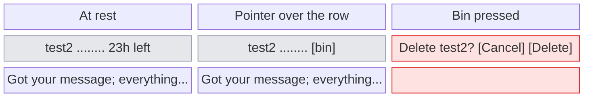
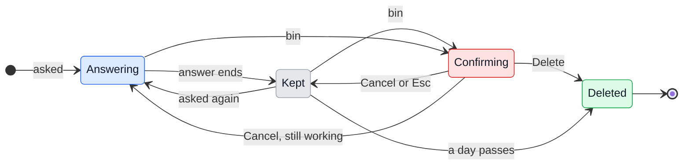

# UX: How long a question is kept, and deleting one

## 1. Why

A general question (Ask, Cmd+Shift+N) used to vanish 5 minutes after its answer, often before Alex had read it or asked the next thing. It is now kept for a day after its last answer. That makes two new needs: seeing how long each one has left, and throwing one away sooner without leaving the list. The first attempt put "Deleted in 23h" as a third line under the answer, which made every row three lines tall. Its delete button turned into a red block that covered the text. Neither can stay.

## 2. What is added

| Surface | What appears | When |
|---|---|---|
| Mac, board head, "Open questions" menu (existing, `Board.tsx`) | Each row's right edge shows the time left, "23h left" | Always, except while the question is being answered |
| Same menu | The time left gives way to a bin icon on the same spot | Pointer over the row |
| Same menu | The row itself turns into one line: "Delete "test2"?" with Cancel and Delete at its right | After the bin is pressed |
| Same menu | The line under the title is cut to one line | Always |
| Mac, bottom bar question chip (existing, `Status.tsx`) | Tooltip ends with "Deleted in 23h" | Hover |
| Phone, Questions list (existing, `PhoneBoard.tsx`) | The time on the right of the row reads "23h left" instead of when it last changed; the tag under the row goes | Always |
| Phone, Questions list | Bin at the row's end, then the Delete sheet (unchanged) | Always |

The row keeps its height in all three: nothing below it moves, and the menu does not close.

## 3. States

| State | When | What the person sees | What they do |
|---|---|---|---|
| Kept | Answer finished, less than a day ago | Title, one line of the answer, "23h left" at the right of the title | Open it, or nothing |
| Answering | Claude is working on it or waits on a card | Title, "Working" under it, nothing at the right | Wait, or open it |
| Pointed at | Pointer over a row, any of the two above | The time left gives way to a bin | Press the bin, or open the row |
| Confirming | Bin pressed | The row is one line, "Delete "test2"?", with Cancel and Delete at its right | Delete, Cancel, or Escape |
| Deleted | Delete pressed, or a day passed | The row is gone; the menu stays open on the rest. With none left the menu closes | Nothing |

## 4. Transitions

| From | Event | To | What the person sees |
|---|---|---|---|
| (none) | Sends a question | Answering | The row appears with "Working" |
| Answering | Answer ends, by itself | Kept | "24h left" appears at the right of the title |
| Kept | Sends another message in it | Answering | "Working"; the time left goes and restarts from a day when this answer ends |
| Kept | Every minute, by itself, while the menu is open | Kept | "23h left" counts down; under an hour, "40m left" |
| Kept or Answering | Presses the bin | Confirming | The row becomes one line, "Delete "test2"?", with Cancel and Delete at its right; Cancel has the focus |
| Confirming | Presses Cancel, presses Escape, or presses the bin on another row | Kept or Answering | The row as it was; with another row's bin, that row is now the one asking |
| Confirming | Presses Delete | Deleted | The row is gone, the rows under it move up, the menu stays open |
| Confirming | Clicks outside the menu | (menu closed) | The menu closes; nothing is deleted |
| Kept | A day after the last answer, by itself | Deleted | The row is gone, wherever the person is |
| Deleted, it was open in Chat | Either way of deleting | (none) | Chat goes to a new conversation, as it did at 5 minutes |

## 5. What stays quiet

| State | Why it is not shown |
|---|---|
| The exact time of deletion ("at 18:40 tomorrow") | "23h left" answers the only question, "do I still have time"; the clock time needs arithmetic |
| Minutes when over an hour is left ("23h 12m") | Nobody acts on the minutes a day ahead |
| That the Claude process was let go after 10 quiet minutes | It is taken up again on the next message without the person doing anything |
| A question that is almost out of time (say, under an hour) in another colour | Nothing is lost that was wanted; a warning colour would make the list read as trouble |

## 6. Thresholds and time

| Number | Value | Why |
|---|---|---|
| Kept for | 24h after the last answer | Long enough to come back to it the next morning, short enough that the list does not grow into a second board |
| Hours or minutes | Minutes under 60, hours otherwise | Under an hour the difference between 50m and 5m matters; above it, it does not |
| Refresh while open | Each minute | The smallest unit shown |

## 7. Wording

| State | Text |
|---|---|
| Kept, at the right of the title | "23h left" / "40m left" |
| Answering, under the title | "Working" |
| Bin tooltip | "Delete" |
| Confirming, the whole row | "Delete "test2"?" with buttons "Cancel" and "Delete" at its right |
| Note at the bottom of the menu | "Each is deleted a day after its last answer." |
| Status bar chip tooltip, last line | "A general question. Deleted in 23h" / "A general question. Deleted a day after it answers" |
| Phone row, time on the right | "23h left" |
| Phone delete sheet | Title "Delete "test2"?", red "Delete", "Nothing anywhere keeps a copy" |

## 8. Edge cases

- **Empty:** with no questions the Questions button reads "Ask" and opens a new one, as now.
- **Long title:** cut with an ellipsis before "23h left"; the time left is never cut.
- **Long answer:** one line with an ellipsis; the whole of it is in the conversation.
- **Deleting while it answers:** allowed; the confirmation reads the same, and Delete stops the answer and deletes it.
- **Deleting the last one:** the menu closes, the button reads "Ask" again.
- **Pressing Delete twice:** the row is gone after the first; nothing is under the pointer to press again.
- **GeckIt quits:** questions leave the list and are not brought back. Known, and out of scope here.

## 9. What is deliberately not here

| Not doing | Why |
|---|---|
| A modal "Delete?" dialog | Closes the menu and takes the eye away from the list for a one-row decision |
| Deleting at the first press, with Undo | The Claude file is deleted at once and there is no copy to undo from |
| The bin turning into a red "Delete" pill over the text | Covered the answer, changed the row's width, and one stray double-click deleted |
| The time left as a third line | Made every row three lines tall for the least important fact on it |
| Cancel on pointer leaving the row | The person moving to Cancel or Delete slightly off the row lost the question |
| Swipe to delete on the Mac | Nothing else in the Mac app swipes |

## 10. Forks

### Where the time left goes

| Option | Verdict |
|---|---|
| Third line under the answer | no |
| Prefix of the answer line ("Deleted in 23h. Got your...") | no |
| Right of the title, where the board cards put their time | yes |

**Why:** it is where the eye already looks for a time on the board cards, and it costs no height.

### How deleting is confirmed

| Option | Verdict |
|---|---|
| Modal dialog | no |
| Bin becomes a red button | no (built, rejected) |
| The row becomes the question, with Cancel and Delete | yes |

**Why:** the menu stays open, the row keeps its height, and the two buttons sit where the eye already is.

### Where Cancel and Delete go

| Option | Verdict |
|---|---|
| Under the question, where the answer line was | no (built first) |
| At the right of the question, on one line | yes |

**Why:** under the question, the buttons made the row 10px taller, the rows below moved, and the menu grew a scrollbar. On one line the row keeps its height.

### Menu component

| Option | Verdict |
|---|---|
| Teach the shared `Menu` about removable rows | no |
| A questions menu of its own | yes |

**Why:** a time on the right, a bin, and a confirmation inside a row are needed by this menu only; the shared menu stays simple.

## 11. Requirements

| Requirement | Where |
|---|---|
| Keep a question longer than 5 minutes | sections 3, 6 |
| Delete from the list of questions | sections 3, 4 |
| Show how soon each is deleted | sections 2, 7 |
| Confirm without a modal and without closing the popup | sections 4, 10 |

**Missing from the requirements:** whether questions should survive GeckIt quitting.
