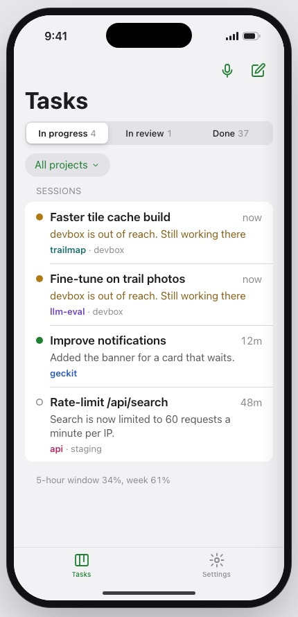
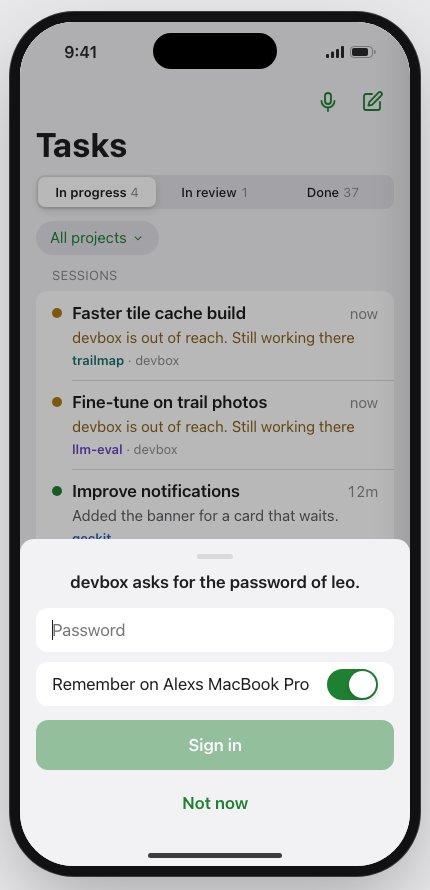
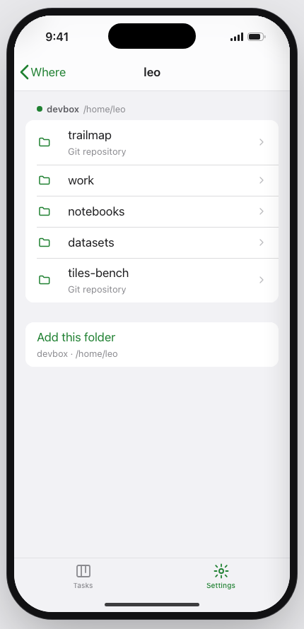
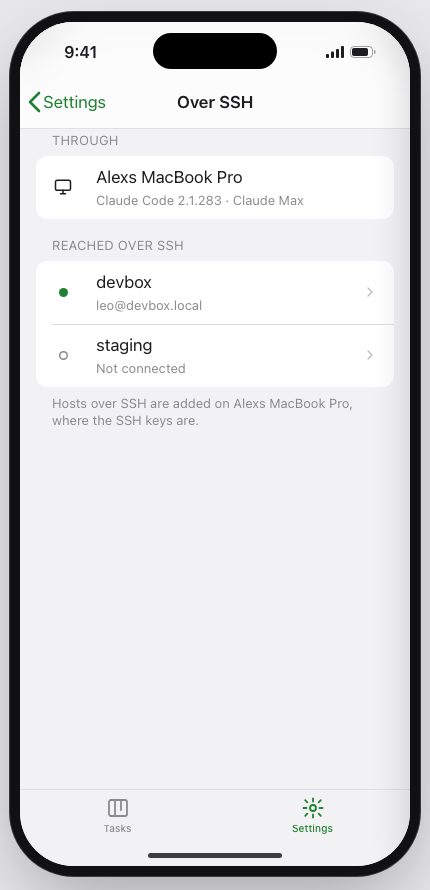
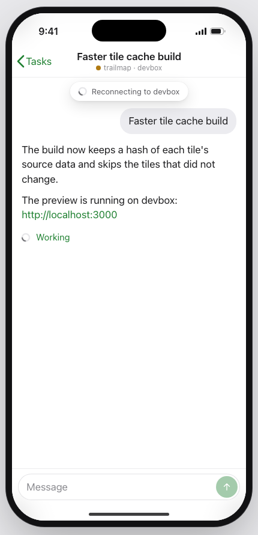
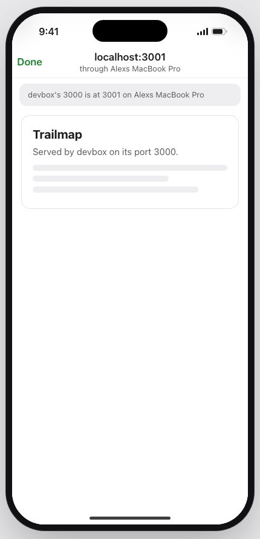
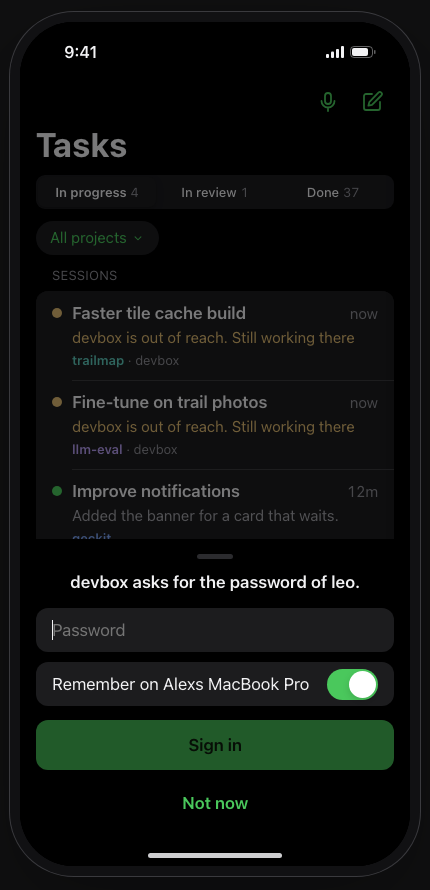
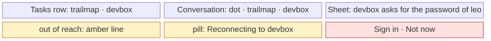
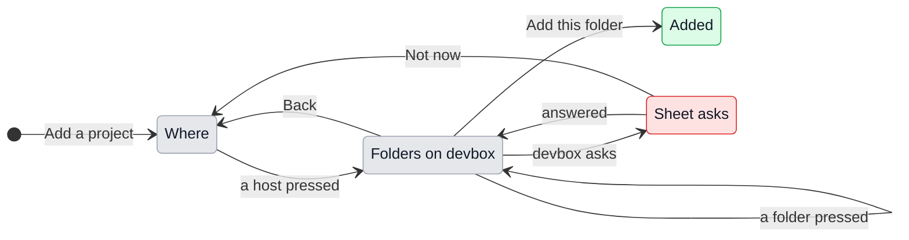

# UX: Hosts, second pass: the phone, and what the first pass left

Prototype: `docs/design/remote-hosts-phone.html`. The buttons on its right show each state; `#drop`, `#password`, `#trust`, `#convo-drop`, `#folders`, `#hosts`, `#host`, `#web` open one directly, `?theme=dark` in the dark theme.

| Host drops | Password | Folders on a host | Hosts |
|---|---|---|---|
|  |  |  |  |

| Conversation, out of reach | `localhost` link | Dark |
|---|---|---|
|  |  |  |

## 1. Why

The phone is how the work is reached away from the desk: on the train, at night, from another city. With hosts added, the phone already shows their conversations and answers their permission cards, but three things strand the person there. A host that asks for a password or to trust its key has nowhere to ask on the phone, so a conversation there stops until the person is back at the computer. A new project on a host can only be added at the computer. And the phone does not say when a host is out of reach, so a silent conversation looks finished rather than cut off.

The first pass also left four rough edges on the computer: a host that is off slows the board and may ask for a password nobody asked it to; a profile shows hosts and an empty Local it has nothing to do with; a host cannot be changed once added; and a few features quietly act as if every project were local.

## 2. Principles

These keep hosts from spreading through the app. Every row below follows from them, and anything that breaks them is left out.

1. **No feature knows about hosts.** Features work on a project's root; `route.ts` alone decides whether that is here or on a host. A feature that behaves wrongly on a host is fixed there, not given a host option.
2. **A host is shown two ways only:** a label after the project, `trailmap · devbox`, and how its connection stands. No menu, setting or screen of any other feature gains a host control. With no hosts added, nothing anywhere changes.
3. **The computer running GeckIt is the gateway.** The phone reaches hosts through it, as it reaches everything: the hosts are usually on a network only that computer is on, and the SSH keys stay on it. Hosts are added and edited on the computer; on the phone they are used.
4. **Groups follow projects.** A host, or Local, appears in a list only where that list has its projects.

## 3. What is added or changed

### The phone

| Surface | What appears | When |
|---|---|---|
| Tasks rows, existing | The project line reads `trailmap · devbox`. A working or asking conversation on a host that is out of reach reads "devbox is out of reach. Still working there" in amber in place of what it said | A project on a host |
| Conversation header, existing | Under the title, `trailmap · devbox` with the host's dot before it | A conversation on a host |
| Out-of-reach pill, existing pill | Under the header, the pill the app already uses for a dropped link: "Reconnecting to devbox" with its spinner | The host is out of reach |
| Composer, existing | The field keeps what is typed; Send is greyed, and a line over the field says "devbox is out of reach. What is typed stays until it is back" | The host is out of reach |
| Sign-in sheet, new | A bottom sheet over whatever is open: the host's question, a secure field, "Remember on <computer>", Sign in, Not now. For a key it has never seen: its fingerprint, Trust, Not now | A host asks while it connects |
| Settings, Hosts, new row | "Hosts" with how many, under Projects | At least one host |
| Hosts page, new | The computer first, by its name, then each host: dot, name, `user@address`, how it stands. A footer: "Hosts are added on Alexs MacBook Pro, where the SSH keys are." | Settings, Hosts |
| Host page, new | How it stands and since when, Claude Code version and plan, Reconnect or Connect, Disconnect | A host pressed |
| Add a project, existing | First "Where": the computer by its name, then each host with its dot. Then the folders of the one chosen, one level at a time, as today, the host's name over them | Settings, Projects, Add a project, or the project list of New task |
| `localhost` link in a conversation on a host, existing web view | Opens the host's page through the computer; a note at the top when the port moved: "devbox's 3000 is at 3001 on Alexs MacBook Pro" | A `localhost` link pressed |

On the phone the computer running GeckIt is called by its name, `Alexs MacBook Pro`, never "Local": for the phone nothing is local, and "this computer" would be the phone.

### The computer

| Surface | What changes | When |
|---|---|---|
| Cmd+K groups, existing | A group is shown only when the list it heads has projects in the profile in use; Local too. "Add a folder" stays last in each shown group; a host with no projects in the profile is reached through "Add a host..." or Settings, Hosts | A profile other than All is in use, or a host has no projects |
| Settings, Profiles, existing | Projects grouped under Local and each host, each with its label `trailmap · devbox` | At least one host |
| Settings, Hosts, existing | Edit on each host, opening the Add a host sheet filled in, its button reading Save. Changing Address, User, Port or how it signs in checks it again; changing only the Name does not. "Forget the password" when one is remembered | Always |
| Board and list with a host off, existing | The host's conversations are listed from what was last read, at once. They are read again in the background only while the host is connected; nothing is asked of a host that is not, and so no password is asked for that nobody wanted | A host not connected at start |
| Update restart, existing | Waits only for conversations running here; a conversation on a host goes on through the restart | An update is ready |
| Search and Hidden conversations, existing | Also read the copies kept here of conversations on hosts | Always |
| Removing a host, existing | Also stops its running conversations there, after the question already asked, and takes its shortcuts and runs away | Remove |
| Voice orders, existing | Projects are named to the model with their host, `trailmap · devbox` | A host's project is in the list |
| A recording in a task on a host, existing | The note says the frames are attached and leaves out the video, which is not on the host | New task on a host with a recording |

## 4. States

The host states are those of `remote-hosts.md`. On the phone:

| State | What the phone shows | What to do |
|---|---|---|
| Connected | The dot, green; nothing else | Work |
| Connecting, after 1 s | The dot pulses in the header | Nothing |
| Lost, after 10 s | Amber line on its working rows; pill "Reconnecting to devbox"; Send greyed | Wait, or Hosts, devbox, Reconnect |
| Needs you | The sign-in sheet, over whatever is open, on the phone and on the computer at once; the first to answer takes it off both | Answer, or Not now |
| No Claude Code, Not signed in | The host page says it in the words of `remote-hosts.md`, with "Do this on Alexs MacBook Pro" | Go to the computer |
| The computer is asleep or out of reach | Nothing new: the app's own "Reconnecting" pill for the computer, as today | Wake the computer |

## 5. Transitions

| From | Event | To | What the person sees |
|---|---|---|---|
| Projects | pressed Add a project, at least one host | Where | The computer by its name, then each host with its dot and how it stands |
| Projects | pressed Add a project, no hosts | Folders on the computer | As today |
| Where | pressed the computer | Folders on the computer | As today |
| Where | pressed a host | Folders on devbox | Its home, the host's name over the path; "Reading devbox..." until it answers |
| Folders on devbox | the host asks for a password or a key | Sheet asks | The sign-in sheet over the folders |
| Sheet asks | answered | Folders on devbox | The sheet goes down; the folders arrive |
| Sheet asks | Not now | Where | The sheet goes down; the host's row says Not connected |
| Folders on devbox | pressed Add this folder | Added | Back to Projects, the new one in the list as `geckit-remote-test · devbox`, and a light tap |
| Folders on devbox | could not read | Folders on devbox | "Could not read /srv on devbox." in place of the list; Back still works |
| Any screen | a host asks, on the computer or the phone | Sheet over it | The sheet; answered anywhere, it goes everywhere |
| Conversation on a host | the host drops for 10 s | Same, out of reach | The pill; Send greyed |
| Out of reach | back by itself | Same | The pill goes; what was said meanwhile appears |
| Out of reach | typing | Same | The line over the field: "devbox is out of reach. What is typed stays until it is back"; Send greyed |

## 6. What stays silent

| State | Why |
|---|---|
| A host not connected with nothing of it open, on the phone | As on the computer: a hollow dot in Hosts is enough |
| The computer reading a host in the background | The person cannot act on it |
| A host whose projects are not in the profile in use, in Cmd+K | Groups follow projects; it is in Settings, Hosts |
| A port that did not move when a `localhost` page is opened | The page is simply there |
| Out of reach for a conversation that was waiting or done | Nothing goes on there it would miss |

## 7. Thresholds

The 1 s and 10 s of `remote-hosts.md` hold on the phone too. Nothing new: the phone is told the host's shown state, not its raw one, so the two never disagree.

## 8. Wording

| Moment | Text |
|---|---|
| Where, title | "Where" |
| Where, footer with hosts | "Folders on hosts are read over their connection." |
| Folders on a host, while reading | "Reading devbox..." |
| Folders, could not read | "Could not read /srv on devbox." |
| Folders, add | "Add this folder" |
| Sheet, password | "devbox asks for the password of leo." Field placeholder "Password"; switch "Remember on Alexs MacBook Pro"; "Sign in"; "Not now" |
| Sheet, passphrase | "devbox asks for the passphrase of ~/.ssh/id_ed25519." "Unlock"; "Not now" |
| Sheet, trust | "This is the first connection to devbox." Then the fingerprint on a line of its own; "Trust"; "Not now" |
| Pill | "Reconnecting to devbox" |
| Over the field while out of reach | "devbox is out of reach. What is typed stays until it is back" |
| Hosts footer | "Hosts are added on Alexs MacBook Pro, where the SSH keys are." |
| Host page, needs the computer | "Claude Code is not installed on devbox. Install it on Alexs MacBook Pro." |
| Port moved note | "devbox's 3000 is at 3001 on Alexs MacBook Pro" |
| Edit sheet button | "Save" |
| Forget password | "Forget the password" |

## 9. Edge cases

- **A sign-in question while the phone is closed.** It is a notification, as a waiting card is today: "devbox asks for a password"; opened, the sheet is up.
- **The same question answered on the computer first.** The sheet on the phone goes down by itself.
- **A host removed while its folders are open on the phone.** Back to Where, the host gone from it.
- **Two folders named the same on two hosts.** Told apart by the label everywhere.
- **The profile in use has only a host's projects.** Cmd+K shows that host's group and no Local.

## 10. What is deliberately not there

| Rejected | Why |
|---|---|
| The phone connecting to hosts itself | Needs an SSH client and the keys on the phone, and a way into the host's network from outside; the computer already has all three |
| Adding or editing a host on the phone | The keys and the SSH settings are on the computer; a half-made host on the phone would be one it cannot reach |
| A terminal on a host from the phone | A terminal is not what a phone is for; `!` commands in a conversation already run there |
| Models and context sizes asked of each host | Another question per host for a difference few will meet; the host's Claude Code says what it cannot run when it is asked |
| `GECKIT.md` on hosts, the `geckit` CLI for hosts | Each is a feature of its own for a rare need; noted for later |
| Terminal on Windows and Linux | Belongs to the app's terminal as a whole, local projects too |

## 11. Forks

| Question | Verdict | Why |
|---|---|---|
| The phone reaches hosts directly, or through the computer | Through the computer | Principle 3; the keys and the network are there |
| What the phone calls the computer | Its name | "Local" and "this computer" both mean the phone when read on it |
| Hosts filtered by profile | By their projects | Principle 4; no new setting |
| Edit a host | The Add sheet, filled | One sheet, two uses; no screen of its own |
| Password questions on the phone | A system-like sheet over anything | A question with nowhere to be answered stops the work, and a sheet is how iOS asks |
