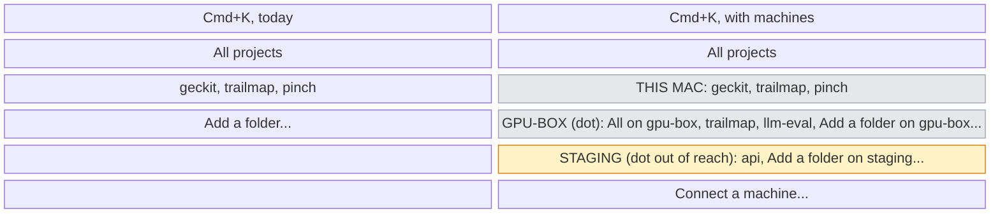
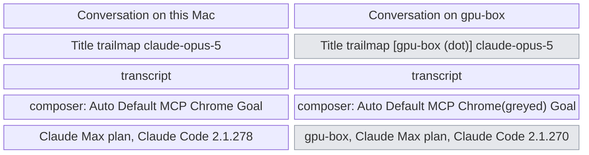
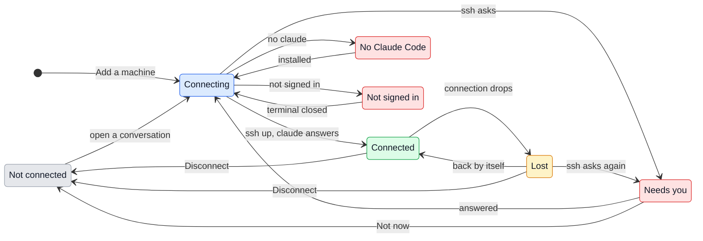

# UX: Conversations on other machines, over SSH

Prototype: `docs/design/remote-hosts.html`.

## 1. Why

Everything GeckIt runs, it runs on this Mac: `claude` is spawned here, the sidebar reads `~/.claude/projects` here, git, files, background tasks and the terminal are all local. Code that lives on a GPU box, a dev VM or a server can only be worked on from a terminal over `ssh`, so those conversations are not on the board, their questions do not reach the phone, and a laptop lid closing kills the `claude` that was running in that ssh session. The person today keeps two worlds: the board for the Mac, and a stack of terminal tabs for everything else, and cannot see in one place what is waiting for them across both.

What is wanted is one board: conversations on this Mac and on other machines side by side, moved between, answered and started the same way, with the machine visible wherever it matters and silent wherever it does not.

## 2. References, and what is taken from each

| Product | How it does it | Taken | Left |
|---|---|---|---|
| Claude Desktop, SSH sessions ([docs](https://code.claude.com/docs/en/desktop)) | An Environment dropdown before a session starts: Local, Cloud, an SSH connection, "+ Add SSH connection" with Name, Host, Port, Identity file. Installs Claude Code on the remote by itself | Adding a machine by a Host from `~/.ssh/config`, a friendly name, installing Claude Code there on first use | The environment chosen as a global switch before the session, the sidebar that does not say which machine a folder is on ([#95069](https://github.com/anthropics/claude-code/issues/95069)), `claude` dying with the ssh connection ([#49790](https://github.com/anthropics/claude-code/issues/49790)) |
| Zed, Remote Projects ([docs](https://zed.dev/docs/remote-development)) | One dialog lists servers with their projects under them; uses the `ssh` on PATH so `~/.ssh/config` and ControlMaster just work; a headless daemon on the server survives a dropped connection and is reattached | Machines as headers with projects below; reusing the person's own `ssh`; the process on the remote outliving the connection | A daemon of our own to install and upgrade on every server |
| VS Code Remote-SSH ([docs](https://code.visualstudio.com/docs/remote/ssh)) | A remote indicator at the bottom left says where the window runs; "Reconnecting..." in the status bar; ports used on the remote are forwarded to localhost by themselves | Saying where the open conversation runs in its own header; forwarding `localhost` links; "Open in VS Code" as `code --remote ssh-remote+<host>` | One window per machine: it is exactly what makes two machines impossible to watch at once |
| JetBrains Gateway | A launcher of recent remote projects, grouped by host, before the IDE opens | Recent projects grouped by host in the project picker | A launcher standing between the person and the work |

## 3. What is added

The one decision everything else follows from: **a machine is a property of a project, not a mode of the window.** A project is a folder on a machine; `trailmap` on this Mac and `trailmap` on `gpu-box` are two projects. Nothing is switched to "be on" a machine: the board, the list, Cmd+K, Cmd+P, Ctrl+Tab and search hold every machine's conversations at once, and a machine is narrowed to the way a project already is.

| Surface | What appears | When seen |
|---|---|---|
| Settings, new section "Machines" (beside General, Profiles, Correct and dictation, Phone) | This Mac first, then each machine: its name, `user@host`, how it stands, the Claude Code there and whose plan it runs on. "Add a machine" at the bottom | Always |
| "Add a machine" sheet, new | A field "Host" offering the Hosts from `~/.ssh/config` as it is typed, a field "Name" filled from it, and "Connect". What it is checking, line by line, under the fields | Pressed from Settings or from the project picker |
| Project picker, Cmd+K, existing | Projects grouped under their machine: "This Mac", then each machine by name with a dot for how it stands. Each machine's header row is itself a scope: "All on gpu-box". At the end of each group "Add a folder on gpu-box...", and last "Connect a machine..." | Only when at least one machine is added; before that it is as today |
| Project label on a card, a list row, a Cmd+P row, a Ctrl+Tab row, existing | For a project on another machine: its name, then the machine name in the faint text, `trailmap · gpu-box`. On this Mac: the name alone, as today | A project on another machine |
| Conversation header, existing | After the project name, a machine chip `gpu-box` with its dot. Its menu: how it stands and since when, "Open a terminal there", "Open in VS Code", "Reconnect" or "Disconnect" | A conversation on another machine |
| Card and list row, existing | When its machine is out of reach, the second line of a conversation that was working or asking reads "gpu-box is out of reach. Still working there" in place of what it last said. Others on that machine keep their line | The machine is Lost or Needs you |
| Composer, existing | While its machine is out of reach: the field stays, what is typed is kept, the send button is replaced by "Reconnecting to gpu-box". "Chrome" is greyed with the reason | Out of reach; Chrome always greyed on another machine |
| New task form, existing | The Project select groups projects under machines (`optgroup`), and ends with "Choose a folder on this Mac..." and one "Choose a folder on gpu-box..." for each connected machine | Only when a machine is added |
| Remote folder chooser, new | A path field starting at the machine's home, completing as it is typed from that machine's folders, with folders holding `.git` marked | "Choose a folder on gpu-box..." |
| Status bar, existing | Plan and Claude Code are those of the open conversation's machine: `gpu-box · Your Claude Max plan · Claude Code 2.1.270` | A conversation on another machine is open |
| Question card, and a machine asking for a passphrase, new | A card like a permission card: "gpu-box asks for the passphrase of ~/.ssh/id_ed25519" with a field, or "gpu-box's host key has changed" with the two fingerprints | `ssh` asked for something (SSH_ASKPASS) |
| Phone | Nothing new: conversations on other machines are on the phone's board as they are on the Mac's, carried through the Mac | Always |

## 4. How it runs, as far as the person can tell

This is not the implementation, only what the states below depend on.

- GeckIt uses the person's own `ssh`, so `~/.ssh/config`, the agent, the keychain, jump hosts and ControlMaster work as they do in a terminal. One connection per machine carries everything.
- `claude` on the machine is started detached from the connection: its output goes to a file there, its input comes from a pipe there. The connection only reads and writes those. So the connection dropping, the lid closing or GeckIt quitting does not stop the work; reconnecting reads on from where it left off.
- Nothing of GeckIt's is installed on the machine. It needs `sh` and `claude`; if `claude` is missing it is installed with the official installer, once, when the person says so.
- `claude` there runs on whatever plan is signed in there. GeckIt does not carry the Mac's sign-in over.
- A conversation there is read from that machine's own `~/.claude/projects`, so one started in a terminal there shows up here, as local ones do today.

## 5. States

A machine:

| State | When it happens | What the person sees | What to do |
|---|---|---|---|
| Not connected | Added, but nothing on it is open or running; or disconnected by hand | In the picker and Settings a hollow dot and "Not connected". Its projects and conversations are listed from the last time it was read | Nothing; opening one of its conversations connects |
| Connecting | A conversation on it is opened, or GeckIt starts with one of its conversations running | After 1 s, "Connecting to gpu-box" in the conversation's composer and a pulsing dot on the chip | Nothing, it passes by itself |
| Connected | `ssh` is up and `claude` answers | A solid dot, nothing else | Work |
| Lost | The connection dropped while connected | For 10 s nothing. After that the chip's dot turns amber, cards on it say "gpu-box is out of reach. Still working there", the composer says "Reconnecting to gpu-box" | Nothing; it retries by itself. "Reconnect" in the chip's menu tries at once |
| Needs you | `ssh` asks for a passphrase, a password, a one-time code, or the host key is unknown or changed; or it failed on authentication | A card in the conversation and on the machine's row in Settings, in the words below; the chip's dot red | Answer the card, or "Not now" |
| No Claude Code | Connected, but `claude` is not on the machine's PATH | In the conversation or the add sheet: "Claude Code is not installed on gpu-box." and "Install it" | Install it, or "Use another path" |
| Not signed in | `claude` is there but not signed in to a plan | "Claude Code on gpu-box is not signed in." and "Sign in on gpu-box" | Press it: a terminal opens `ssh -t gpu-box claude /login`; GeckIt checks again when it closes |

A conversation on another machine has the states a local one has (working, asking, waiting, done), and one more:

| State | When it happens | What the person sees | What to do |
|---|---|---|---|
| Out of reach | Its machine is Lost or Needs you, and it was working or asking | The card keeps its column; its second line reads "gpu-box is out of reach. Still working there". Opened, the transcript shows what was known, with "Reconnecting to gpu-box" where the send button was | Wait, or answer the machine's card |

## 6. Transitions

| From | Event | To | What the person sees |
|---|---|---|---|
| (none) | pressed "Connect" in "Add a machine" | Connecting | The checks listed under the fields, one ticked after another: "Reached gpu-box", "Claude Code 2.1.270", "Signed in: Claude Max" |
| Not connected | opened a conversation on it, or chose "Add a folder on gpu-box..." | Connecting | Nothing for 1 s, then "Connecting to gpu-box" |
| Not connected | GeckIt starts and one of its conversations was working when it quit | Connecting | Nothing; by itself, without the person |
| Connecting | `ssh` is up and `claude --version` answered | Connected | The dot turns solid; the composer becomes usable |
| Connecting | `ssh` asked for a passphrase, a code or a host key | Needs you | The card, in the words of section 9 |
| Connecting | `claude` not on PATH | No Claude Code | "Claude Code is not installed on gpu-box." with "Install it" |
| Connecting | `claude auth status` says not signed in | Not signed in | "Claude Code on gpu-box is not signed in." with "Sign in on gpu-box" |
| Connecting | nothing answered in 20 s | Needs you | "Could not reach gpu-box: timed out after 20 s." with "Try again" |
| Needs you | answered the card | Connecting | The card goes; nothing else |
| Needs you | pressed "Not now" | Not connected | The card goes; its conversations stay listed with a hollow dot |
| No Claude Code | pressed "Install it", and it finished | Connecting | The installer's lines in the card as it runs, then the card goes |
| Not signed in | the terminal opened by "Sign in on gpu-box" closed | Connecting | By itself; the card goes when it is signed in, stays if it is not |
| Connected | the connection dropped | Lost | Nothing for 10 s; after that the amber dot and "out of reach" lines |
| Lost | the connection came back, by itself | Connected | The lines go; the transcript catches up with what was said meanwhile, and any question asked meanwhile appears as its card |
| Lost | pressed "Reconnect" in the chip's menu | Lost, retried at once | Nothing new unless it comes back |
| Lost | `ssh` asks for something on reconnecting | Needs you | The card |
| Connected or Lost | pressed "Disconnect" in the chip's menu or in Settings | Not connected | "Disconnect gpu-box? 2 conversations are working there and will keep working." with "Disconnect" and "Cancel", only when something is working; otherwise straight away |
| Any | removed in Settings | (gone) | "Remove gpu-box? Its 14 conversations stay on gpu-box and leave this list." with "Remove" and "Cancel" |

A conversation on another machine moves between its columns exactly as a local one. Out of reach is not a column and does not move the card.

## 7. What stays silent

| State | Why it is not shown |
|---|---|
| Connecting that takes under 1 s | Most do; a flash of "Connecting" on every open reads as a problem |
| Lost for under 10 s | Wi-Fi changes and sleep wake-ups recover in that time; saying so would make the board flicker amber for nothing |
| Which machine a project on this Mac is on | "This Mac" on every local card would add a word to every card of every person who never adds a machine |
| The ssh connection itself: ControlMaster, the pipes, the log offset | The person cannot act on any of it |
| Out of reach, for a conversation on that machine that was waiting for the person or done | Nothing goes on there that it would miss; its last line is still true. The chip says it when it is opened |
| A machine Not connected with nothing open on it | It is not a problem; the hollow dot in the picker is enough |
| A different Claude Code version from this Mac's | It is in the status bar and Settings; a notice would be noise. Only "No Claude Code" is a state |

## 8. Thresholds and timing

| Number | What it does | Why |
|---|---|---|
| 1 s | Before "Connecting to gpu-box" appears | Below this a connection through ControlMaster is instant; above it the person is waiting and should know on what |
| 10 s | Before Lost is shown | Wi-Fi hand-over and wake from sleep recover within it, as VS Code's own reconnect does |
| 1, 2, 4, 8, 15, then every 30 s | Retries while Lost | Fast enough to catch a network coming back, slow enough not to hammer a machine that is down |
| 20 s | Before Connecting gives up and says so | ssh's own ConnectTimeout plus a jump host; longer and the person has already gone to the terminal |
| 12 h | A `claude` on the machine with nobody attached and no turn running is stopped | Covers a night with the laptop shut; beyond it the process only holds memory. The conversation is on disk there and resumes with `--resume` as any other |
| 60 s | How often Not connected machines' conversation lists are read again while the picker or board is open, only if the connection is already up | The same rate the plan and version are looked at today |

## 9. Wording

| State or moment | Exact text |
|---|---|
| Picker header, this machine | "This Mac" (Windows and Linux: "This computer") |
| Picker scope row | "All on gpu-box" |
| Picker, end of group | "Add a folder on gpu-box..." |
| Picker, last row | "Connect a machine..." |
| Project label | "trailmap · gpu-box" |
| Chip tooltip, connected | "On gpu-box (leo@10.0.4.12), connected for 2 h" |
| Connecting | "Connecting to gpu-box" |
| Card second line, out of reach | "gpu-box is out of reach. Still working there" |
| Composer, out of reach | "Reconnecting to gpu-box" |
| Passphrase card | "gpu-box asks for the passphrase of ~/.ssh/id_ed25519." Field, "Unlock", "Not now" |
| Code card | "gpu-box asks for a one-time code." Field, "Send", "Not now" |
| Unknown host key | "This is the first connection to gpu-box. Its key is SHA256:3f9...a1c. Trust it?" "Trust", "Not now" |
| Changed host key | "gpu-box's key has changed since the last connection. Was SHA256:3f9...a1c, now SHA256:88e...02d. If you did not reinstall it, do not trust it." "Trust the new key", "Not now" |
| Timed out | "Could not reach gpu-box: timed out after 20 s." "Try again" |
| Auth failed | "gpu-box refused the key ~/.ssh/id_ed25519." "Try again" |
| No Claude Code | "Claude Code is not installed on gpu-box." "Install it", "Use another path" |
| Not signed in | "Claude Code on gpu-box is not signed in." "Sign in on gpu-box" |
| Chrome greyed | "Chrome is on this Mac, and this conversation runs on gpu-box" |
| Disconnect, something running | "Disconnect gpu-box? 2 conversations are working there and will keep working." |
| Remove | "Remove gpu-box? Its 14 conversations stay on gpu-box and leave this list." |
| Add sheet checks | "Reached gpu-box", "Claude Code 2.1.270", "Signed in: Claude Max" |
| Status bar prefix | "gpu-box ·" before the plan |

## 10. Edge cases

- **The same folder name on two machines.** Two projects, both called `trailmap`; the machine name after one of them tells them apart everywhere a project name is shown. Their colours are chosen separately.
- **Every machine out of reach.** Their cards stay where they were, each with its line; nothing is hidden, since what they were doing is still what they are doing.
- **A question asked while out of reach.** It waits on the machine; `claude` there is blocked on it, as it would be on this Mac. It appears as its card the moment the connection is back.
- **GeckIt quits while a conversation on gpu-box works.** It keeps working. At the next start GeckIt reconnects to every machine with a conversation that was working and catches up.
- **The Mac sleeps for a night.** Same as above; if more than 12 h passed and nothing ran, the `claude` there was stopped and the next message resumes it, which says it is reading the conversation again, as a model change does today.
- **A file pressed in a conversation there.** It is read from gpu-box and shown in the same file view. "Open with" offers only what can open a remote file: VS Code as `code --remote ssh-remote+gpu-box`, Zed as `zed ssh://gpu-box/...`.
- **A `http://localhost:3000` link said there.** GeckIt forwards that port over the machine's connection and opens it here. If 3000 is taken on the Mac it uses the next free one and says "gpu-box's 3000 is at localhost:3001 here".
- **Pictures and files put in the composer.** Copied to the machine before the message is sent; the send waits for them, with the upload in the attachment's own progress.
- **`!` commands and the terminal button.** Run on gpu-box. The terminal button opens the person's terminal with `ssh -t gpu-box` in the conversation's folder.
- **Git in the status bar.** Read on gpu-box, the same line.
- **Two GeckIts, or a terminal, attached to the same conversation there.** As with two local ones today: the last to send wins the turn; this is not new.
- **A machine whose Host is removed from `~/.ssh/config`.** Needs you: "Could not reach gpu-box: ssh has no host by that name."
- **The phone.** It sees every machine's conversations, but only while the Mac is awake and connected; it never connects to a machine itself.

## 11. What is deliberately not there

| Rejected | Why |
|---|---|
| A window per machine, or a global "you are on gpu-box" switch | It is the one thing that makes watching two machines at once impossible, which is the point |
| An Environment dropdown before every new conversation | The project already says where; choosing a machine and then a folder is two choices for one fact |
| A GeckIt daemon installed on each machine | Something to install, upgrade and trust on every server; `sh`, a pipe and a file do the same |
| Keeping passwords or passphrases in GeckIt | The keychain and ssh-agent already do; GeckIt only passes on what is typed into the card |
| Carrying the Mac's Claude sign-in to the machine | Moving a credential to a server without being asked; the machine signs in on its own |
| A colour per machine | Colours already mean projects; a second meaning on the same cards would read as a project colour |
| Docker, WSL, Codespaces, cloud | Each is its own feature; SSH first, and the model (a machine owns projects) takes them later |

## 12. Forks

| Question | Options | Verdict | Why |
|---|---|---|---|
| Where the machine lives | Window mode; per-conversation property; per-project property | Per project | A conversation's folder already decides everything else; the machine is part of the folder's address |
| Local projects marked "This Mac"? | Always; only when a machine is added; never on cards | Never on cards, in the picker only when a machine is added | Silent for the person with one machine; the absence of a machine name is itself the sign |
| Survive disconnect | Kill with the connection, as Claude Desktop does; tmux; own detached process | Own detached process | tmux is not everywhere and has its own output; a pipe and a file are |
| Machine as a scope | Only projects; "All on gpu-box" too | Both, the header row is the scope | Narrowing to a machine is the "switch" people will look for, and it costs one row |
| Profiles | Separate from machines; able to hold remote projects | They hold any project | A profile is a list of projects; where they are is their own business |

## 13. Against the request

- Local and remote sessions side by side: section 3, one board.
- Connecting a remote machine: Settings, Machines, and the add sheet.
- Switching: narrowing by "All on gpu-box" in Cmd+K; moving between conversations on different machines with Cmd+P and Ctrl+Tab, which hold all of them.
- Working across several sessions on several machines: nothing is a mode, so any mix is on the board at once, and questions from all of them arrive the same way.
- Not covered yet: whether the phone should be able to reach a machine when the Mac sleeps (it cannot here).
