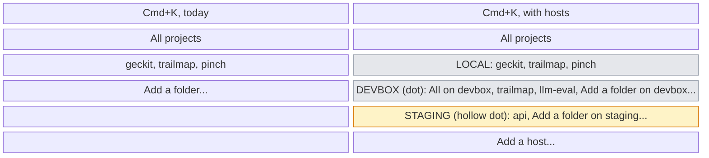
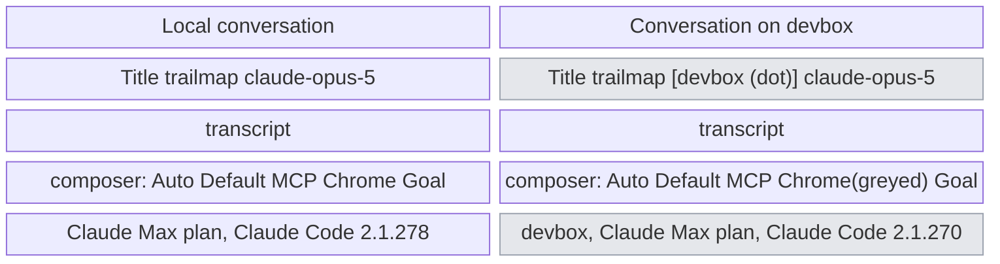
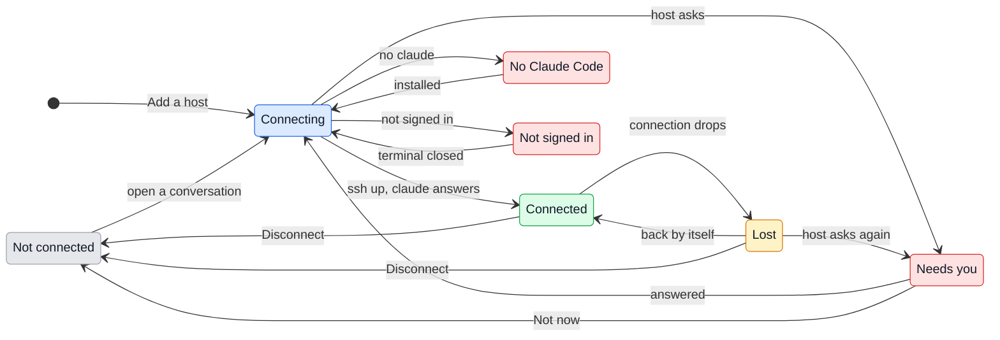

# UX: Conversations on remote hosts

Prototype: `docs/design/remote-hosts.html`.

## Terms

- **Host**: a computer GeckIt reaches over SSH to run Claude Code there. The only word for it, in the interface and in this document.
- **Local**: the computer GeckIt itself runs on, whatever its system. It is the same word on macOS, Windows and Linux.

## 1. Why

Everything GeckIt runs, it runs locally: `claude` is spawned here, the list reads `~/.claude/projects` here, git, files, background tasks and the terminal are all on this computer. Code that lives on another computer can only be worked on from a terminal over SSH, so those conversations are not on the board, their questions do not reach the phone, and closing the laptop ends the `claude` that ran in that terminal. The person keeps two worlds: the board for local work, a stack of terminal tabs for the rest, and no single place that shows what is waiting across both.

What is wanted is one board: local conversations and conversations on hosts side by side, moved between, answered and started the same way, with the host shown where it matters and silent where it does not.

## 2. References, and what is taken from each

| Product | How it does it | Taken | Left |
|---|---|---|---|
| Claude Desktop, SSH sessions ([docs](https://code.claude.com/docs/en/desktop)) | An Environment dropdown before a session: Local, or an SSH connection with Name, Host, Port, Identity file. Installs Claude Code on the host by itself | "Local" as the word for this computer; a friendly name; installing Claude Code on first use | Choosing the environment before every session; a sidebar that does not say which host a folder is on ([#95069](https://github.com/anthropics/claude-code/issues/95069)); `claude` ending with the connection ([#49790](https://github.com/anthropics/claude-code/issues/49790)) |
| JetBrains Gateway ([docs](https://www.jetbrains.com/help/idea/remote-development-a.html)) | Host, Port, Username, then an authentication type: Password, Key pair, or OpenSSH config and agent | The fields and the three ways of signing in | A launcher standing between the person and the work |
| Termius ([docs](https://docs.termius.com/getting-started/quickstart)) | A host is Address, Port, Username, and a password or a key | Address as one field that also takes a name from SSH config | A keychain of its own |
| Zed, Remote Projects ([docs](https://zed.dev/docs/remote-development)) | Hosts as headers with their projects under them; uses the `ssh` on PATH; the process on the host outlives the connection | Hosts as headers with projects below; the person's own `ssh` and its config; work that outlives the connection | A program of its own to install on every host |
| VS Code Remote-SSH ([docs](https://code.visualstudio.com/docs/remote/ssh)) | An indicator of where the window runs; "Reconnecting"; ports used on the host forwarded to `localhost` | The host shown in the conversation's own header; forwarding `localhost` links | One window per host: it is what makes two hosts impossible to watch at once |

## 3. What is added

The one decision everything else follows from: **a host is part of a project's address, not a mode of the window.** A project is a folder on a computer; `trailmap` locally and `trailmap` on `devbox` are two projects. Nothing switches to "be on" a host: the board, the list, Cmd+K, Cmd+P, Ctrl+Tab and search hold every host's conversations at once, and a host is narrowed to the way a project already is.

| Surface | What appears | When seen |
|---|---|---|
| Settings, new section "Hosts" (beside General, Profiles, Correct and dictation, Phone) | Local first, then each host: its name, `user@address`, how it stands, the Claude Code there and whose plan it runs on. "Add a host" at the bottom | Always |
| "Add a host" sheet, new | Address, User, Port, Sign in with (Key or Password), Name; the checks it runs, line by line, under the fields. Details in section 4 | Pressed from Settings or from the project picker |
| Project picker, Cmd+K, existing | Projects grouped under "Local" and then each host by name with a dot for how it stands. Each host's header row is itself a scope: "All on devbox". Each group ends with "Add a folder on devbox...", the list with "Add a host..." | Only when at least one host is added; before that it is as today |
| Project label on a card, a list row, a Cmd+P row, a Ctrl+Tab row, existing | For a project on a host: its name, then the host name in the faint text, `trailmap · devbox`. A local project: the name alone, as today | A project on a host |
| Conversation header, existing | After the project name, a host chip `devbox` with its dot. Its menu: how it stands and since when, "Open a terminal there", "Reconnect" or "Disconnect" | A conversation on a host |
| Card and list row, existing | While its host is out of reach, a conversation that was working or asking reads "devbox is out of reach. Still working there" as its second line. The others on that host keep their line | The host is Lost or Needs you |
| Composer, existing | While its host is out of reach: the field stays, what is typed is kept, the send button is replaced by "Reconnecting to devbox". "Chrome" is greyed with the reason | Out of reach; Chrome is always greyed on a host |
| New task form, existing | The Project select groups projects under Local and each host, and ends with "Choose a folder on this computer..." and "Choose a folder on devbox..." for each connected host | Only when a host is added |
| Folder chooser on a host, new | A path field starting at the host's home, completing from the host's folders as it is typed, folders holding `.git` marked | "Choose a folder on devbox..." |
| Status bar, existing | Plan and Claude Code are those of the open conversation's host: `devbox · Your Claude Max plan · Claude Code 2.1.270` | A conversation on a host is open |
| Sign-in card, new | A card like a permission card when the host asks for something: a password, a key's passphrase, a one-time code, or trust in its key | The host asked while connecting |
| Phone | Nothing new: conversations on hosts are on the phone's board as they are on the computer's, carried through it | Always |

## 4. Adding a host

The form asks what every SSH client asks, in the order people know from JetBrains Gateway and Termius, and fills in what it can.

| Field | What it takes | Filled by itself |
|---|---|---|
| Address | A name or IP address, or a `Host` from the SSH config, offered as it is typed | Typing `leo@devbox.local:2222` splits into Address `devbox.local`, User `leo`, Port `2222` |
| User | The account on the host | From the SSH config for that Host; otherwise the local account's name |
| Port | A number | 22, or the SSH config's |
| Sign in with | Two choices. **Key**: "Default keys" (the SSH config and the running agent) or "Choose a key file...". **Password**: a password field and "Remember on this computer" | Key and "Default keys" |
| Name | What the board calls it | The Address, or the SSH config's Host name |

- A remembered password is kept in the system's own credential store (Keychain, Credential Manager, Secret Service), never in GeckIt's settings file. Not remembered, it is asked for on the sign-in card each time the host is connected.
- A key's passphrase is asked for on the card when the agent does not already hold it. GeckIt does not keep it.
- "Connect" checks, one line after another: "Reached devbox", "Claude Code 2.1.270", "Signed in: Claude Max". The host is saved only when the first line passes, as Zed does.

## 5. How it runs, as far as the person can tell

This is not the implementation, only what the states below depend on.

- GeckIt uses the `ssh` already on the computer, so the person's SSH config and agent work as they do in a terminal. One connection per host carries everything.
- `claude` on the host is started apart from the connection: its output goes to a file there, its input comes from a pipe there. The connection only reads and writes those. So the connection dropping, the laptop closing or GeckIt quitting does not stop the work; reconnecting reads on from where it left off.
- Nothing of GeckIt's is installed on the host. It needs a POSIX shell and `claude`; if `claude` is missing it is installed with the official installer, once, when the person says so.
- `claude` there runs on whatever plan is signed in there. GeckIt does not carry the local sign-in over.
- A conversation there is read from that host's own `~/.claude/projects`, so one started in a terminal there shows up here, as local ones do today.

## 6. States

A host:

| State | When it happens | What the person sees | What to do |
|---|---|---|---|
| Not connected | Added, but nothing on it is open or running; or disconnected by hand | In the picker and Settings a hollow dot and "Not connected". Its projects and conversations are listed from the last time it was read | Nothing; opening one of its conversations connects |
| Connecting | A conversation on it is opened, or GeckIt starts with one of its conversations running | After 1 s, "Connecting to devbox" in the conversation's composer and a pulsing dot on the chip | Nothing, it passes by itself |
| Connected | SSH is up and `claude` answers | A solid dot, nothing else | Work |
| Lost | The connection dropped while connected | For 10 s nothing. After that the chip's dot turns amber, working cards on it say "devbox is out of reach. Still working there", the composer says "Reconnecting to devbox" | Nothing; it retries by itself. "Reconnect" in the chip's menu tries at once |
| Needs you | The host asks for a password, a passphrase, a one-time code, or trust in an unknown or changed key; or it refused the sign-in | The sign-in card in the conversation and on the host's row in Settings, in the words below; the chip's dot red | Answer the card, or "Not now" |
| No Claude Code | Connected, but `claude` is not on the host's PATH | "Claude Code is not installed on devbox." and "Install it" | Install it, or "Use another path" |
| Not signed in | `claude` is there but not signed in to a plan | "Claude Code on devbox is not signed in." and "Sign in on devbox" | Press it: a terminal opens `claude /login` on the host; GeckIt checks again when it closes |

A conversation on a host has the states a local one has (working, asking, waiting, done), and one more:

| State | When it happens | What the person sees | What to do |
|---|---|---|---|
| Out of reach | Its host is Lost or Needs you, and it was working or asking | The card keeps its column; its second line reads "devbox is out of reach. Still working there". Opened, the transcript shows what was known, with "Reconnecting to devbox" where the send button was | Wait, or answer the host's card |

## 7. Transitions

| From | Event | To | What the person sees |
|---|---|---|---|
| (none) | pressed "Connect" in "Add a host" | Connecting | The checks under the fields, one ticked after another |
| Not connected | opened a conversation on it, or chose "Add a folder on devbox..." | Connecting | Nothing for 1 s, then "Connecting to devbox" |
| Not connected | GeckIt starts and one of its conversations was working when it quit | Connecting | Nothing; by itself, without the person |
| Connecting | SSH is up and `claude --version` answered | Connected | The dot turns solid; the composer becomes usable |
| Connecting | the host asked for a password, a passphrase, a code or trust in a key | Needs you | The sign-in card, in the words of section 10 |
| Connecting | `claude` not on PATH | No Claude Code | "Claude Code is not installed on devbox." with "Install it" |
| Connecting | `claude auth status` says not signed in | Not signed in | "Claude Code on devbox is not signed in." with "Sign in on devbox" |
| Connecting | nothing answered in 20 s | Needs you | "Could not reach devbox: timed out after 20 s." with "Try again" |
| Needs you | answered the card | Connecting | The card goes; nothing else |
| Needs you | pressed "Not now" | Not connected | The card goes; its conversations stay listed with a hollow dot |
| No Claude Code | pressed "Install it", and it finished | Connecting | The installer's lines in the card as it runs, then the card goes |
| Not signed in | the terminal opened by "Sign in on devbox" closed | Connecting | By itself; the card goes when it is signed in, stays if it is not |
| Connected | the connection dropped | Lost | Nothing for 10 s; after that the amber dot and "out of reach" lines |
| Lost | the connection came back, by itself | Connected | The lines go; the transcript catches up with what was said meanwhile, and a question asked meanwhile appears as its card |
| Lost | pressed "Reconnect" in the chip's menu | Lost, retried at once | Nothing new unless it comes back |
| Lost | the host asks for something on reconnecting | Needs you | The sign-in card |
| Connected or Lost | pressed "Disconnect" in the chip's menu or in Settings | Not connected | "Disconnect devbox? 2 conversations are working there and will keep working." with "Disconnect" and "Cancel", only when something is working; otherwise straight away |
| Any | removed in Settings | (gone) | "Remove devbox? Its 14 conversations stay on devbox and leave this list." with "Remove" and "Cancel" |

A conversation on a host moves between its columns exactly as a local one. Out of reach is not a column and does not move the card.

## 8. What stays silent

| State | Why it is not shown |
|---|---|
| Connecting that takes under 1 s | Most do; a flash of "Connecting" on every open reads as a problem |
| Lost for under 10 s | Network changes and waking from sleep recover in that time; saying so would make the board flicker amber for nothing |
| That a local project is local | "Local" on every card would add a word to every card of every person who never adds a host |
| Out of reach, for a conversation on that host that was waiting or done | Nothing goes on there that it would miss; its last line is still true. The chip says it when it is opened |
| The connection itself: multiplexing, the pipes, the log offset | The person cannot act on any of it |
| A host Not connected with nothing open on it | It is not a problem; the hollow dot in the picker is enough |
| A different Claude Code version from the local one | It is in the status bar and Settings; a notice would be noise. Only "No Claude Code" is a state |

## 9. Thresholds and timing

| Number | What it does | Why |
|---|---|---|
| 1 s | Before "Connecting to devbox" appears | Below this a reused connection is instant; above it the person is waiting and should know on what |
| 10 s | Before Lost is shown | A network change or waking from sleep recovers within it, as VS Code's own reconnect does |
| 1, 2, 4, 8, 15, then every 30 s | Retries while Lost | Fast enough to catch a network coming back, slow enough not to hammer a host that is down |
| 20 s | Before Connecting gives up and says so | SSH's own connect timeout plus a hop; longer and the person has already gone to the terminal |
| 12 h | A `claude` on the host with nobody attached and no turn running is stopped | Covers a night with the laptop shut; beyond it the process only holds memory. The conversation is on disk there and resumes with `--resume` as any other |
| 60 s | How often a connected host's conversation list is read again while the picker or board is open | The same rate the plan and version are looked at today |

## 10. Wording

| State or moment | Exact text |
|---|---|
| Picker header, this computer | "Local" |
| Picker scope row | "All on devbox" |
| Picker, end of group | "Add a folder on devbox..." |
| Picker, last row | "Add a host..." |
| Project label | "trailmap · devbox" |
| Chip tooltip, connected | "On devbox (leo@devbox.local), connected for 2 h" |
| Connecting | "Connecting to devbox" |
| Card second line, out of reach | "devbox is out of reach. Still working there" |
| Composer, out of reach | "Reconnecting to devbox" |
| Password card | "devbox asks for the password of leo." Field, "Remember on this computer", "Sign in", "Not now" |
| Passphrase card | "devbox asks for the passphrase of ~/.ssh/id_ed25519." Field, "Unlock", "Not now" |
| Code card | "devbox asks for a one-time code." Field, "Send", "Not now" |
| Unknown key | "This is the first connection to devbox. Its key is SHA256:3f9...a1c. Trust it?" "Trust", "Not now" |
| Changed key | "devbox's key has changed since the last connection. Was SHA256:3f9...a1c, now SHA256:88e...02d. If it was not reinstalled, do not trust it." "Trust the new key", "Not now" |
| Timed out | "Could not reach devbox: timed out after 20 s." "Try again" |
| Sign-in refused | "devbox did not accept the sign-in for leo." "Try again" |
| No Claude Code | "Claude Code is not installed on devbox." "Install it", "Use another path" |
| Not signed in | "Claude Code on devbox is not signed in." "Sign in on devbox" |
| Chrome greyed | "Chrome is on this computer, and this conversation runs on devbox" |
| Disconnect, something running | "Disconnect devbox? 2 conversations are working there and will keep working." |
| Remove | "Remove devbox? Its 14 conversations stay on devbox and leave this list." |
| Add sheet title | "Add a host" |
| Add sheet, under the fields | "Uses the SSH settings already on this computer. Nothing is installed on the host." |
| Add sheet checks | "Reached devbox", "Claude Code 2.1.270", "Signed in: Claude Max" |
| Settings section | "Hosts" |
| Status bar prefix | "devbox ·" before the plan |

## 11. Edge cases

- **The same folder name locally and on a host.** Two projects, both called `trailmap`; the host name after one of them tells them apart everywhere a project name is shown. Their colours are chosen separately.
- **Every host out of reach.** Their cards stay where they were; nothing is hidden, since what they were doing is still what they are doing.
- **A question asked while out of reach.** It waits on the host; `claude` there is blocked on it, as it would be locally. It appears as its card the moment the connection is back.
- **GeckIt quits while a conversation on devbox works.** It keeps working. At the next start GeckIt reconnects to every host with a conversation that was working and catches up.
- **The computer sleeps for a night.** Same as above; if more than 12 h passed and nothing ran, the `claude` there was stopped and the next message resumes it, which says it is reading the conversation again, as a model change does today.
- **A file pressed in a conversation there.** It is read from the host and shown in the same file view.
- **A `http://localhost:3000` link said there.** GeckIt forwards that port over the host's connection and opens it here. If 3000 is taken locally it uses the next free one and says "devbox's 3000 is at localhost:3001 here".
- **Pictures and files put in the composer.** Copied to the host before the message is sent; the send waits for them.
- **`!` commands and the terminal button.** Run on the host. The terminal button opens the person's terminal already signed in to the host, in the conversation's folder.
- **Git in the status bar.** Read on the host, the same line.
- **A password that has changed.** The remembered one is refused; the card asks again, and a new one remembered replaces it.
- **A host whose name no longer resolves.** Needs you: "Could not reach devbox: no host by that name."
- **The phone.** It sees every host's conversations, but only while the computer running GeckIt is awake; it never connects to a host itself.

## 12. What is deliberately not there

| Rejected | Why |
|---|---|
| A window per host, or a global "you are on devbox" switch | It is the one thing that makes watching two hosts at once impossible, which is the point |
| An environment dropdown before every new conversation | The project already says where; choosing a host and then a folder is two choices for one fact |
| A program of GeckIt's installed on each host | Something to install, upgrade and trust on every host; a shell, a pipe and a file do the same |
| Passwords in GeckIt's settings file | The system's credential store exists for that; a remembered password goes there or nowhere |
| Carrying the local Claude sign-in to the host | Moving a credential to another computer without being asked; the host signs in on its own |
| A colour per host | Colours already mean projects; a second meaning on the same cards would read as a project colour |
| One "ssh command" field instead of the form | Quick for people who type SSH commands, a puzzle for everyone else; the Address field still takes `user@address:port` |

## 13. Forks

| Question | Options | Verdict | Why |
|---|---|---|---|
| Where the host lives | Window mode; per-conversation property; per-project property | Per project | A conversation's folder already decides everything else; the host is part of the folder's address |
| Local projects marked? | Always; only when a host is added; never on cards | Never on cards; "Local" in the picker only when a host is added | Silent for the person with no hosts; the absence of a host name is itself the sign |
| The word for this computer | Per system ("This Mac", "This PC"); one word | "Local", one word | GeckIt runs on three systems; one word reads the same in every screenshot and doc, as in Claude Desktop and VS Code |
| Sign-in fields | One address string; separate fields | Separate fields, and the Address field splits `user@address:port` | The shape people know from Gateway and Termius, without losing the quick way |
| Survive disconnect | End with the connection; a terminal multiplexer; own detached process | Own detached process | A multiplexer is not on every host and has its own output; a pipe and a file are |
| Host as a scope | Only projects; "All on devbox" too | Both, the header row is the scope | Narrowing to a host is the "switch" people will look for, and it costs one row |
| Profiles | Separate from hosts; able to hold projects on hosts | They hold any project | A profile is a list of projects; where they are is their own business |

## 14. Against the request

- Local and remote sessions side by side: section 3, one board.
- Connecting a host: Settings, Hosts, and the sheet in section 4.
- Switching: narrowing by "All on devbox" in Cmd+K; moving between conversations on different hosts with Cmd+P and Ctrl+Tab, which hold all of them.
- Working across several sessions on several hosts: nothing is a mode, so any mix is on the board at once, and questions from all of them arrive the same way.
- Not covered yet: whether the phone should reach a host while the computer running GeckIt sleeps (it cannot here).
