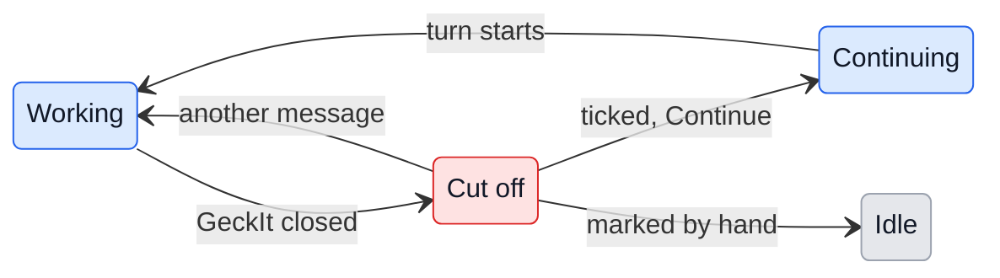

# UX: Continue what a restart cut off

## 1. Why

GeckIt holds every conversation's `claude` process, so quitting it, a crash, an update installed by hand or a restart of the dev app ends every turn that was running. The conversation stays on disk, but nothing says it was cut off: its card looks like any other that went quiet, and Alex finds out only by opening it and reading that the last thing is a command with no result. Then he types "continue" into each one, if he remembers which ones they were.

## 2. What is added

| Surface | What appears | When |
|---|---|---|
| Chat window, on start (new dialog) | "Continue where they stopped?", one row per conversation that was cut off, each ticked, with its title, its project and when its turn began; Not now and Continue | GeckIt starts and at least one turn was cut off; once per start of GeckIt |
| Board card, list row, phone row (existing) | "Stopped when GeckIt closed" as the second line | From the start until the conversation is written in or marked |

## 3. States

| State | When | What Alex sees | What Alex does |
|---|---|---|---|
| Cut off | GeckIt started, and the conversation was working when it last closed | The dialog on start, and the line on the card | Leaves it ticked and presses Continue, unticks it, or presses Not now and writes in it later |
| Continuing | Continue pressed | The card is working, "continue" is sent as his message | Nothing; it goes on by itself |
| Left alone | He does nothing | The card keeps its line until he writes in it or marks it | Anything, whenever |

## 4. Transitions

| From | Event | To | What Alex sees |
|---|---|---|---|
| Working | GeckIt quits, crashes, is force-stopped, or the machine restarts | Cut off (on the next start) | Nothing then; on the next start the dialog and the line |
| Cut off, ticked | Presses Continue in the dialog | Continuing | The dialog goes; "continue" as his message in each ticked one, then Claude working |
| Cut off, unticked | Presses Continue in the dialog | Cut off | Its card keeps the line |
| Cut off | Presses Not now, or Escape | Cut off | The dialog goes, and does not come back until the next start; the lines stay |
| Cut off | Writes anything in it, "continue" too | Working | His message; the line goes |
| Cut off | Marks it In review, Blocked or Done | Idle | The card in that column; the line goes |

## 5. What stays quiet

| State | Why it is not shown |
|---|---|
| A turn that GeckIt stopped because Alex pressed Stop | He stopped it; it is not cut off |
| A conversation that was only open, not working | Nothing was lost |
| A general question | It ends with GeckIt and is not kept |
| No system notification on start | The window is opening anyway; the dialog is where he is looking |
| No Continue button in the conversation itself | The dialog is the offer; after Not now, "continue" typed in the conversation does the same |

## 6. Thresholds and time

None. A cut-off conversation keeps its line until it is dealt with, however old: a conversation from last week that stopped mid-command is just as unfinished.

## 7. Wording

| State | Text |
|---|---|
| Card second line | "Stopped when GeckIt closed" |
| Dialog title | "Continue where they stopped?" |
| Dialog text | "These were working when GeckIt closed. Each ticked one is sent \"continue\"." |
| A row | its title, then "geckit, working since 17:39": when the turn began, since when it stopped is not known |
| Dialog buttons | "Not now", "Continue" |
| What is sent | "continue" |

## 8. Edge cases

- **Waiting on a permission card when it closed:** counts as cut off; after Continue the tool asks again if it still needs to.
- **A goal was set:** continue carries on toward it, since the goal is in the tool's own file.
- **Messages queued behind the turn:** they are lost with GeckIt today; Continue does not bring them back (see 9).
- **The conversation was continued in a terminal meanwhile:** it is still listed; unticking it is the answer. Reading the tool's file to tell is not worth it for how rarely it happens.
- **Continue with many ticked:** each starts its own process at once, as sending to each by hand would.
- **A conversation in another profile:** listed all the same; it was working, and it goes on in its own project.

## 9. What is deliberately not there

| Not done | Why |
|---|---|
| Continuing by itself on start | Alex may have closed GeckIt precisely to stop something |
| Keeping queued messages across a restart | A separate change; worth doing, not this one |
| A different word than "continue" | It is what one types in a terminal, and Claude understands it |

## 10. Decisions

### Detect by what GeckIt knew, or by reading the file

| Option | Verdict |
|---|---|
| GeckIt writes down each conversation it is working in, and crosses it off when the turn ends | yes |
| Reading each file's last line for a command with no result | no |

**Why:** a crash or a force-stop gives no chance to write anything at the end, so the mark has to be written at the start of a turn.

### A notice with Continue all, or a list on start

| Option | Verdict |
|---|---|
| A notice counting them, with Continue all and Show, and a Continue note in each conversation | no, first proposed |
| A list on start, each ticked, with Continue | yes |

**Why:** Alex asked for the list: he sees at once which ones, and leaves out the one he closed GeckIt to stop.

## 11. Requirements

| Requirement | Where it is answered |
|---|---|
| On start, GeckIt lists what closing it cut off and offers to continue it | 2, 4, 7 |
