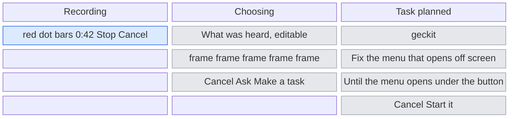
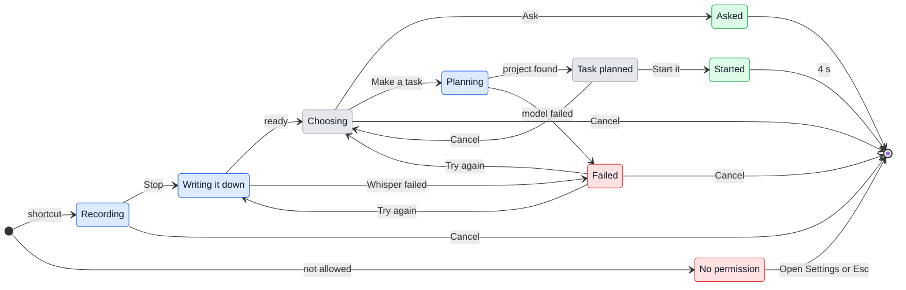

# UX: Screen recording

## 1. Why

Some problems are easier to show than to describe: a menu that opens in the wrong place, a card that flickers, a page on a site that has to become a task. Today Alex has to take screenshots one at a time, paste them into the composer, and type out what he meant, or say it with Cmd+Alt+G and lose the picture. What is on the screen and what is said about it never reach Claude together. Claude Code cannot watch video, so a recording has to reach it as what was said plus a few still frames taken at the moments that matter.

## 2. What is added

| Surface | What appears | When seen |
|---|---|---|
| Global shortcut, new, `Cmd+Alt+R` | Starts recording the screen and the microphone, and stops it when pressed again | Always, while GeckIt runs |
| Voice capsule (`voice/Record.tsx`), existing window | A recording mode that leads with what is recorded: a red dot, a screen icon, "Recording the screen", the time; then, after a rule and quieter, the microphone and its bars; Stop and Cancel | While recording |
| Board head and sidebar head (`Board.tsx`, `Sidebar.tsx`), existing | A screen button beside the microphone of "Say what to do", titled "Record the screen while you talk, then ask about it or make it a task" | Always |
| Panel tabs (`Panel.tsx`), existing | "Record", beside "Say" | Always |
| Voice capsule, new state "Choosing" | What was heard, as editable text, a strip of the frames that will be sent, and two actions: "Ask" and "Make a task" | After Stop, once the words are written down |
| Voice capsule, existing "asking" state | The planned task: project, text, goal, and "Start it" | After "Make a task" |
| Chat window, existing | The question opened with the recording already sent: the words as the message, the frames as its pictures | After "Ask" |
| Board, existing | A new card in In progress, with its goal | After "Start it" |
| Tray menu (`main/tray.ts`), existing | "Record the Screen", in the tray's title case | Always |
| Keyboard shortcuts dialog (`ui/Shortcuts.tsx`), existing | `Cmd+Alt+R` with "Record the screen while you talk, then ask about it or make it a task; again to stop"; fixed, like the other shortcuts that work anywhere | Always |

The capsule is the one dictation and Cmd+Alt+G already use, so there is one place that listens, not three. It is left out of the recording, so it never shows up in its own frames. It opens at the bottom middle of the screen the pointer is on, 24 px above the Dock, so it does not cover what is being shown, and it grows upward when it becomes a card. It is moved by dragging any part of it that is not a control, like a window by its title bar; the clear margin around it does not move it.

## 3. States

| State | When it happens | What the person sees | What to do |
|---|---|---|---|
| Recording | The shortcut was pressed | The capsule with a red dot, the bars, the time; the Mac's own recording indicator in the menu bar | Show and talk, then press the shortcut again, Enter or Stop; Escape or Cancel throws it away |
| Writing it down | Stopped, the audio is at Whisper and the frames are being chosen | "Writing it down" with the spinner | Nothing, it takes a few seconds |
| Choosing | The words and frames are ready | What was heard, the frame strip, "Ask" and "Make a task" | Correct the words if they are wrong, remove a frame with its x, then choose |
| Planning | "Make a task" was pressed | "Finding the project" with the spinner | Nothing |
| Task planned | The model picked a project and wrote the task | The project, the task, "Until" and the goal, "Start it" | "Start it" or Enter; Cancel goes back to Choosing |
| Doing it | "Ask" or "Start it" was pressed and the conversation is being started | "Doing it" with the spinner, as a carried-out voice order says | Nothing, it takes a second or two |
| Started | "Start it" was pressed and the conversation began | "Started in geckit" | Nothing, the capsule goes by itself; the card is on the board |
| Asked | "Ask" was pressed | The capsule goes and the Chat window opens on the question with the answer coming | Read the answer, carry on in it |
| No permission | The Mac has not allowed GeckIt to record the screen | "The Mac has not allowed GeckIt to record the screen." and "Open Settings" | "Open Settings", turn GeckIt on, reopen GeckIt |
| Nothing heard | Whisper returned no words | Choosing, with the text box empty and "Nothing was heard. Say it here in writing." as its placeholder | Type what was meant, or Cancel |
| Failed | Whisper or the planning model failed | The error and "Try again" | "Try again" with the same recording, or Cancel |

## 4. Transitions

| From | Event | To | What the person sees |
|---|---|---|---|
| Nothing | Pressed `Cmd+Alt+R` or "Record the screen" in the tray, screen recording allowed | Recording | The capsule, red dot, time from 0:00 |
| Nothing | Same, screen recording not allowed | No permission | "The Mac has not allowed GeckIt to record the screen." and "Open Settings" |
| Recording | Pressed `Cmd+Alt+R` again, Enter or Stop | Writing it down | "Writing it down" |
| Recording | Pressed Escape or Cancel | Nothing | The capsule goes; nothing was kept |
| Writing it down | Words and frames ready, by itself | Choosing | What was heard, the frames, "Ask" and "Make a task" |
| Writing it down | Whisper failed, by itself | Failed | The error and "Try again" |
| Choosing | Pressed "Ask" or Cmd+Enter | Asked | The capsule goes, the Chat window comes forward on the new question with the frames in the message |
| Choosing | Pressed "Make a task" or Enter | Planning | "Finding the project" |
| Choosing | Pressed Escape or Cancel | Nothing | The capsule goes; the recording is thrown away |
| Planning | The model answered with one project and a task, by itself | Task planned | Project, task, goal, "Start it" |
| Planning | The model failed or named no project, by itself | Failed | "No project fits what was said. Name the project and try again." and "Try again" |
| Task planned | Pressed "Start it" or Enter | Started | "Started in geckit"; a card appears in In progress |
| Task planned | Pressed Cancel or Escape | Choosing | The words and frames as they were, so the other choice can be made |
| Started | 4 seconds passed, by itself | Nothing | The capsule goes |
| Failed | Pressed "Try again" after Whisper failed | Writing it down | "Writing it down" with the same recording |
| Failed | Pressed "Try again" after no project fitted | Choosing | The words, with the cursor at their end, to add the project's name |
| Failed | Pressed Cancel or Escape | Nothing | The capsule goes |
| No permission | Pressed "Open Settings" | Nothing | The Mac's Screen & System Audio Recording pane; the capsule goes |
| No permission | Pressed Escape or the x | Nothing | The capsule goes |

The recording shortcut pressed while the capsule is past Recording does nothing, so an extra press cannot throw a recording away.

## 5. What stays quiet

| State | Why it is not shown |
|---|---|
| Which frames were picked by picture change and which by speech | Only the frames matter; the reason for each is for whoever tunes the picking |
| The size of the recording and where the file is | The path is in the message for Claude to use; Alex does not need it to decide |
| Frames sent at a lower resolution than recorded | Claude reads them at its own size anyway |
| The recording file being removed after 7 days | Nothing can be done about it and nothing is lost that the conversation still needs |

## 6. Numbers and time

| Number | Value | Why |
|---|---|---|
| Longest recording | none | A walk through a whole flow can take as long as it takes. The video is written to disk a second at a time, so length costs no memory; the speech is recorded at 24 kbit/s, so more than two hours of it stays under Whisper's 25 MB |
| Frames at most | 8 | Each frame costs about as much as a page of text; 8 shows a flow, more makes Claude skim |
| Frames at least | 1 | The last frame before Stop is always kept: it is what was on the screen when the point was made |
| Picture change that makes a frame | a tenth of the screen changed since the last frame | Catches a new page, a dialog, a menu, and not a blinking cursor or a clock |
| Recording kept after it is sent | 7 days | Claude may be asked to look at the video again while the work is still going; after a week it is not |
| Started stays up | 4 seconds | The same as a carried-out voice order today (`READ_IT`) |
| Where the card appears | the middle of the screen, once | The pill starts at the bottom to stay out of the way; the card that follows Stop is taller than the space under most of what is shown, so it goes where all of it can be read. Moved by hand after that, it stays where it was put |

## 7. Wording

| State | Text |
|---|---|
| Tray item | "Record the Screen" |
| Recording, label | "Recording the screen" |
| Recording, Stop tooltip | "Stop (Enter)" |
| Recording, Cancel tooltip | "Throw away (Esc)" |
| Writing it down | "Writing it down" |
| Choosing, frame x tooltip | "Leave this frame out" |
| Choosing, first action | "Ask" |
| Choosing, second action | "Make a task" |
| Nothing heard, placeholder | "Nothing was heard. Say it here in writing." |
| Planning | "Finding the project" |
| Task planned, action | "Start it" |
| Started | "Started in geckit" |
| No permission | "The Mac has not allowed GeckIt to record the screen." |
| No permission, action | "Open Settings" |
| No project fits | "No project fits what was said. Name the project and try again." |
| No OpenRouter key | "Recording needs an OpenRouter key in Settings, to write down what was said." |
| Message sent to Claude, after the words | "Recorded on the screen, 0:42. The frames are attached in order. The whole recording is at <path> if you need more of it." |

## 8. Edge cases

- **Empty:** a recording where nothing changes and nothing is said still has its last frame; Choosing shows it with the empty text box, and "Ask" and "Make a task" stay off until something is typed.
- **Everything at once:** a recording with dozens of changes keeps the 8 frames furthest apart in time, so the start, the middle and the end are all there.
- **Two screens:** the screen the pointer is on when the shortcut is pressed is recorded; the other is not.
- **Interrupted:** GeckIt quits or the Mac sleeps while recording - what was recorded is thrown away and nothing is sent. The capsule was up the whole time, so the loss is seen.
- **Repeated:** the shortcut pressed while dictation or Cmd+Alt+G is listening stops that one first, as those two already do for each other.
- **Private things on the screen:** a password field or a message shown while recording goes into the frames. Choosing shows every frame that will be sent, and any can be left out before anything leaves the Mac.
- **Stale:** the project list the model picks from is read when "Make a task" is pressed, not when recording started.
- **Phone:** the phone does not record; the shortcut and the tray item are the Mac's.

## 9. What is left out on purpose

| Not done | Why |
|---|---|
| Sending the video itself to Claude | Claude Code takes pictures and text, not video |
| Choosing a window or an area before recording | One more step before starting, for something the frames strip already covers: a frame with something private in it is left out afterwards |
| Recording the Mac's sound | What matters is what Alex says; the Mac's sound would be written down with it |
| A task that waits on the board, not started | The board has no card that waits; every card is a conversation. Adding one is a change to the board, not to recording |
| Saying the project out loud as a required step | The model already picks projects for Cmd+Alt+G; when it cannot, the failure asks for the name |
| Pause and resume | Stop and a second recording do the same, and the capsule stays one row |
| Keeping recordings in a library to browse | Each recording lives in the conversation it was sent to |

## 10. Forks

### What "Make a task" does

| Option | Verdict |
|---|---|
| Starts a conversation in the project right away, with a goal, after one confirmation | yes |
| Puts a card on the board that waits until pressed | no |
| Adds a line to the day plan or to Reminders | no |

**Why:** it is the same thing Cmd+Alt+G does with "start", so the capsule, the model prompt and "Do it" are already there. A waiting card is a new board state and should be decided on its own.

### What is recorded

| Option | Verdict |
|---|---|
| The whole screen the pointer is on | yes |
| A window or an area chosen first | no |

**Why:** the shortcut should start recording at once, as dictation does. Privacy is handled at Choosing, where every frame can be left out.

### Which action is the default on Enter

| Option | Verdict |
|---|---|
| "Make a task" on Enter, "Ask" on Cmd+Enter | yes |
| "Ask" on Enter | no |

**Why:** a recording is most often a problem to fix in a project; a question is the lighter case. Open for Alex to turn around after using it.

### Where frames come from

| Option | Verdict |
|---|---|
| Picture changes, plus the frame at the end of each thing said, plus the last frame | yes |
| Evenly spaced | no |

**Why:** evenly spaced frames miss a dialog that was up for a second and repeat a page that stayed for a minute.

### Where recording is started inside the app

| Option | Verdict |
|---|---|
| A screen icon in the board and sidebar heads, and "Record" in the panel | no, reversed after it was built |
| "Record the screen" inside the New task and Ask forms, and in a menu on "New task" | yes |

**Why:** Alex could not tell from the head that the icon starts a task. Decided in `docs/ux/starting-work.md`, which replaces this document's rows for the heads and the panel.

## 11. Requirements

| Requirement | Where closed |
|---|---|
| Record the screen while saying something | sections 2, 3 |
| Then offer to ask AI | "Ask", sections 3, 4 |
| Or to create a task from the recording | "Make a task", sections 3, 4, 10 |

**Missing from the requirements:** whether a task may also be one that waits on the board (section 10), and whether a recording can go into a conversation already open, as "say" does for Cmd+Alt+G. Neither is in this document.
