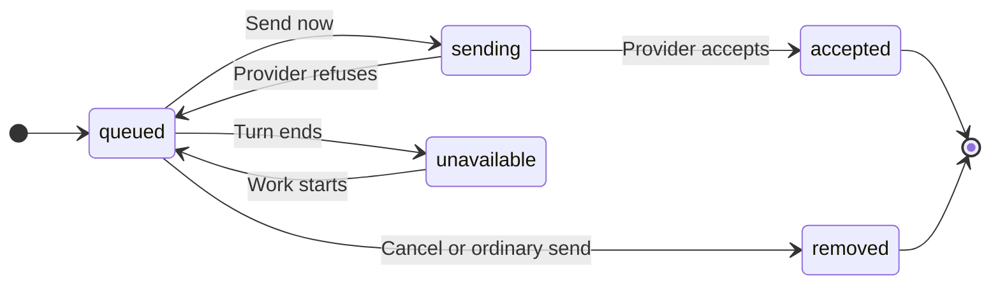

# UX: Send a queued message into running work

## 1. Why
Guidance waiting behind a running task can arrive too late to correct its direction. Alex explicitly requested immediate injection for built-in providers and libraries after discussing a "Send now" action.

## 2. What is added

| Surface | Addition | When visible |
| --- | --- | --- |
| Existing queued rows in desktop and phone Composer | Compact send-arrow action beside existing row actions | Active supporting driver, no pending approval, ordinary message |
| Existing trouble area | Delivery failure | Provider rejected delivery |
| Existing transcript | Accepted selected message | Delivery succeeds |

Use existing queue layout, controls and tokens. The entire queue remains in its existing scroll context; no new modal or global control. Button is reachable by Tab; Enter/Space submits. While sending, row edit/remove/reorder/delegate and other Send now actions are disabled. Focus moves to a neighboring queue action or composer when the delivered row disappears; failures retain focus and message.

Phone Send now has a minimum 44px touch target. Full desktop and phone review, both themes and keyboard/focus/scrolling evidence: [design handoff](../../specs/005-send-queued-now/design.md#review-evidence).

## 3. States

| State | Trigger | What Alex sees | Action |
| --- | --- | --- | --- |
| Queued, supporting active work | Guidance waits during work | Send-arrow icon | Send now, edit or wait |
| Sending | Send now pressed | Spinner in the send control, disabled queue actions | Wait |
| Accepted | Provider accepted input | Message in transcript; row gone | Continue reading |
| Rejected | Provider cannot deliver | Existing error text; original queued row | Retry or wait |
| Unavailable | Idle, unsupported, approval pending, or command | Existing queue actions only | Wait, edit, cancel or answer approval |

## 4. Transitions

| From | Event | To | Visible result |
| --- | --- | --- | --- |
| Queued | Alex presses the send arrow | Sending | Spinner in the send control |
| Sending | Provider accepts, automatically | Accepted | Row disappears; message appears in transcript |
| Sending | Provider refuses or turn ended, automatically | Queued/unavailable | Error; original row retained |
| Queued | Turn ends or approval appears, automatically | Unavailable | Send now disappears; queue remains |
| Unavailable | Supported work resumes, automatically | Queued | Send now reappears |
| Queued | Alex cancels, or ordinary queue sends automatically | Removed | Existing behavior |

## 5. What stays silent
No toast for accepted input. Protocol acknowledgments and turn IDs stay internal. Supporting an operation does not claim instant model application. Provider updates keep existing running-driver behavior until the turn finishes.

## 6. Thresholds and time
No new timeout or delay in host. One delivery per conversation at a time prevents duplicate clicks and ordering conflicts. Provider owns delivery timing and acknowledgment; existing scheduling delay still applies to ordinary queued messages.

## 7. Wording

| State | Exact text |
| --- | --- |
| Available | Send-arrow icon; accessible name "Send this message into the current work" |
| Accessible name / tooltip | "Send this message into the current work" |
| Pending | Spinner; accessible name "Sending this message into the current work" |
| Unsupported | "This assistant cannot receive a message while working." |
| Turn ended | "The assistant is no longer working. Your message is still queued." |

Provider-specific failures use the existing trouble surface, preserving the queue.

## 8. Edge cases
Empty queue adds nothing. Long text stays in the current row. Attachments travel with selected message. Duplicate clicks are ignored while pending. Queue edits/removal/reorder/delegation are locked during delivery; automatic queue draining waits too. Stale IDs do nothing. Failure retains original position. Slash commands, goals and changed settings are not injected as control operations. Native question/approval is answered before injection. Disconnection is reported by provider; host does not silently retry accepted delivery.

## 9. Deliberately absent
No automatic steering on Send, global default, stop-and-restart fallback or new concurrency slot. Older libraries remain usable without capability.

## 10. Decisions
Use a compact icon action matching existing queue controls. Alex requested this revision on 2026-10-09 because the text button crowds the queued message on the phone. The arrow reuses the composer send icon; its accessible name preserves the action meaning. User's implementation request explicitly covers the previously proposed "Send now" behavior. No additional design approval gate is introduced. Per-driver optional method is the authority, so live versions and legacy libraries do not inherit a false capability from provider metadata.

## 11. Requirements coverage
FR-001/002: sections 2-4. FR-003/004: states and edges. FR-005/006: surfaces and capability. FR-007: edges and deliberate omissions. No unresolved requirements.

## Revision - 2026-10-09

The queued send action uses the existing send-arrow icon, with a spinner while delivery is pending. Tooltip and accessible name explain delivery into current work. The phone retains a 44px touch target. No queue delivery, focus, error, or availability rule changes. Alex's request authorizes this revision.

Review on 2026-10-09: actual Composer and Transcript at 391x844 and 1200x900 CSS viewports, light/dark; keyboard Tab/Enter, pending disabled actions/spinner, failed delivery retaining row and focus, and 15-message queue scrolling. DOM measurements confirmed 24x24 desktop and 44x44 phone controls. Native Electron/iPhone review was not performed.
