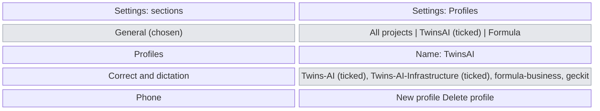
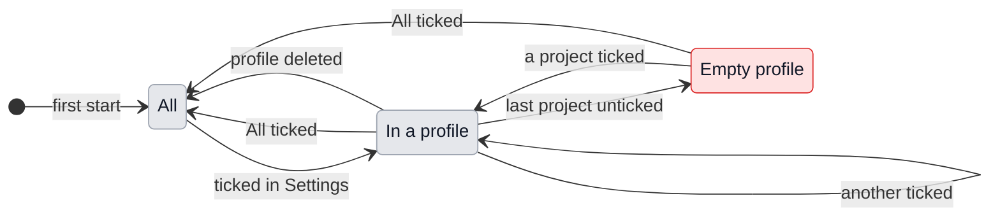

# UX: Profiles, and Settings in sections

## 1. Why

Alex works for several companies from one Mac: TwinsAI in the morning, Formula in the afternoon, his own projects in between. The board, the project picker, New task, search and the shortcuts always hold every project, so a Formula afternoon is spent reading past TwinsAI cards, and the picker's "All projects" is all of them or one. Ticking projects in the picker narrows the list, but the ticks are lost the moment one project is pressed, and there is no way to say "the TwinsAI ones" twice in one day. Settings, where such a choice belongs, is already one long page: appearance, file rules, languages, a vendor, three keys, updates, Claude Code and the phone, in that order, with no way to find anything but scrolling.

## 2. What is added

| Surface | What appears | When |
|---|---|---|
| Settings (existing dialog, rebuilt) | A list of sections down the left: General, Profiles, Correct and dictation, Phone. The right side shows one section at a time. Keyboard shortcuts and Done stay at the bottom | Always |
| Settings > General | Appearance, Open files with, Updates, Claude Code: what was there, unchanged | The section is chosen, which it is on opening |
| Settings > Profiles (new) | The profiles as a list with the one in use ticked: "All projects" first, then Alex's own, e.g. TwinsAI, Formula. Under the list, the chosen profile's name and its projects with ticks, and New profile / Delete profile | The section is chosen |
| Settings > Correct and dictation | Your language, Translate into, the vendor, the three keys and Show keys: what was there, unchanged | The section is chosen |
| Settings > Phone | The Phone switch and the QR: what was there, unchanged | The section is chosen, Mac only |
| Project picker (existing, Cmd+K) | The first row says which profile it is: "All in TwinsAI" and "3 folders", in place of "All projects". The rows under it are the profile's projects only | A profile other than All is in use |
| Board, list, Cmd+P, Ctrl+Tab, search, New task, shortcuts, the menu bar's shortcuts (existing) | The profile's projects and their conversations only | A profile other than All is in use |
| "Projects listed" in Settings (existing, uncommitted) | Removed: a profile does what the ticks did | Never |

## 3. States

| State | When | What Alex sees | What Alex does |
|---|---|---|---|
| All | First start, no profile made, or All chosen | Every project everywhere, as today; the picker says "All projects" | Works; makes a profile in Settings when wanted |
| In a profile | A profile is ticked in Settings | Only its projects, everywhere listed above; the picker's first row "All in TwinsAI" | Works; switches in Settings |
| Empty profile | The profile in use has no projects ticked | The board's columns empty, and on the board "No projects in TwinsAI. Tick some in Settings, Profiles." | Ticks projects, or goes back to All |
| Editing a profile | A profile is chosen in the Profiles section | Its name in a field and every project with a tick | Renames it, ticks projects, deletes it |

## 4. Transitions

| From | Event | To | What Alex sees |
|---|---|---|---|
| All | Ticks TwinsAI in Settings, Profiles | In a profile | The board behind the dialog has only TwinsAI cards at once; the dialog stays open |
| In a profile | Ticks All projects | All | Every project's cards are back |
| In a profile | Ticks Formula | In a profile | Formula's cards instead of TwinsAI's |
| In a profile | Unticks the last project of the profile in use | Empty profile | "No projects in TwinsAI. Tick some in Settings, Profiles." on the board |
| Empty profile | Ticks a project, or ticks All | In a profile / All | That project's cards / every card |
| In a profile | Deletes the profile in use | All | Every card; nothing asked, since nothing but a name and ticks is lost |
| In a profile | Adds a project with the folder picker | In a profile | The new folder is listed, and is ticked in the profile in use as well as in All |
| In a profile | A conversation in another profile asks for permission or finishes | In a profile | The notification, the Dock badge and the Dock bounce, as today. Pressing the notification opens that conversation over the board; the profile does not change |
| In a profile | Opens a conversation from a notification that is not in the profile, then closes it | In a profile | The board as it was |
| Any | Quits and opens GeckIt again | The same | The profile in use is kept |

## 5. What stays quiet

| State | Why it is not shown |
|---|---|
| How many conversations the other profiles hold | A profile is for not seeing them; a count is the same distraction in smaller type |
| A shortcut of another profile runs on its timetable | It still runs, and its conversation is there when the profile is switched to. Its notification comes like any other |
| Which profile a project is in, on the card or in the picker | The profile in use is said once, in the picker's first row; every card saying it again would be noise |

Nothing that needs Alex's hands is quiet: a question, a permission card or a finished answer in another profile still notifies and still counts on the Dock badge.

## 6. Thresholds and time

Not applicable: switching is immediate, nothing waits or expires. The existing limit of 20 remembered projects is unchanged.

## 7. Wording

| State | Text |
|---|---|
| Section names | "General", "Profiles", "Correct and dictation", "Phone" |
| Profiles, the list's first row | "All projects" and under it "Every project, always" |
| Profiles, a profile row | its name, and under it "3 projects" |
| Profiles, the name field's label | "Name" |
| Profiles, the ticks' label | "Projects in this profile" |
| Profiles, buttons | "New profile", "Delete profile" |
| Profiles, the note under the ticks | "The board, the project picker, New task, search and shortcuts show only these projects. Conversations in other projects keep running and still tell you when they need you." |
| A new profile's name | "New profile" (selected in the field, ready to type over) |
| Picker, first row in a profile | "All in TwinsAI" and under it "3 folders" |
| Board, empty profile | "No projects in TwinsAI. Tick some in Settings, Profiles." |

## 8. Edge cases

- **Nothing yet:** no projects added: Profiles shows "All projects" only, New profile is there, and the ticks say "Add a project first, from the project picker."
- **Everything at once:** a project in two profiles is fine: TwinsAI and "Mornings" can both hold Twins-AI.
- **A project forgotten** from the picker leaves every profile too.
- **Two profiles with one name:** allowed; they are told apart by their projects. Not worth a refusal.
- **The phone:** it shares the Mac's settings, so a profile chosen on the Mac narrows the phone's board too, and the other way round.
- **General questions** belong to no project and are shown in every profile.
- **Stale copy:** a window open while the profile changes on the phone redraws at once, since settings are broadcast to every window.

## 9. What is deliberately not there

| Not done | Why |
|---|---|
| A profile button in the header | Alex chose Settings: the switch happens twice a day, not twice an hour, and the header is already full |
| A keyboard shortcut for switching | Same reason; can be added once switching turns out to be frequent |
| Profiles carrying other settings (model, mode, theme) | A profile is which projects; anything more is a second settings system |
| Hidden projects as their own setting | Replaced: a project Alex never wants is left out of every profile he uses. Keeping both would be two ways to hide one thing |
| Settings as a separate window with a toolbar, as macOS System Settings | A dialog with sections is enough for four sections and needs no new window to manage |

## 10. Decisions

### Profiles and hidden projects

| Option | Verdict |
|---|---|
| Profiles replace hidden projects | yes |
| Both, hidden applied inside a profile | no |

**Why:** both answer "which projects do I see". Alex chose one mechanism.

### Where the profile is switched

| Option | Verdict |
|---|---|
| Top of the project picker | no |
| Own button in the header | no, first chosen, then changed |
| In Settings | yes |

**Why:** Alex reversed his first choice: the profile is picked in Settings, and Settings is reorganised so that picking it there is not a scroll through keys and languages.

## 11. Requirements

| Requirement | Where it is answered |
|---|---|
| Profiles such as TwinsAI and Formula, All by default | 2, 3, 4 |
| Chosen in Settings | 2, 10 |
| Settings no longer one big page | 2 |

**Not yet in the requirements:** what the phone does (edge cases: it follows the Mac), and whether notifications from other profiles should be quieter (section 5 says no).
