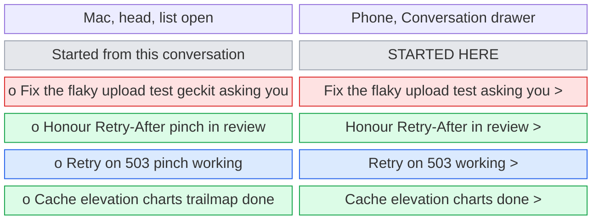
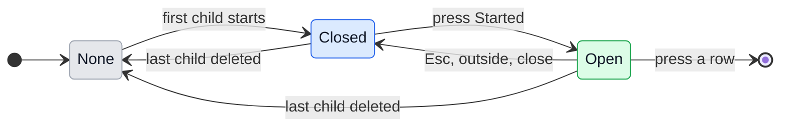

# UX: every conversation a conversation started, in one list

## 1. Why

A conversation that asked GeckIt for others shows them in its request block, in its transcript where it asked. Once the conversation goes on, the block scrolls up and out of sight, and a second or third batch puts the children in two or three blocks far apart. The board card says only counts, "Started 2 - 1 working, 1 in review", and the phone's drawer the same counts, which cannot be pressed. So today Alex cannot see, from anywhere, the whole list of what one conversation started, with how each stands, and open one of them in one press. The request block stays as it is: it is the record of what was asked and answered, in time order. This adds a place that is always one press away and always current.

## 2. What is added

| Surface | What appears | When seen |
|---|---|---|
| Mac, conversation head (`Chat.tsx`), new | A picker "Started 3" beside "Links" and "N in the background". Pressed, a list "Started from this conversation": a row per conversation it started, in the order started, each with its status dot, title, project and status. What those started in turn is under them, indented | The open conversation has started at least one that is still there |
| Mac, board card (`Board.tsx`), existing line | "Started 2 - 1 working, 1 in review" becomes pressable and opens the same list over the board, anchored to the line, without opening the card | The same |
| Phone, the Conversation drawer (`PhoneInfo.tsx`), existing | The single "Started" cell is replaced by a section "Started here": a row per started conversation, title, project under it, status at the right, a chevron. What those started is indented under them | The same |
| Phone, conversation bar, existing | Under the title, after the project and context, "· Started 3", which opens the drawer at "Started here" | The same |
| Mac, conversation head of a started one, existing "From" | Moved from beside the project to where "Started 3" stands in the parent: a control with a back arrow and the parent's title, which opens the parent | The conversation was started by another that is still there |
| Phone, conversation bar of a started one | "· From <parent title>" under the title, which opens the parent | The same |
| Request block, existing | Unchanged | As today |

## 3. States

The list is of the conversations whose `parent` is this one, and theirs in turn, as GeckIt knows them now. It keeps no history of its own: a row is a conversation, and says what that conversation says on its own card.

| State | When it happens | What Alex sees | What Alex does |
|---|---|---|---|
| None | The conversation started nothing, or everything it started was deleted | No picker, no line, no section | Nothing |
| Closed | It has at least one started conversation | "Started 3" in the head, the pressable line on the card, "Started 3" under the phone title | Press it to see them |
| Open | Alex pressed "Started 3" or the card's line, or opened the drawer | The list, each row current and moving as the children move | Press a row to open that conversation, or close the list |

A row has the status of its conversation, as `childSaid` names it, with one more: a child waiting for Alex's answer reads "asking you" rather than "working", since that is the one row that needs him.

## 4. Transitions

| From | Event | To | What Alex sees |
|---|---|---|---|
| None | Alex presses Start in a request block, on either device, and at least one conversation starts. By itself from there | Closed | "Started 1" appears in the head, the card gains its line, the phone its "Started 1" |
| Closed | A child moves: working, asking, queued, in review, blocked, done. By itself | Closed | The count in the label does not change; the card's line changes its counts, as today |
| Closed | Another batch is answered and starts more | Closed | The number goes up |
| Closed | Mac: Alex presses "Started 3" in the head | Open | The list drops from the picker, focus on its first row |
| Closed | Mac: Alex presses the card's "Started 2 - ..." line | Open | The same list, anchored to the line; the card does not open and the board does not move |
| Closed | Phone: Alex presses "Started 3" under the title | Open | The Conversation drawer opens scrolled to "Started here" |
| Open | A child moves, is renamed, or starts a child of its own. By itself | Open | Its row changes in place; a new grandchild appears indented under its parent row. Nothing reorders under the pointer |
| Open | Alex presses a row, or Enter on it | - | That conversation opens, on the Mac in the Chat window as a card press does, on the phone as pressing its board row does. The list closes |
| Open | Alex presses Esc, outside the list, or swipes the drawer down | Closed | The list closes; nothing else changes |
| Open | A child is deleted. By itself | Open | Its row goes; its own children, if any, move up to its place, indented one step less |
| Closed or Open | The last child is deleted. By itself | None | The picker, the line and the section go; an open list closes |

## 5. What stays silent

| State | Why it is not shown |
|---|---|
| Refused tasks | Nothing was started; the request block already says "refused" where it was decided |
| Hidden children | Hiding a conversation is Alex saying he does not want to see it; a list that brings it back undoes that. The count leaves them out too |
| Deleted children | There is nothing to open |
| The time each was started | Rows are in the order started, which is what the time would say. Each conversation's own card has its time |
| A change of a child's status, as a notice | The child's own card and its own notices already say when it needs Alex. A second notice from the parent for the same thing is noise |
| Which batch a child came from | The request block is that record; the list is the current state |

## 6. Thresholds and time

| Number | Value | Why |
|---|---|---|
| Levels shown | All; indented one step per level up to 3, deeper ones at the third step | A chain of three is already rare. Past three steps the titles lose too much width on the phone |
| Rows before the list scrolls | As many as fit between the button and the window's edge, as every menu in the Chat window does | A fixed number would either cut a list the window has room for or run past a small window |
| Number in the label | Direct children only | It then says the same as the request blocks and the card's "Started 2". What those started is one press away, under them |
| When the list updates | At once, with the session list | A row is a live conversation; a stale status is the one thing this list must not show |

## 7. Wording

| Place | Text |
|---|---|
| Mac head picker | "Started 3" (one: "Started 1") |
| Its tooltip | "Conversations started from this one" |
| List title, Mac | "Started from this conversation" |
| Row, Mac | the status dot, then the title on up to two lines, under it the project in its colour and the status: "asking you", "working", "queued", "in progress", "in review", "blocked", "done" |
| Board card line | as today, "Started 2 - 1 working, 1 in review"; its tooltip "Show them" |
| Phone bar, under the title | "Started 3" |
| Phone drawer section | "Started here" |
| Phone row | the title; under it the project; at the right the status, as on the Mac, and a chevron |
| Screen reader, a row | "<title>, <project>, <status>", and for an indented one "started from <parent row title>" after it |

## 8. Edge cases

- **One child:** the list has one row; it is still a list, so there is one place to look whatever the number.
- **Many children:** the Mac list scrolls once it reaches the window's edge; the phone drawer scrolls as it does.
- **A child on a host that is not connected:** its row shows the last status GeckIt had and "away" in the status's place, as its own board row does.
- **A child that is itself open:** pressing its row opens it; nothing special.
- **The parent is open on both devices:** each shows the same list; nothing is chosen in it, so there is nothing to disagree about.
- **A child started in a terminal:** it has no parent in GeckIt, so it is not in the list.
- **A child whose parent was deleted:** it has no parent to be listed under; its own "From" line has gone already.
- **A child hidden and then shown again:** it is back in the list and in the count.
- **A request answered but none started yet:** a queued child is a conversation already and is listed as "queued".
- **The parent itself is hidden or done:** the list is the same; being done does not end the children.

## 9. Deliberately not done

| Not done | Why |
|---|---|
| Nesting children under the parent on the board | The board is ordered by what needs Alex, and a child in review belongs in In review, not under a parent in Done |
| A board filter "started from X" | Needs a way to name X, and a way out; the list does the same job one press from the parent |
| Actions in the list: stop, move, delete | Those are the child's own card's; the list is for seeing and opening |
| A separate side panel on the Mac | The head already has two lists of this kind, Links and background; a third reads the same way and costs no width |
| Merging into the background tasks sheet | That sheet is Claude Code's `/tasks`, per process; children are GeckIt conversations with their own status, and mixing them confuses both |
| Showing children of children in the count | See 6 |

## 10. Forks

### Where on the Mac

| Option | Verdict |
|---|---|
| A picker in the head, beside Links and background | Yes |
| A section in the status bar at the bottom | No: the status bar is about the plan and the checkout, not the conversation's work |
| A right-hand panel | No: takes width from the transcript for something looked at now and then |

**Why:** the head is where the conversation's other lists already are, and it is on screen whatever the transcript's scroll.

### Where on the phone

| Option | Verdict |
|---|---|
| The Conversation drawer, with "Started 3" under the title opening it there | Yes |
| A tab or screen of its own | No: one more place to navigate for a list of a few rows |
| Only the board row's line | No: rows are for opening their own conversation |

**Why:** the drawer already holds "From" and the counts; making the counts a list of rows is the smallest change, and the bar line makes it one press.

### "asking you" in place of "working"

| Option | Verdict |
|---|---|
| Keep "working" for a child that asks, as the request block and the card's counts do today | No |
| "asking you" in the list, the request block's rows and the card's counts | Yes |

**Why:** the list is where Alex looks for the child that needs him. The words then match the child's own card, "Asking you".

## 11. Against the requirements

- Covers: keep the inline block (unchanged); a second place on the Mac (head picker, and the board card's line); a second place on the phone (drawer section, bar line); all children, and theirs.
- Not covered, needs Alex: whether "all child tasks" also means one list across every conversation, rather than per parent. This document reads it as per parent.
