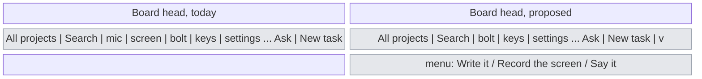
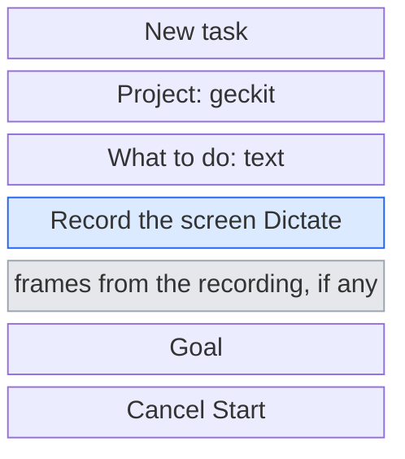
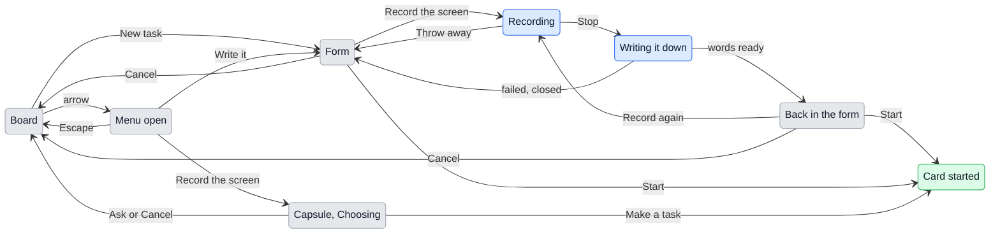

# UX: Ways to start a task

Continues `docs/ux/screen-recording.md`, and changes where recording is started from inside the app.

## 1. Why

The board head has two bare icons, a microphone and a screen, between the search field and the Shortcuts button. Nothing about them says that they start work: they sit with the tools (Shortcuts, Keyboard shortcuts, Settings), not with "Ask" and "New task", and their meaning is only in a tooltip. Alex, who built them, looked at the head and could not see that recording the screen is a way to make a task. The two verbs that start work are already there with words on them, "Ask" and "New task"; recording and speaking are ways of saying what the work is, so they belong inside those two, not beside the tools.

## 2. What is added

| Surface | What appears | When seen |
|---|---|---|
| Board head (`Board.tsx`), existing | The microphone and screen icons are removed. "New task" becomes a split button: pressing its words opens the form as today, its arrow opens a menu of ways to start | Always |
| Menu under the arrow, new | "Write it", "Record the screen", "Say it", each with a line saying what happens and its shortcut | When the arrow is pressed |
| New task form (`NewTask` in `Board.tsx`), existing | Under "What to do", a row of two buttons: "Record the screen" and "Dictate" | Always |
| Ask form, existing | The same row | Always |
| New task form, after a recording | The words at the end of "What to do", the frames among the pictures, and under them "From a 0:42 recording. Claude gets the video too." with an x | After a recording made from the form |
| List view head (`Sidebar.tsx`), existing | The microphone and screen icons are removed; "New conversation" stays as it is. It opens the composer, not this form, so recording from the list view is Cmd+Alt+R or the tray | Always |
| Panel tabs (`Panel.tsx`), existing | "Record" is removed; "Say" stays | Always |

The global shortcut and the tray item keep the capsule's own Choosing card, since there is no form open when they are pressed. From the form, the capsule never asks "Ask or Make a task": the form was opened to make one of the two, and already holds the project and the goal.

## 3. States

The states of the recording itself (Recording, Writing it down, No permission, Failed) are those of `screen-recording.md`. What this document adds is what happens around them when the recording is started from a form.

| State | When it happens | What the person sees | What to do |
|---|---|---|---|
| Menu open | The arrow beside "New task" was pressed | The three ways, each with its line and shortcut | Pick one, or Escape |
| Form | "New task", "Write it" or "Ask" | The form, with "Record the screen" and "Dictate" under the field | Write, or record, or dictate |
| Recording from the form | "Record the screen" in the form was pressed | The Chat window goes behind other windows, so whatever is to be shown is in front; the capsule records | Show and talk, then Stop |
| Back in the form | The recording was written down | The Chat window comes forward with the form as it was left, plus the words at the end of "What to do", the frames among the pictures, and the recording line | Read it over, set the goal, Start |
| Back unchanged | The recording was thrown away, failed and was closed, or was not allowed | The form exactly as it was left | Carry on writing, or record again |

## 4. Transitions

| From | Event | To | What the person sees |
|---|---|---|---|
| Board | Pressed the words "New task" or Cmd+N | Form | The New task form, as today, with the new row under the field |
| Board | Pressed the arrow beside "New task" | Menu open | "Write it", "Record the screen", "Say it" under the button |
| Menu open | Picked "Write it" | Form | The New task form |
| Menu open | Picked "Record the screen" | Capsule, Choosing, through the recording | The Chat window goes behind, the capsule records; after Stop it asks "Ask" or "Make a task", as the shortcut does |
| Menu open | Picked "Say it" | The capsule for saying what to do | The same as Cmd+Alt+G today |
| Menu open | Escape or a press outside | Board | The menu closes |
| Form | Pressed "Record the screen" | Recording | The Chat window goes behind other windows; the capsule records |
| Form | Pressed "Dictate" | Form | The dictation capsule; what is heard is typed where the cursor is in "What to do", as Cmd+Alt+V does |
| Recording | Stop, Enter or Cmd+Alt+R | Writing it down | "Writing it down" in the capsule |
| Recording | Escape or the x | Form | The capsule goes, the Chat window comes forward, the form is as it was |
| Writing it down | The words and frames are ready, by itself | Back in the form | The Chat window comes forward; the words are added at the end of "What to do", on a new line when there was text; the frames join the pictures; the recording line is under them; the cursor is at the end of the words |
| Writing it down | It failed, and the capsule was closed | Form | The form as it was; nothing from the recording is kept |
| Back in the form | Pressed the x on the recording line | Form | The frames and the recording line go; the words stay, since they may have been edited |
| Back in the form | Pressed "Record the screen" again | Recording | A second recording; its words and frames are added after the first's |
| Back in the form or Form | Pressed "Start" or Cmd+Enter | Card started | The form closes and the card is in In progress, with the frames in its first message and the recording's note under the words |
| Back in the form or Form | Cancel or Escape | Board | The form closes, the recording with it |

## 5. What stays quiet

| State | Why it is not shown |
|---|---|
| That the Chat window was sent behind | It comes back by itself when the recording ends; saying so would only be one more thing to read before showing the screen |
| The recording's note (length, frame times, the video's path) in "What to do" | It is for Claude, not for the person; it is put under the words when the task starts. The recording line says the same thing briefly |
| Which of the three ways the task was started with | The card is the same card |

## 6. Numbers and time

| Number | Value | Why |
|---|---|---|
| Pictures in the form | 8 at most, the frames counting among them | The form already holds 8 pictures; a recording's frames are pictures like any other |
| Frames kept when the pictures would pass 8 | The ones furthest apart in time, as in `screen-recording.md` | The same rule wherever frames are cut down |

## 7. Wording

| Place | Text |
|---|---|
| Arrow beside "New task", tooltip | "Other ways to start a task" |
| Menu, first | "Write it" / "The form: project, what to do, a goal. Cmd+N" |
| Menu, second | "Record the screen" / "Show it and talk. The recording becomes the task. Cmd+Alt+R" |
| Menu, third | "Say it" / "Tell GeckIt what to start, answer or mark. Cmd+Alt+G" |
| Form row, first | "Record the screen" |
| Form row, second | "Dictate" |
| Form row, first, tooltip | "Show what you mean and talk; the words and frames come back into this form (Cmd+Alt+R)" |
| Form row, second, tooltip | "Say it instead of typing it (Cmd+Alt+V)" |
| Recording line | "From a 0:42 recording. Claude gets the video too." |
| Recording line, x tooltip | "Take the recording off" |
| Placeholder of "What to do", changed | "Ask Claude Code. Paste a picture, drop a file, or record the screen" |

## 8. Edge cases

- **Empty:** a recording where nothing was heard comes back with its frames and the line, and "What to do" as it was; Start stays off until there is text or a picture, as today.
- **Everything at once:** the form already has 6 pictures and the recording brings 5 frames: the pictures the person put in stay, and the frames are cut to the 2 furthest apart.
- **Interrupted:** the Chat window is closed while recording: the recording ends as thrown away, since the form it was going into is gone.
- **Repeated:** Cmd+Alt+R pressed while the form is open is the same as its "Record the screen" button: the recording goes into the form.
- **Stale:** the project picked in the form is kept; the recording does not choose a project when started from the form.
- **Phone:** the row is not shown on the phone, which records nothing.

## 9. What is left out on purpose

| Not done | Why |
|---|---|
| Keeping the two icons and giving them words | The head would have five labelled buttons; the ways to start belong with the verb that starts |
| "Record" in the panel | The panel is for correcting and transcribing text; a task does not start there |
| A split arrow on "Ask" too | Asking is the lighter case; the row in the Ask form is enough, and two arrows side by side read as one control |
| Letting the capsule pick the project when recording from the form | The form already has a project chosen; guessing over it would undo the person's choice |

## 10. Forks

### Where the in-app entry to recording goes

| Option | Verdict |
|---|---|
| A screen icon in the head, beside the microphone | no - this was built first and read as a tool, not as a way to start |
| A "Record the screen" row inside the New task and Ask forms, plus a menu on "New task" | yes |
| A third labelled button in the head, "Record" | no |

**Why:** the forms are where a task is made, so a button there cannot be misread; the menu on "New task" lets it be reached from the board in one step without a new button in the head.

### What a recording from the form does

| Option | Verdict |
|---|---|
| Fills the form: words into the field, frames into the pictures | yes |
| Opens the capsule's Choosing card, as the shortcut does | no |

**Why:** the form was opened to make a task in a project with a goal; asking again whether it is a task, and which project, would repeat what was already answered.

## 11. Requirements

| Requirement | Where closed |
|---|---|
| It is clear that recording is a way to create a task | sections 1, 2, 10 |

**Changes to `screen-recording.md`:** its section 2 rows for the board head, the sidebar head and the panel tab are replaced by this document.
