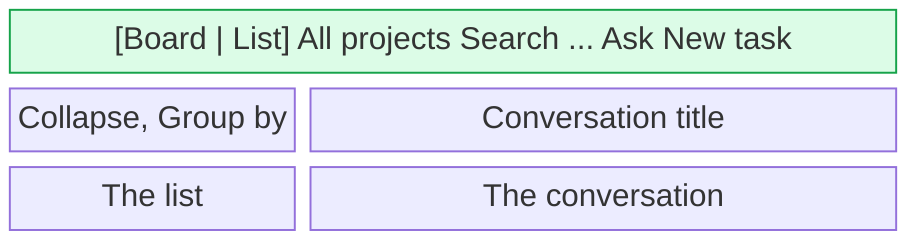
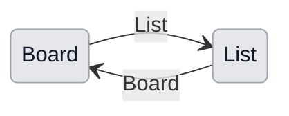

# UX: Board and list, two views of the same conversations

## 1. Why

The Chat window shows the conversations in two ways: as a board of cards in three columns, and as a list in a sidebar beside the open conversation. Until now each view had one icon button that led to the other: a list icon in the board's header, a board icon among six icons in the sidebar's header. Nothing said there were two views, which one was on, or that the button was a way back. The list icon on the board looked like a menu button, and Alex had to hover it to find out what it does. The two views also had different tops: the board a full-width bar with search, Ask and New task, the list a row of icons over the sidebar, so switching looked like going to another screen rather than seeing the same conversations another way.

## 2. What is added

| Surface | What appears | When seen |
|---|---|---|
| Top bar, the board's header, existing | A two-part switch, Board and List, each with its icon and name, at the left of the bar; the one in use is raised | Always |
| Top bar in the list, new | The board's bar, the same in every part, across the whole window above the sidebar and the conversation | Always in the list |
| List sidebar, existing | Loses its header of icons, its project picker and its "New conversation" button; keeps "Collapse all" and "Group by" in a short row above the list | Always in the list |

The bar does not change when the view does; only what is below it does.

## 3. States

| State | When it happens | What the person sees | What to do |
|---|---|---|---|
| Board | The board is the view in use | The bar, Board raised, the columns below | Press List |
| List | The list is the view in use | The bar, List raised, the list and the conversation below | Press Board |
| Hover | The pointer is on the half not in use | Its name darkens, and after a moment the tooltip describes the view | Press it |
| Focus | Tab reaches the switch | The focus ring around the half in focus | Space or Enter |

## 4. Transitions

| From | Event | To | What the person sees |
|---|---|---|---|
| Board | Pressed List | List | The bar stays; below it the list, and the conversation that was open over the board open beside it; List is raised |
| List | Pressed Board | Board | The bar stays; below it the board, the open conversation still open over it; Board is raised |
| Either | Pressed the half already in use | Same | Nothing changes |
| List | New task, or Cmd+N | List | The new-task form, as on the board: project, what to do, a goal |

The choice is kept in settings (`chatView`), as before, so the app opens in the view last used.

## 5. What stays quiet

| State | Why it is not shown |
|---|---|
| A keyboard shortcut for the switch | Every obvious letter is taken (Cmd+B is not, but Ctrl+B runs a command in the background, and the two would be confused); the switch is pressed rarely |
| A count on each half | Both views show the same conversations |
| An animation of the raised part sliding across | Everything below the bar changes at the same moment, so a sliding thumb would not be seen |

## 6. Numbers and time

| Number | Value | Why |
|---|---|---|
| Top bar height | 45 px, the board's | The same bar in both views |
| Sidebar width | From 220 px to the window's width less 420 px, 264 by default | Existing; the sidebar now holds only the list |
| Switch | 116 px | Two labelled halves in a 2 px frame |

## 7. Wording

| State | Text |
|---|---|
| Board half, label | "Board" |
| List half, label | "List" |
| Board half, tooltip | "Board: the conversations as cards, by what stands where" |
| List half, tooltip | "List: the conversations one under another, by project" |
| Switch, for a screen reader | "View", a radio group of Board and List |

## 8. Edge cases

- **Narrow window:** the bar is the board's, so it holds at every width the board holds at.
- **Nothing to collapse and not every project listed:** the sidebar's short row has neither button and is not drawn.
- **Search:** the bar's search field is the one Cmd+P goes to in both views; the Cmd+P panel over the window is no longer opened from the list.
- **The phone:** the phone has its own board and no list, so no switch there.

## 9. What is deliberately not done

| Not done | Why |
|---|---|
| Moving the list into the board, as a third column or a drawer | A different change; the two views stay as they are |
| A menu "View: Board / List" | A menu hides the choice behind a press, which is the problem this solves |
| Keeping "New conversation" in the sidebar beside New task | Two buttons that start work in two different ways; the form asks for the project and the goal first, which the empty conversation did not |

## 10. Forks

### What the top of the list is

| Option | Verdict |
|---|---|
| The sidebar's own header of icons, with the switch in it | no |
| The sidebar's header of icons, the switch beside the project picker | no |
| The board's bar across the whole window | yes |

**Why:** with one bar in both views, switching changes only what is below it, which is what says these are two views of the same conversations. The sidebar's header had six icons after the traffic lights and ran out of the sidebar at 220 px, and the switch squeezed beside the picker cut the project's name. The cost is one row of height, 45 px, taken from the list and the conversation.

### What each half shows

| Option | Verdict |
|---|---|
| Icons only | no |
| Icon and name | yes |

**Why:** the names are what makes it read as two views, and the bar has room for them in both views now.

### What New task does in the list

| Option | Verdict |
|---|---|
| Opens an empty conversation beside the list, as "New conversation" did | no |
| Opens the new-task form, as on the board | yes |

**Why:** one button in one bar that does two things by view would be the same button meaning two things; the form asks for the project and a goal before the work starts.

## 11. Requirements check

| Requirement | Where it is covered |
|---|---|
| Make it clear there are two views | Sections 2, 10 |
| The list's top bar the same as the board's | Sections 2, 10 |

**What the requirements do not say yet:** that New task and Cmd+N open the form in the list as well (section 10), and that "New conversation" leaves the sidebar (section 9).
