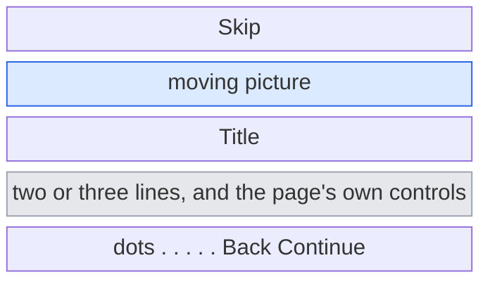
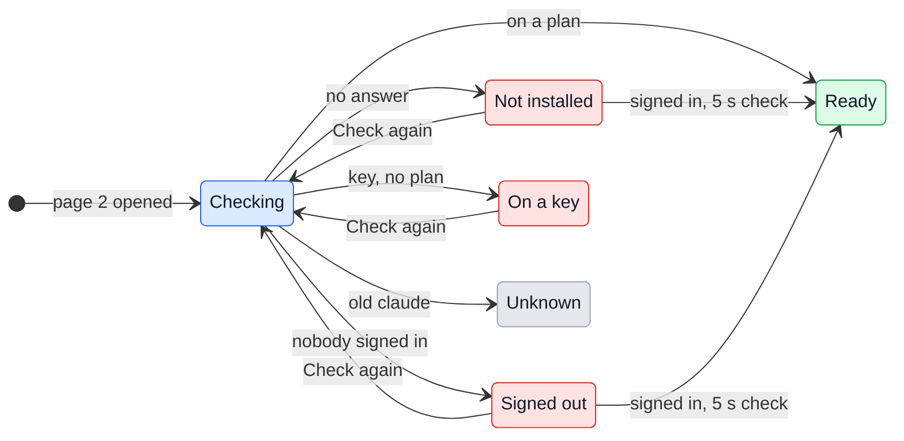

# UX: The first start

## 1. Why

A person who installs GeckIt and opens it for the first time lands on an empty board with one grey sentence under it: "Choose a project folder on the left", or "Claude Code is not on this machine. Install it, then reopen this window." Nothing says what the app is for, that it runs on their own Claude plan through the `claude` program, how to install and sign that in, that dictation needs an OpenRouter key, or that there is a phone app. Each of these is found by accident or not at all, and the first one blocks everything: without a signed-in `claude` nothing in the Chat window works.

## 2. What is added

| Surface | What appears | When seen |
|---|---|---|
| Chat window, new sheet `Welcome` | A full-window sheet over the board, five pages with a picture that moves at the top of each, dots for the pages, Back and Continue at the bottom, Skip at the top right | First start (see section 6), or from Settings |
| Page 1, "What GeckIt is" | Three things it does, each one line: the board of Claude Code conversations, Correct, Dictate. Picture: a card moving from In progress to In review to Done | Always first |
| Page 2, "Claude Code" | What is needed (the `claude` program and a Pro or Max plan), a line saying where this machine stands, the one command for the next step in a terminal that types itself, Copy and Check again | Always |
| Page 3, "A project" | What a project is (a folder Claude works in) and Choose a folder. Picture: a folder dropping into the list | Always |
| Page 4, "Correct and dictate" | The two shortcuts as keys that press themselves; a field for the OpenRouter key dictation needs; on macOS, a line and a button for the Accessibility permission pasting needs | Always |
| Page 5, "Your phone" | One line, then the Phone switch and QR code from Settings, Phone, with the same note. Picture: a phone scanning the code | Always, as Settings offers Phone everywhere |
| Settings, General, existing | A row "Welcome" with a button "Show again" | Always |

## 3. States

Page 2 is the only page whose content depends on the machine. It reads the same `claude auth status` the Chat window already asks.

| State | When it happens | What the person sees | What to do |
|---|---|---|---|
| Checking | Page 2 opened, the answer has not come | "Looking for Claude Code..." | Nothing, it passes by itself |
| Not installed | `claude` did not answer | The status line and the install command | Run the command, press Check again |
| Signed out | `claude` answered and nobody is signed in | The status line and `claude auth login` | Run it, press Check again |
| On a key | Signed in with an API key, not a plan | The status line and `claude auth login` | Sign in with the plan's account, press Check again |
| Unknown | An older `claude` that does not say | The status line, no command | Continue |
| Ready | Signed in on a plan | The status line with the plan and version, a tick, no command | Continue |

Page 3: before a folder is chosen, Choose a folder; after, the folder's name with a tick and "Choose another". Page 4: the key field is empty or filled; the Accessibility line says granted or not granted. Page 5: the phone states are those of Settings, Phone.

## 4. Transitions

| From | Event | To | What the person sees |
|---|---|---|---|
| (app start) | First start, see section 6; by itself | Page 1 | The sheet over the board |
| Settings, General | Pressed "Show again" | Page 1 | Settings closes, the sheet opens |
| Any page | Pressed Continue | Next page | The next picture starts |
| Any page but the first | Pressed Back | Previous page | The previous picture starts again |
| Any page | Pressed a dot | That page | That page |
| Last page | Pressed "Start using GeckIt" | Board | The sheet goes; if a folder was chosen, the board is on it |
| Any page | Pressed Skip or Esc | Board | The sheet goes, and does not come back by itself |
| Page 2, Not installed / Signed out / On a key | Pressed Check again | Checking | "Looking for Claude Code..." for as long as the answer takes |
| Page 2, Not installed / Signed out / On a key | 5 s passed while the page is open; by itself | The state the tool says | Nothing until the answer differs, so the line does not blink every 5 s |
| Page 2, Checking | The tool answered | The state it says | That state's line |
| Page 2, Ready | Nothing | Ready | It stays; the check stops |
| Page 3 | Pressed Choose a folder, picked one | Page 3, chosen | The folder's name and a tick |
| Page 3 | Pressed Choose a folder, cancelled the dialog | Page 3 as it was | Nothing |
| Page 4 | Typed or pasted a key | Page 4 | The key is saved as typed, as in Settings |
| Page 4 | Pressed "Open Accessibility settings" | System Settings | System Settings opens at Accessibility; coming back, the line says whether it is granted |

Continue is never held back: a page that is not done says so in its button, "Continue without it", and the Chat window's own lines still say what is missing afterwards.

## 5. What is silent

| State | Why it is not shown |
|---|---|
| The microphone permission | macOS asks for it by itself at the first start, before this sheet is drawn |
| Screen recording permission | Asked the first time a recording starts, and only people who record need it |
| Correct's engine and model | Correct runs on the plan by default and needs nothing; the key engine is for people who already know they want it |
| Profiles, phrases, shortcuts, open-with | Learned from the board when they are needed; five pages is already the limit of what is read |
| Which install method is "right" | One command is shown per platform; Homebrew and npm people know their own |

## 6. Thresholds and time

| Number | Why |
|---|---|
| First start = no `welcomed` in settings and no projects | Everyone who used a build before this has at least one project, so they are not shown the sheet after an update |
| Recheck every 5 s on page 2 | Installing or signing in takes longer than 5 s, so the page catches up about when the person looks back; `claude auth status` is local and cheap. Only while page 2 is open and not Ready |
| One picture loop is 3 to 4 s | Long enough to be read once, short enough not to be waited for |
| Pictures do not move with Reduce motion on | They show their last frame instead |

## 7. Wording

| Where | Text |
|---|---|
| Page 1 title | "Welcome to GeckIt" |
| Page 1 body | "Claude Code, on a board. Each conversation is a card that moves from In progress to In review to Done, and runs on your own Claude plan." / "Correct: select text anywhere and press Cmd+C+D to have it fixed." / "Dictate: press Cmd+Alt+V, speak, and the words are pasted where you were typing." |
| Page 2 title | "Claude Code" |
| Page 2 body | "GeckIt drives the claude program on this computer and signs in with your Claude Pro or Max plan. It never uses an API key, so nothing is billed beyond the plan." |
| Checking | "Looking for Claude Code..." |
| Not installed | "Claude Code is not on this computer. Run this in a terminal:" + `curl -fsSL https://claude.ai/install.sh \| bash` (Windows: `irm https://claude.ai/install.ps1 \| iex`) |
| Signed out | "Claude Code 2.1.283 is here, and nobody is signed in. Run this in a terminal:" + `claude auth login` |
| On a key | "Claude Code is signed in with an API key. Sign in with your plan instead:" + `claude auth login` |
| Unknown | "Claude Code is here. This version does not say who is signed in." |
| Ready | "Ready: your Claude Max plan, Claude Code 2.1.283." |
| Page 2 buttons | "Copy", "Check again" |
| Page 3 title | "A project" |
| Page 3 body | "A project is a folder. Everything asked in it runs there, with Claude Code's access to its files." |
| Page 3 button | "Choose a folder", after one: "Choose another" |
| Page 4 title | "Correct and dictate" |
| Page 4 body | "Both work in any app, from anywhere." / "Dictation turns speech into text with Whisper through OpenRouter, so it needs an OpenRouter key. Correct needs nothing." |
| Page 4 key field | label "OpenRouter key", placeholder "sk-or-..." |
| Page 4 Accessibility | not granted: "To paste what you said, GeckIt needs Accessibility." + "Open Accessibility settings"; granted: "Accessibility is on." |
| Page 5 title | "Your phone" |
| Page 5 body | "Follow your conversations from an iPhone.", then Settings' own "Open the conversations on your phone" and its note on scanning the code |
| Buttons | "Skip", "Back", "Continue", "Continue without it", last page "Start using GeckIt" |
| Settings row | label "Welcome", button "Show again" |

## 8. Edge cases

- **Signed in while page 3 is open.** Page 2 is not reopened; the next time it is opened it checks again.
- **Window closed mid-sheet.** Nothing is saved as seen; the next start shows it again from page 1.
- **The app quit on page 5 with Phone on.** Phone stays on; it is the same setting as in Settings.
- **A folder chosen and then Skip.** The folder is kept; the board opens on it.
- **Two Chat windows.** There is one Chat window.
- **Windows and Linux.** Page 4 has no Accessibility line.

## 9. What is deliberately not here

- **Installing Claude Code from the app.** Running a script from the internet with the person's rights, unseen, is worse than a command they read and run themselves.
- **Signing in from the app.** GeckIt never holds the secret (`account.ts`); `claude auth login` is the tool's own flow.
- **A video.** Heavy in the package, and out of date the week the UI changes; the pictures are drawn from the app's own shapes.
- **A tour pointing at the real buttons.** It breaks every time the board head changes and cannot be read again at leisure.

## 10. Decisions

| Question | Verdict | Why |
|---|---|---|
| A separate window, or a sheet over Chat | Sheet over Chat | Chat is what opens at start, and the board is seen behind it, which is what page 1 describes |
| Block Continue until Claude Code is ready | No | Some people install later; the Chat window already says what is missing |
| Show again to people who updated | No | They already set it up; Settings has Show again |
| Phone page on Windows and Linux | Yes | Settings offers Phone on every platform, so the welcome does too |
