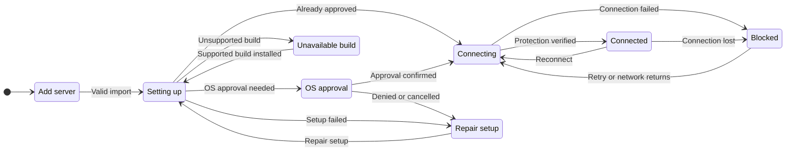

# UX: Automatic native VPN setup and recovery

## 1. Purpose

Users should import their AmneziaWG configuration and approve macOS permissions, then work. Developer accounts, signing, provisioning, notarization and manual helper commands belong to GeckIt's build process. Alex requested automatic setup and recovery. This handoff describes future behavior after native routing and crash-safe blocking pass qualification; the current build remains unavailable.

## 2. Surfaces

| Surface | Change | When visible |
| --- | --- | --- |
| Existing desktop Agent VPN settings | Import starts setup automatically; show one current setup/connection result and its next action. | Configuration is retained. |
| Existing bottom status control | Reflect the real state; open Agent VPN settings directly. | Chat is open. |
| macOS permission UI | GeckIt requests extension/VPN approval and explains the actual OS response. | macOS requires approval. |
| Existing phone VPN sheet | Reflect paired computer status; explain when approval is needed there. | Phone is paired; configuration remains computer-only. |

Use the existing status area above server controls. No additional setup wizard or demonstration is required.

## 3. States

| State | Entry | Visible wording | Next action |
| --- | --- | --- | --- |
| Empty | No retained configuration | "Add your VPN server" | Import .conf file. |
| Preparing | Valid import; component installation needed | "Setting up Agent VPN" | Wait, or Cancel setup. |
| Approval | OS reports approval required | "Approve Agent VPN on this Mac" | Open System Settings; approve locally; Check again. |
| Connecting | Installation approved and blocking ready | "Connecting to your VPN server" | Wait, or disconnect while keeping protection required. |
| Connected | Tunnel and enforcement verified | "Connected" | Work; Reconnect or select another server when needed. |
| Blocked | Tunnel unavailable or user disconnects | "Agent internet access is blocked" | Reconnect; repair configuration if needed. |
| Repair | Component, approval or enforcement fails | "Agent VPN needs attention" | Repair setup; retry OS approval when applicable. |
| Unsupported | Native enforcement not qualified for this build/platform | "VPN routing is not ready in this build" | Keep configuration; use a supported build when available. |

Closing settings never cancels protection. Removing all profiles or explicitly disabling protection follows the existing approved policy, with its separate confirmation.

## 4. Transitions

| From | Event | To | What the user sees |
| --- | --- | --- | --- |
| Empty | Import valid .conf file | Preparing, automatically | "Setting up Agent VPN"; agent admission is closed before setup. |
| Preparing | OS requires approval | Approval | "Approve Agent VPN on this Mac" and the actual approval location. |
| Preparing / Approval | OS confirms current component approval | Connecting, automatically | "Connecting to your VPN server". |
| Preparing / Approval | Setup fails, approval denied or Cancel setup | Repair | "Agent VPN needs attention"; retained protection stays required. |
| Preparing | Installed build lacks qualified enforcement | Unsupported | "VPN routing is not ready in this build". |
| Connecting | Tunnel and enforcement checks pass | Connected, automatically | "Connected"; only now can covered work proceed. |
| Connecting / Connected | Tunnel fails | Blocked, automatically | "Agent internet access is blocked"; same-server recovery begins when safe. |
| Connected / Blocked | Reconnect | Connecting | Same selected server; native blocking remains throughout restart. |
| Blocked | Network returns or scheduled safe retry | Connecting, automatically | "Connecting to your VPN server"; no alternative server is chosen. |
| Connected | Disconnect | Blocked | "Agent internet access is blocked"; suppress automatic retries until Reconnect. |
| Repair | Repair setup | Preparing | "Setting up Agent VPN"; only repair the GeckIt component. |
| Unsupported | Supported build installed, with retained configuration | Preparing, automatically | "Setting up Agent VPN". |
| Any | Close settings, then reopen | Same underlying state | Current real state; no setup restart or policy change. |

## 5. What stays silent

Hide certificates, provisioning profiles, team identifiers, helper paths and packet counters. They provide no user decision. Keep routine successful install checks and background same-server retries quiet apart from the current status. Never expose raw configuration, private keys or credentials to the renderer or phone.

## 6. Thresholds and timing

No arbitrary retry duration is specified before native qualification. Use bounded retries with backoff, one operation at a time, and immediate handling of network return or a manual Reconnect. Establish blocking before any install/start/restart transition, with no grace period for direct traffic. OS approval has no timeout that silently removes protection.

## 7. Exact wording

State wording is defined once in section 3. Approval guidance: "macOS needs your permission to enable Agent VPN. Approve it in System Settings on this Mac." Blocked explanation: "Agents and their tools cannot reach the internet until this VPN reconnects." Use that explanation only after native blocking has been proved. The current build retains its admission-only limitation. Phone approval guidance: "Approve Agent VPN on your paired computer." Actions: "Open System Settings", "Check again", "Cancel setup", "Repair setup", "Reconnect".

The developer qualification extension's macOS permission description is "Tests a separate VPN connection for GeckIt agents and their tools." It describes the test component without claiming verified protection. macOS owns the permission dialog's layout, themes, focus and approval controls; this text must be inspected in the actual activation UI before its visual review is considered complete.

## 8. Edge cases

- Invalid/cancelled import leaves the previous server and policy unchanged.
- Duplicate import, repeated Reconnect, or simultaneous phone/desktop requests join or serialize the existing operation; no parallel tunnel starts.
- App restart with a configured VPN establishes blocking and resumes setup/connection automatically before covered requests.
- Revoked approval, damaged component or app update enters Repair; no direct fallback. Version replacement needs tested OS behavior before implementation.
- Stale callbacks cannot reopen admission after disconnect, failure or server switch.
- Unknown provider submission results are not replayed automatically. Preserve history and pending messages; let provider protocol determine safe continuation.
- A computer-wide VPN that prevents reaching the selected server leaves agents blocked. Never modify that other VPN automatically.
- An offline paired computer gives the phone its existing Host offline state; phone cannot approve Mac permissions.
- SSH hosts and existing shared tmux/browser/daemon processes remain outside local protection until separately covered.

## 9. Intentionally absent

No developer provisioning instructions in the product, password collection, automatic OS permission approval, global VPN route installation, automatic server substitution or simulated Connected state. The rejected export/import demo remains removed.

## 10. Decisions

Automatic setup replaces manual helper installation for end users. Developer qualification remains a separate developer workflow. User consent remains local because macOS controls it. Native macOS execution remains selected; a VM is not a fallback. Existing same-server recovery and manual Reconnect both retain continuous enforcement; neither changes the saved server.

## 11. Requirements and review

FR-030 defines automatic distribution/setup; FR-006/007/020/029 govern blocking and truthful readiness; FR-024 prevents automatic server substitution; FR-027/028 provide desktop and phone entry points. T035 completes notarization/qualification; T036 implements this flow afterward. This is a draft handoff, not implemented UX. Mermaid rendering and full light/dark, keyboard, scrolling and viewport review remain required before UI delivery.
