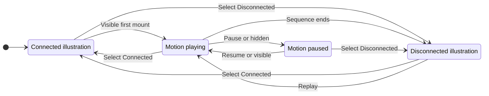

# UX: Explain agent VPN routing and loss of internet access

## 1. Purpose

The screenshot explains import before saying what Agent VPN does. "Native component" does not explain why Connect is unavailable or distinguish denying new work from blocking running tools' internet. Alex requested motion like SSH Hosts. This is a traffic explanation; the rejected export/import walkthrough stays removed.

## 2. Surfaces

| Surface | Change | Visible when |
| --- | --- | --- |
| Agent VPN settings | Purpose, accurate current support, inline routing figure, existing setup | Section open |
| Phone VPN sheet | Same intended routing figure and actual support, scoped to paired computer | Sheet open |
| Real browser preview | Themes, states and motion preference fixtures | Development review |

Current support appears before the figure. Its three persistent objects are agents and tools, AmneziaWG and internet. Illustrated states are independent of saved names and real runtime status.

## 3. States

| State | Entry | User sees | Next action |
| --- | --- | --- | --- |
| Actual required | Real view required | "Agents cannot start until VPN connects." | Inspect saved configuration; native setup is unfinished |
| Actual unconfigured | Real view not required | "VPN routing is not ready in this build." | Import; saving requires VPN before new work |
| Actual pending/error | No view or failed read | Existing loading/error feedback, no protection claim | Wait or reopen Settings |
| Illustration connected | First visible mount, Replay or Connected selection | "Agents and tools reach AI providers and websites through the VPN." | Pause or see illustrated failure |
| Illustration disconnected | Sequence ends or Disconnected selected | "VPN disconnected. Agents have no internet access until it reconnects." | Select Connected or Replay |
| Paused | Pause, hidden page or out of view | Diagram position held | Resume; automatic pause resumes when visible |
| Reduced motion | System preference | Static state controls only | Select either state |

## 4. Transitions

| From | Event | To | User sees |
| --- | --- | --- | --- |
| Initial | Visible automatically, normal motion | Playing | Request/reply crosses both VPN links |
| Playing | Six-second sequence ends automatically | Disconnected | Packets stop, link is blocked, agents wait |
| Playing | Pause, hidden or offscreen | Paused | Position held; no unseen frames |
| Paused | Resume or visible after automatic pause | Playing | Same sequence resumes; manual pause requires Resume |
| Any | Select Connected/Disconnected | Static chosen state | Caption and route change; no network operation |
| Any | Replay | Playing | Fresh finite sequence; no replay under reduced motion |
| Any | Close or navigate away | Unmounted | Observers/listeners removed; existing focus return |

## 5. What stays silent

Illustration changes are not connection live-region announcements. They do not update the footer, native runtime, configurations, admission or conversations. No counters, endpoints, secrets, developer account or pretend success.

## 6. Time

| Value | Purpose | Reason |
| --- | --- | --- |
| Six seconds | One request/reply before disconnection | Time to follow both links; ends without an idle loop |
| No motion under reduced motion | Manual static states | Explain without movement or timed transitions |
| Immediate hidden/offscreen pause | Freeze CSS clock and packets | No background rendering/timer advancement |

Only HTML transform/opacity animate. A finite CSS clock can deliver completion; no recurring JS timer or polling.

## 7. Exact copy

Purpose: "Give GeckIt agents and their tools a separate AmneziaWG connection."

Intended behavior: "When connected, their internet traffic goes through your VPN server. If the VPN disconnects, their internet access stops until you reconnect."

Actual required detail: "VPN routing is not ready in this build. GeckIt blocks new agent work, but network-level blocking for running tools is not active yet."

Actual unconfigured detail: "You can save server configurations. Connecting and blocking agent internet access are still being completed."

Figure heading: "How protection will work". Disclaimer: "Illustration only. This is not your connection status." Object labels: "Agents & tools", "AmneziaWG", "Internet". Accessible state group: "Illustration state"; controls "Connected", "Disconnected". Quiet motion control: "Pause", "Resume", "Replay", with an accessible illustration-specific name.

Scope: "This policy applies to agents running on this computer. SSH hosts need their own protection." Phone's existing paired-computer explanation establishes which computer.

## 8. Edge cases

- Empty/saved/corrupt states share the diagram; actual status remains distinct. Pending reads are not unconfigured.
- Long profile names affect only saved controls; generic diagram labels never imply the selected profile works.
- Narrow views retain all three objects and both links, wrap controls/captions, and provide touch targets without horizontal diagram scrolling.
- Changing to reduced motion stops animation and timed transitions. Returning to normal does not replay unexpectedly.
- Reopening may play one new visible sequence. Profile edits must not restart it.
- SSH execution is remote; local routing is not remote enforcement.

## 9. Deliberate omissions

No file-transfer demo, inoperative Connect/Reconnect, infinite traffic loop, alternate direct route or claim that the native kill switch works. Native provisioning and installed routing/failure checks remain incomplete.

## 10. Decisions

The new request supersedes "no replacement illustration" for this traffic explanation only. Reuse SSH Hosts' compact objects/wires, not its animated layout properties or infinite loop. Real status remains separate. Existing import/rename/check/remove and admission behavior stay unchanged. This UI request does not approve pending Apple capabilities.

The user's explicit request authorizes this existing-feature explanation and connected/disconnected story. Implementation follows this UX handoff and GeckIt's own design system.

## 11. Requirements

FR-001 through FR-008 describe intended routing/failure blocking. The figure explains, but does not implement them. FR-029 admission is the actual current behavior. T034 covers UI, motion lifecycle, full-context theme/viewport/keyboard/scroll review and both builds. T005/T007/T016/T027/T031/T032 remain open. Feature documentation must preserve unimplemented routing limits.
