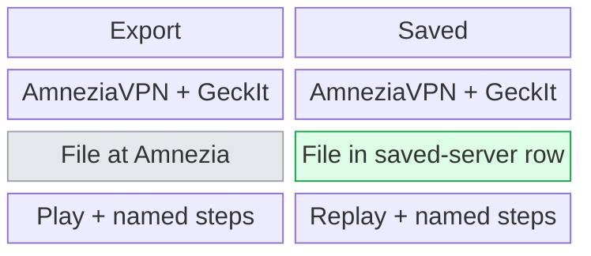
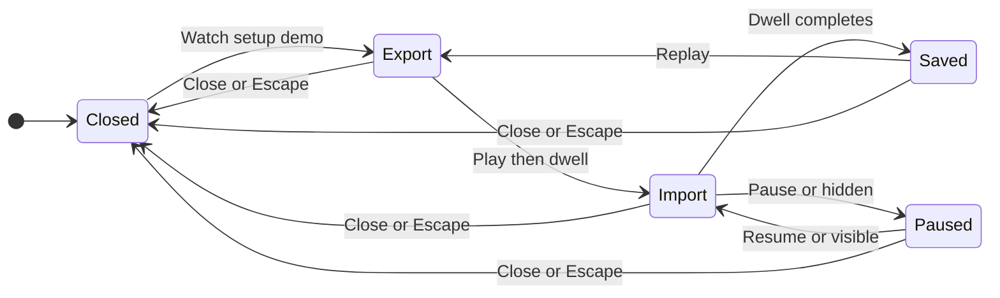

# UX: A continuous VPN setup walkthrough

## 1. Purpose

Alex rejected the first demonstration: unrelated miniature cards replace one another and a file fades upward without showing what export and import do. Keep both applications visible and follow one configuration file from Amnezia to GeckIt's saved-server list. This is a demonstration of the existing configuration workflow, not a VPN connection demonstration.

## 2. Surfaces

| Surface | Change | When visible |
| --- | --- | --- |
| Existing Agent VPN Settings | Existing Watch setup demo opens the revised inline walkthrough. | Desktop setup card. |
| Existing AgentVpnDemo | One persistent stage with AmneziaVPN, GeckIt and a moving configuration file. | Walkthrough open. |
| Walkthrough controls | Named Export, Import and Saved steps; one Play/Pause/Replay action and quiet restart/close controls. | Walkthrough open; motion controls omitted with reduced motion. |

The application windows and controls stay in place. Only the configuration file and the receiving row respond to progress. Captions occupy a reserved area so changing steps does not move controls or scroll the panel.

At the desktop viewport, keep the entire walkthrough within the existing Settings scroll region: use compact gaps and a caption area sized for its two-line instructions. On narrow screens, allow the caption to grow for wrapping. Opening the walkthrough aligns its beginning with the scroll region so its controls are immediately visible.

## 3. States

| State | Entry | Visible result | Next action |
| --- | --- | --- | --- |
| Closed | Initial state or Close/Escape | Existing setup instructions. | Watch setup demo. |
| Export | Open or restart | Amnezia native-format export and geckit.conf at its origin. | Play or choose a named step. |
| Import | Next playback step or Import step button | Same file travels toward GeckIt's import area. | Pause, select another step or wait. |
| Saved | Final playback step or Saved step button | File resolves into GeckIt's saved-server row; VPN required. | Replay, select another step or Close. |
| Paused | Pause or out-of-view/hidden | Current phase and file position held. | Resume when visible or close. |
| Reduced motion | System motion preference | Static positions and named step navigation. | Select Export, Import or Saved. |

## 4. Transitions

| From | Event | To | What the person sees |
| --- | --- | --- | --- |
| Closed | Watch setup demo | Export | Both applications, file at origin and Play demo. |
| Export | Play demo; first dwell ends automatically | Import | File moves across to the import area; caption changes. |
| Import | Dwell ends automatically | Saved | Receiving row appears; file settles into it. |
| Saved playing | Final dwell ends automatically | Saved finished | Movement stops and primary playback control becomes Replay demo. |
| Playing | Pause demo | Paused | Current position freezes; button becomes Play demo. |
| Playing | Page hidden or walkthrough outside scroll view | Suspended | Motion/time stop silently while unseen; resume automatically on visibility. |
| Any open state | Named step | Selected static phase | File and receiving row resolve immediately to that phase; playback stops. |
| Playing or paused | Restart demo | Export playing | Previous playback is cancelled and the full sequence starts once. |
| Any open state | Close demo or Escape | Closed | Walkthrough disappears immediately; focus returns to Watch setup demo. |
| Any open state | Reduced-motion preference enabled | Static phase | Movement stops, playback controls disappear, named steps remain. |

## 5. What stays silent

| Detail | Reason |
| --- | --- |
| Playback clocks, fractions and animation frames | They do not help export or import a configuration. |
| Background pause notices | The walkthrough is not visible; no action is required. |
| Real profile data and network state | The walkthrough is illustrative and never performs a real import or connection. |

## 6. Timing

| Number | Meaning | Reason |
| --- | --- | --- |
| 3 phases | Export, import and saved configuration. | Matches the actual setup sequence. |
| 3 seconds per phase | Caption-reading dwell, 9 seconds total. | Existing finite playback budget; no looping or default autoplay. |
| Short movement within a phase | File travels or settles, then holds still. | Motion explains cause and destination; it does not occupy the entire reading interval. |
| 600 pixels | Existing narrow Settings breakpoint. | Maintain full-width readable content instead of a squeezed second column. |

The stage must remain readable at a 390-pixel viewport. Keep the same application identities and file path across layouts; adapt the arrangement if a side-by-side layout becomes illegible. Use existing GeckIt motion conventions for transitions and no animated layout properties.

## 7. Exact wording

| State or control | Text |
| --- | --- |
| Heading | "How setup works" |
| Scope | "Example only. This saves a configuration, not a VPN connection." |
| Export title | "Export from Amnezia" |
| Export caption | "Share VPN access for GeckIt. Choose AmneziaWG native format and save the .conf file." |
| Import title | "Bring the file into GeckIt" |
| Import caption | "Choose Import .conf file and select your exported file." |
| Saved title | "Ready for later" |
| Saved caption | "Your server is saved. VPN routing is not available yet." |
| Saved row status | "VPN required" |
| Step navigation | "Export", "Import", "Saved" |
| Playback | "Play demo", "Pause demo", "Replay demo" |
| Quiet restart | "Restart demo" |
| Dismiss | "Close demo" |
| Reduced motion | "Choose a step to see how setup works." |

## 8. Edge cases

- Empty or many real profiles: same synthetic walkthrough; never reads profile data.
- Import error behind walkthrough: existing error remains unchanged; demo cannot dismiss or repair it.
- Repeat/restart during export: reset timer and file pose, cancel old cleanup without overwriting the fresh dwell.
- Visibility interruption: preserve remaining time and position; no automatic next phase while paused.
- Long instructions and narrow viewport: wrap captions, preserve control placement and avoid overflow.
- Two reasons at once: hidden and reduced motion both stop playback; visibility cannot resume a reduced-motion walkthrough.
- Keyboard: Tab in visual order, Enter/Space activates controls, Escape closes; all icon-only controls have names and titles.

## 9. Intentionally absent

| Omission | Reason |
| --- | --- |
| VPN traffic animation or Connected result | Routing is unfinished. |
| Replacing the entire illustration at each step | Erases the file's origin/destination. |
| Constant bouncing, looping or decorative glow | Distracts from the setup sequence. |
| Real file picker inside the illustration | Demo must not change configuration. |
| Duplicate large Play and Replay buttons | Only one primary playback decision is needed. |

## 10. Decisions

### Separate scene cards versus a continuous workspace

| Option | Verdict |
| --- | --- |
| First implementation: swapped cards and generic upward fade | Rejected by Alex on 2026-10-04. |
| Persistent two-application stage and one moving file | Implement under Alex's requested apple-ui redesign. |

The revised motion preserves object identity and makes the transfer explain the workflow. Use GeckIt's own tokens, icons and Settings language; Notula's colours and measurements are outside this product.

### Inline walkthrough versus another modal

| Option | Verdict |
| --- | --- |
| Inline in existing Settings scroll region | Keep. |
| Nested modal with another focus trap | Omit. |

The walkthrough remains optional beside the real import action. Existing focus and close behavior already match that scope.

## 11. Requirements

| Requirement | Coverage |
| --- | --- |
| FR-026 | Continuous illustrative file transfer, finite playback and static manual navigation. |
| FR-025, FR-023 | VPN required result; no enable/connection claim. |
| FR-014 | Platform-neutral captions, themes and keyboard behavior. |
| T019/T020 | Revise component/style, Chrome interactions, motion and responsive checks, rebuild both clients. |

No new runtime requirement. Existing native routing gates remain blocked. [Main UX document](../../docs/ux/agent-vpn.md) remains authoritative for real settings actions.

## Required-admission revision - 2026-10-04

Alex requires configured agents to stay stopped until VPN connects. The final walkthrough step now says "VPN required" and "Your server is saved. Agents are blocked until VPN connects. The native VPN component is not installed." No tunnel or Connected state is simulated. This supersedes the earlier configuration-only result text, following [required-admission UX](../../docs/ux/agent-vpn.md#required-vpn-admission---2026-10-04).

## Superseded: demo removed - 2026-10-04

Alex rejected this demonstration and requested its removal. This document records the abandoned walkthrough; current setup uses visible text instructions and Import .conf file only. See [current removal decision](../../docs/ux/agent-vpn.md#setup-demo-removal---2026-10-04).
